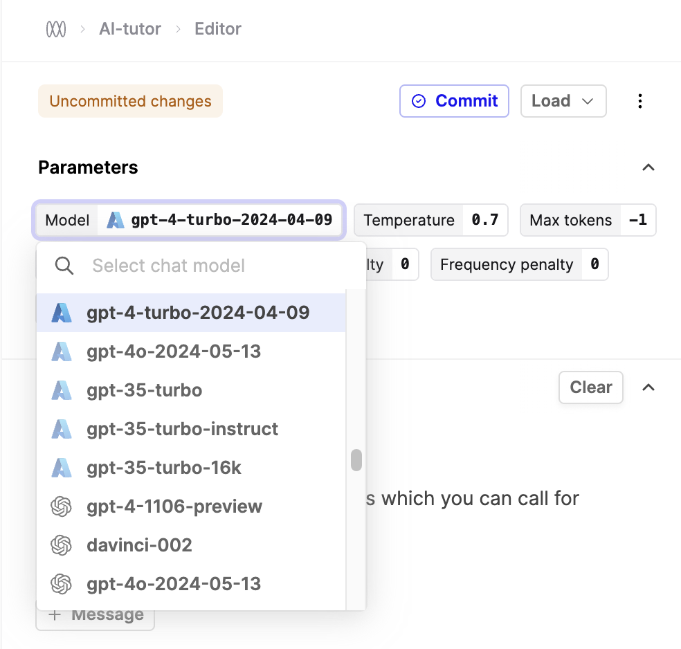

## Azure Model Updates

You can now access the latest versions of GPT-4 and GPT-4o hosted on Azure in the Humanloop Editor and via our Chat endpoints.

Once you've configured your Azure key and endpoint in your organization's provider settings, the model versions will show up in the Editor dropown as follows:

For more detail, please see the [API documentation](https://docs.humanloop.com/reference/logs_list) on our Logs endpoints.

