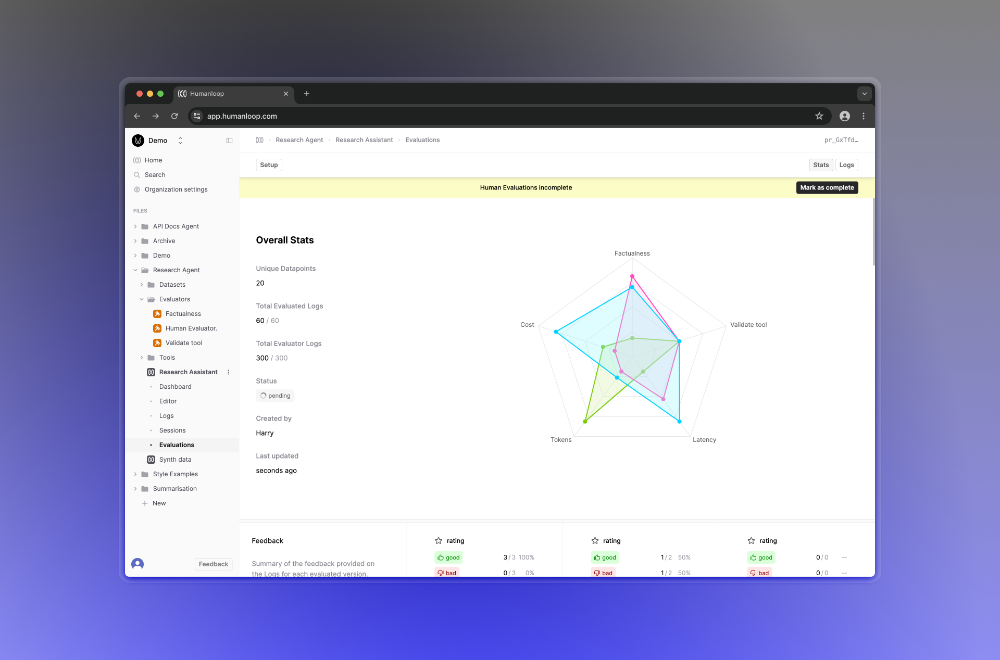
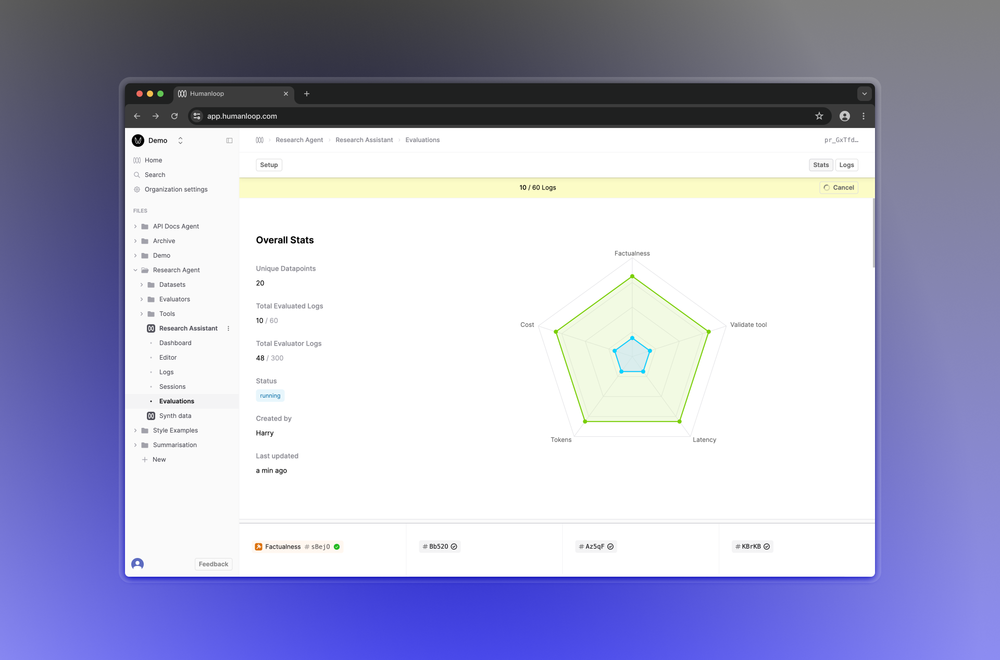

## Status of Human Evaluators

With Humanloop Evaluation Reports, you can leverage multiple Evaluators for comparing your Prompt and Tool variations. Evaluators can be of different types: code, AI or Human and the progress of the report is dependent on collecting all the required judgements. Human judgments generally take longer than the rest and are collected async by members of your team.

To better support this workflow, we've improved the UX around monitoring the status of judgments, with a new progress bar. Your Human Evaluators can now also update the status of the report when they're done.

We've also added the ability to cancel ongoing Evaluations that are pending or running. Humanloop will then stop generating Logs and running Evaluators for this Evaluation report.
