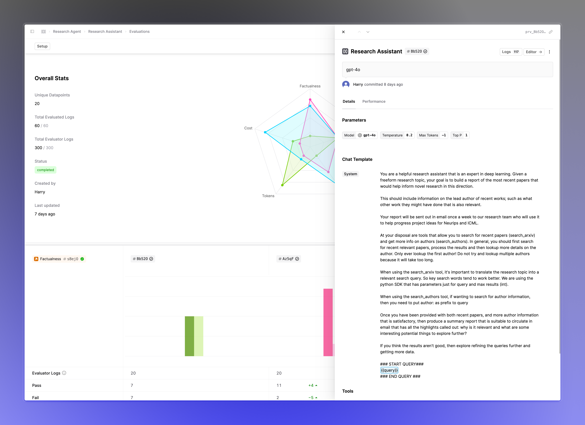

## Prompt and Tool version drawer in Evaluation reports

You can now click on the Prompt and Tool version tags within your Evaluation report to open a drawer with details. This helps provide the additional context needed when reasoning with the results without having to navigate awa

