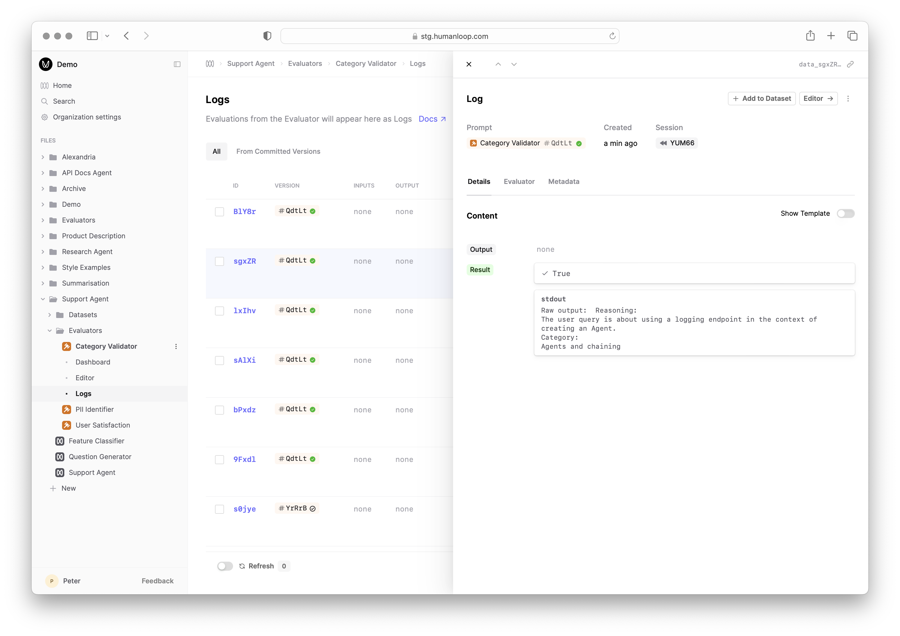

## Improved Code Evaluator Debugging

We've added the ability to view the Standard Output (Stdout) for your Code Evaluators. 

You can now use `print(...)` statements within your code to output intermediate results to aid with debugging.

The Stdout is available within the Debug console as you iterate on your Code Evaluator:

Additionally, it is stored against the Evaluator Log for future reference:

