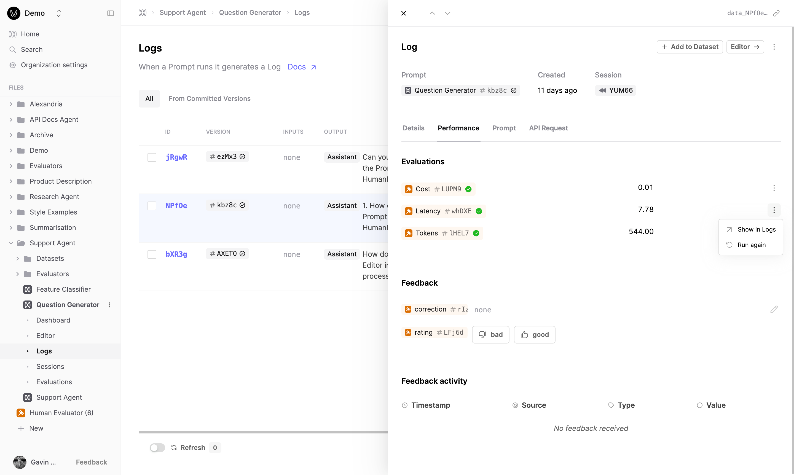

## Updated Evaluator Logs table

The Logs table for Evaluators now supports the same columns and functionality as you would expect from our other Logs tables. This will make it easier to filter and sort your evaluator judgments.

We are continuing to improve Logs usage within the app, with more updates coming soon.

## New ability to re-run your Evaluators

We have introduced the ability to re-run your evaluator logs. This feature allows you to address and fix issues with previous evaluator judgments in a more tailored and precise manner.

By selecting one of your logs, you can view your evaluation judgment under the Performance tab of the log drawer. The evaluation results will show the latest judgment per evaluator. You can request a re-run of that evaluator by opening the menu next to that evaluator and pressing the "Run Again" option. 
