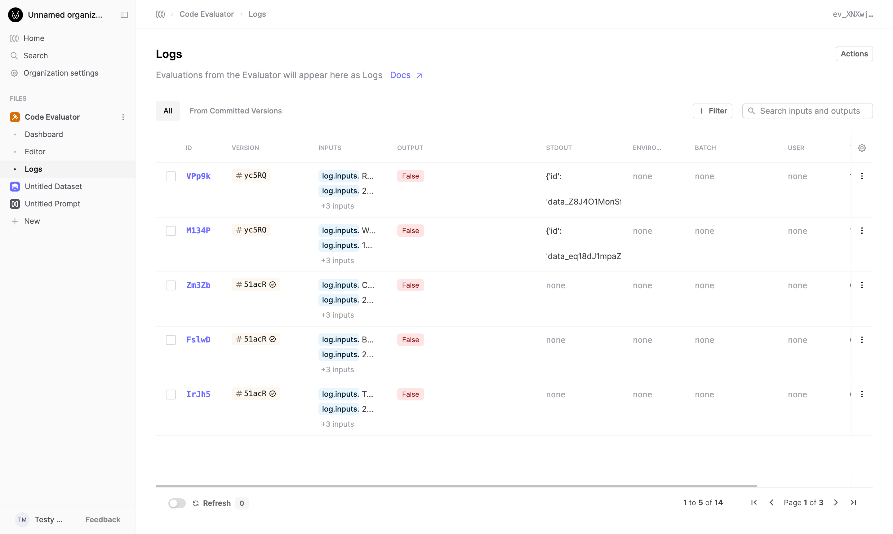

## Updated Evaluator Logs table

The Logs table for Evaluators now supports the same columns and functionality as you would expect from our other Logs tables. This will make it easier to filter and sort your evaluator judgments.

We are continuing to improve Logs usage within the app, with more updates coming soon.