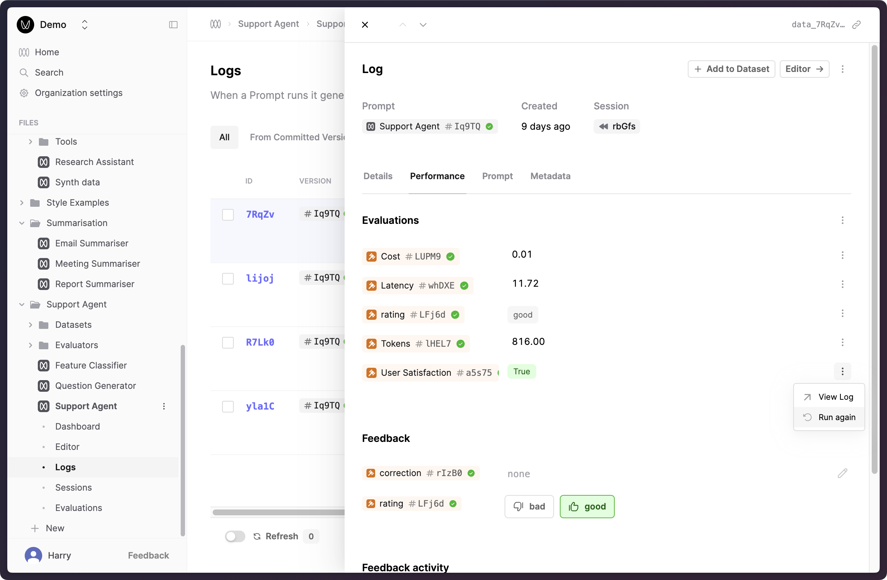
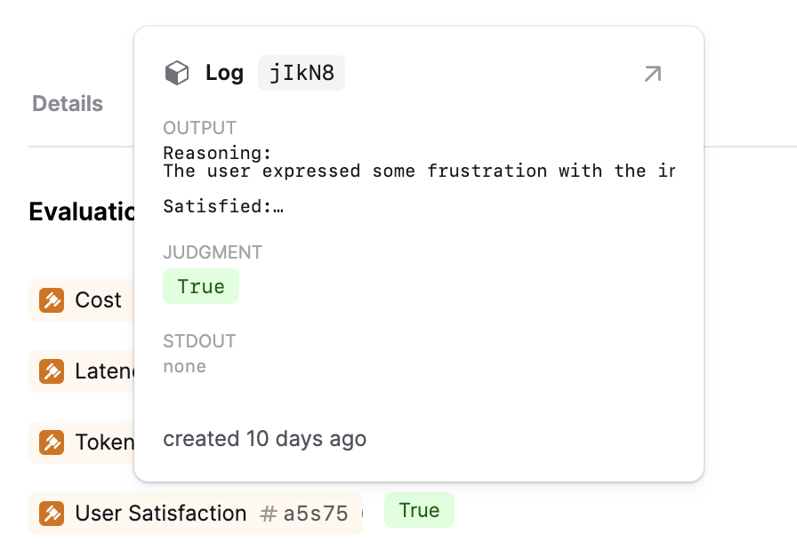

## Evaluations improvements

We've made improvements to help you evaluate the components of your AI applications, quickly see issues and explore the full context of each evaluation.

### A clearer Evaluation tab in Logs

We've given the Log drawer's Evaluation tab a facelift. You can now clearly see what the results are for each of the connected Evaluators that have been applied to that Log.

This means that it's now easier to view the judgments applied to a Log, and if necessary, re-run code/AI Evaluators
against the Log.

### Ability to re-run your Evaluators

We have introduced the ability to re-run your evaluators. This feature allows you to address and fix issues with previous evaluator judgments.

By selecting one of your logs, you can view your evaluation judgment under the Performance tab of the log drawer. The evaluation results will show the latest judgment per evaluator. You can request a re-run of that evaluator by opening the menu next to that evaluator and pressing the "Run Again" option.

### Evaluation popover

If you hover over an evaluation result, you'll now see a popover with more details about the evaluation including any intermediate results or console logs without leaving your current conext.

### Updated Evaluator Logs table

The Logs table for Evaluators now supports the functionality as you would expect from our other Logs tables. This will make it easier to filter and sort your evaluator judgments.
