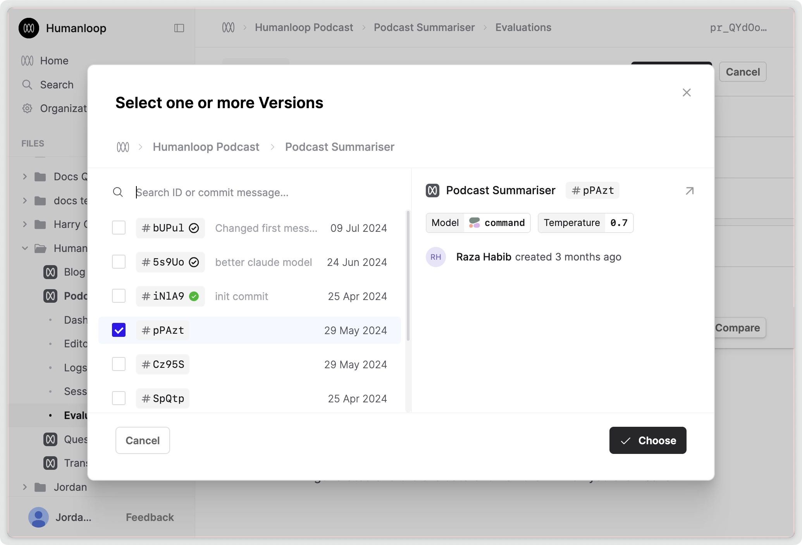

## Evaluate uncommitted versions

You can now evaluate versions without committing them first. This means that you can draft a version of a Prompt in the editor and simultaneously evaluate it in the evaluations tab. This can speed up your iteration cycle.

This is a global change, so that you load and use uncommitted versions. Uncommitted versions are created from every different version of a Prompt, Tool or Evaluator that is either run in their respective editors, or called via the API. These versions will appear in the version pickers underneath all the committed versions.

To evaluate an uncommitted version, just select a version by knowing the hash (known as the "version id") of the version you want to evaluate.

