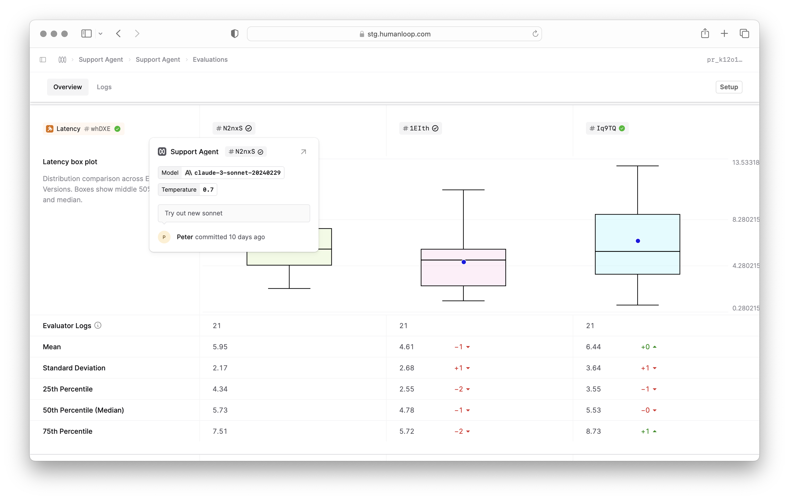

## Improved popover UI

We've expanded the information shown in the version popover so that it is easier to identify which version you are working with.

This is particularly useful in places like the Logs table and within Evaluations reports where you may be working with multiple versions of a Prompt, Tool, or Evaluator and need to preview the contents.

