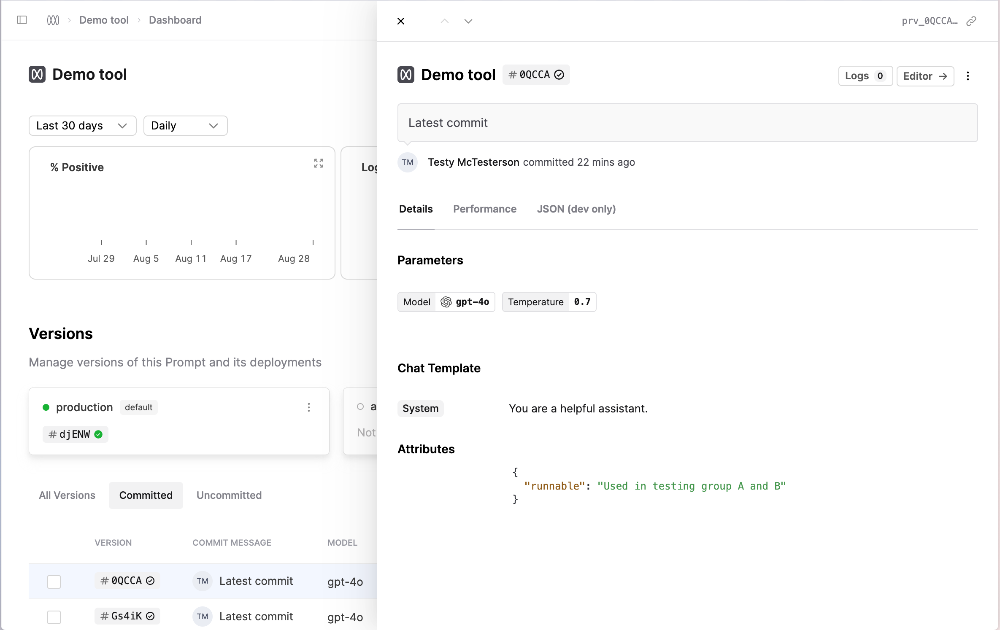

## Custom attributes for Files

You can now include custom attributes to determine the unique version of your file definitions on Humanloop. 

This allows you to make the version depend on data custom to your application that Humanloop may not be aware of. 

For example, if there are feature flags or identifiers that indicate a different configuration of your system that may impact the behaviour of your Prompt or Tool.

`attributes` can be submitted via the v5 API endpoints. When added, the attributes are visible on the Version Drawer and in the Editor.

