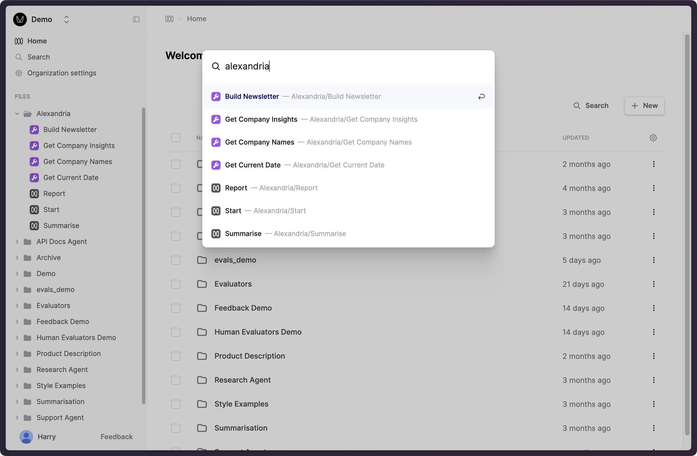

## Search files by path

We've extended our search interface to include file paths, allowing you to more easily find and navigate to related files that you've grouped under a directory.

Bring up this search dialog by clicking "Search" near the top of the left-hand sidebar, or by pressing `Cmd+K`.

## Updated Gemini 1.5 models

Humanloop supports the three newly released Gemini 1.5 models.

Start using these improved models by specifying one of the following model names in your Prompts:

- `gemini-1.5-pro-exp-0827` The improved Gemini 1.5 Pro model
- `gemini-1.5-flash-exp-0827` The improved Gemini 1.5 Flash model
- `gemini-1.5-flash-8b-exp-0827` The smaller Gemini 1.5 Flash variant

More details on these models can be viewed [here](https://ai.google.dev/gemini-api/docs/models/experimental-models#available-models).
