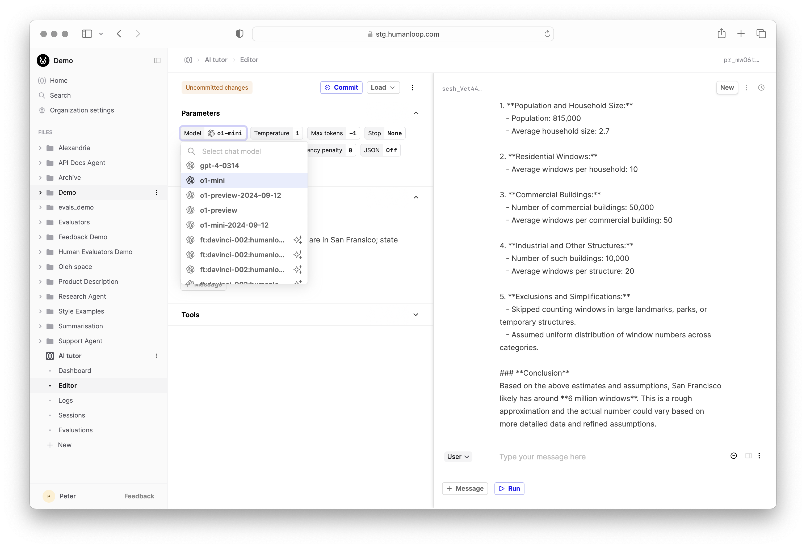

## OpenAI o1

We added same day support for OpenAI's new models, the o1 series. Unlike their predecessors, the o1 models have been designed to spend more time thinking before they respond. 
In practise this means that when you call the API, time and tokens are spent doing chain-of-thought reasoning before you receive a response back.

Read more about this new class of models in OpenAI's [release note](https://openai.com/index/introducing-openai-o1-preview/) and their [documentation](https://platform.openai.com/docs/guides/reasoning). 

These models are still in Beta and don't yet support streaming or tool use, the temperature has to be set to 1 and there are specific rate limits in place.