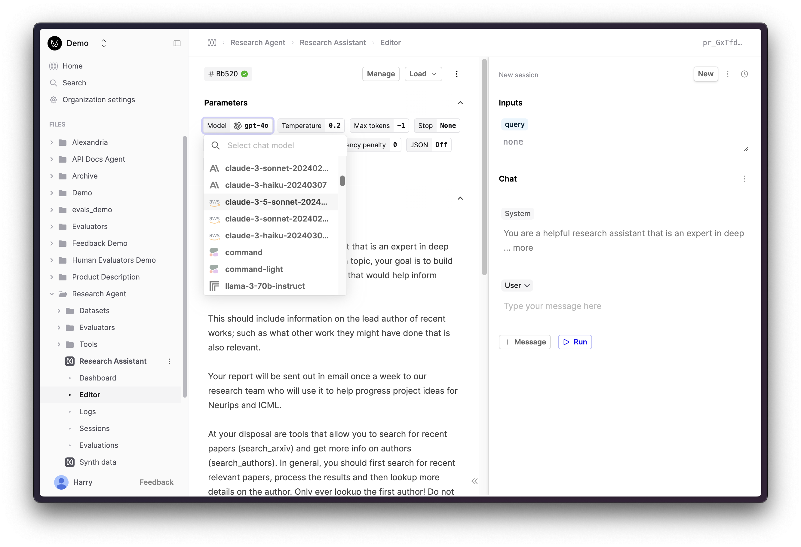
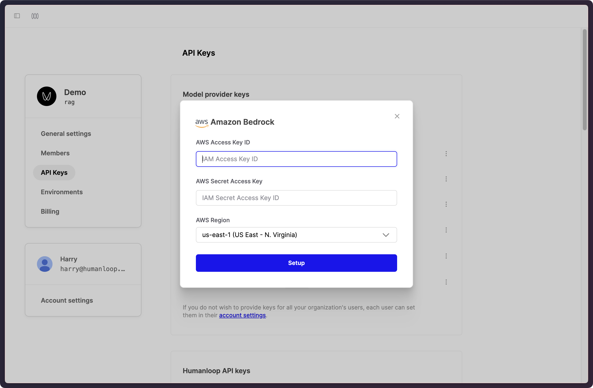

## Bedrock support for Anthropic models

We've introduced a Bedrock integration on Humanloop, allowing you to use Anthropic's models via the Bedrock API, leveraging your AWS-managed infrastructure.

To set this up, head to the API Keys tab in your Organization settings [here](https://app.humanloop.com/account/api-keys). Enter your AWS credentials and configuration.

Once you've set up your Bedrock keys, you can select the Anthropic models in the model selection dropdown in the Prompt Editor and start using them in your Prompts.
