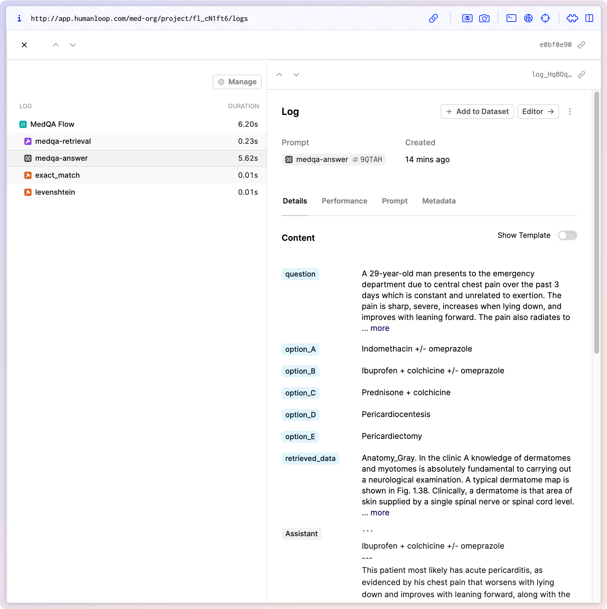
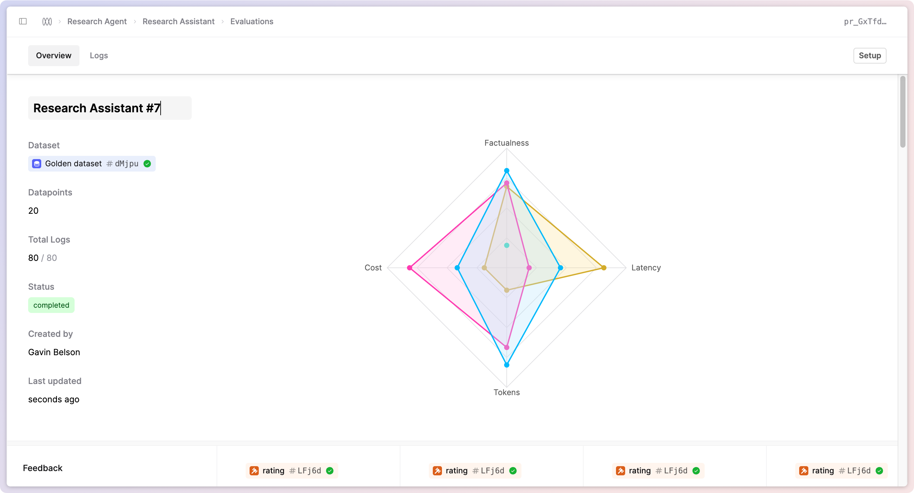

## Introducing Flows

We've added a new key building block to our app with the first release of Flows. Flows allow you to collect multiple Logs into a Trace and evaluate them together, improving observability across your apps.

This release focuses on improving the code-first workflows for evaluating more complex AI applications like RAG and Agent-based apps.

You can start logging your app traces with the [Flows log endpoint](https://humanloop.com/docs/v5/api-reference/flows/log).
(Check back later for a more in-depth tutorial we'll be releasing shortly.)

### What's next

We'll soon be extending support for evaluating Traces, allowing Evaluators to access all Logs inside a Trace.
Additionally, we will build on this by adding UI-first visualisations and management of your Flows.

We'll sunset Sessions in favour of Flows in the near future. Reach out to us for guidance on how to migrate your Session-based workflows to Flows.

## Evaluation Names

You can now name your Evaluations in the UI and via the API. This is helpful for more easily identifying the purpose of your different Evaluations, especially when multiple teams are running different experiments.

In the API, pass in the `name` field when creating your Evaluation to set the name. Note that names must be unique for all Evaluations for a specific file. In the UI, navigate to your Evaluatio,n and you will see an option to rename it in the header.
