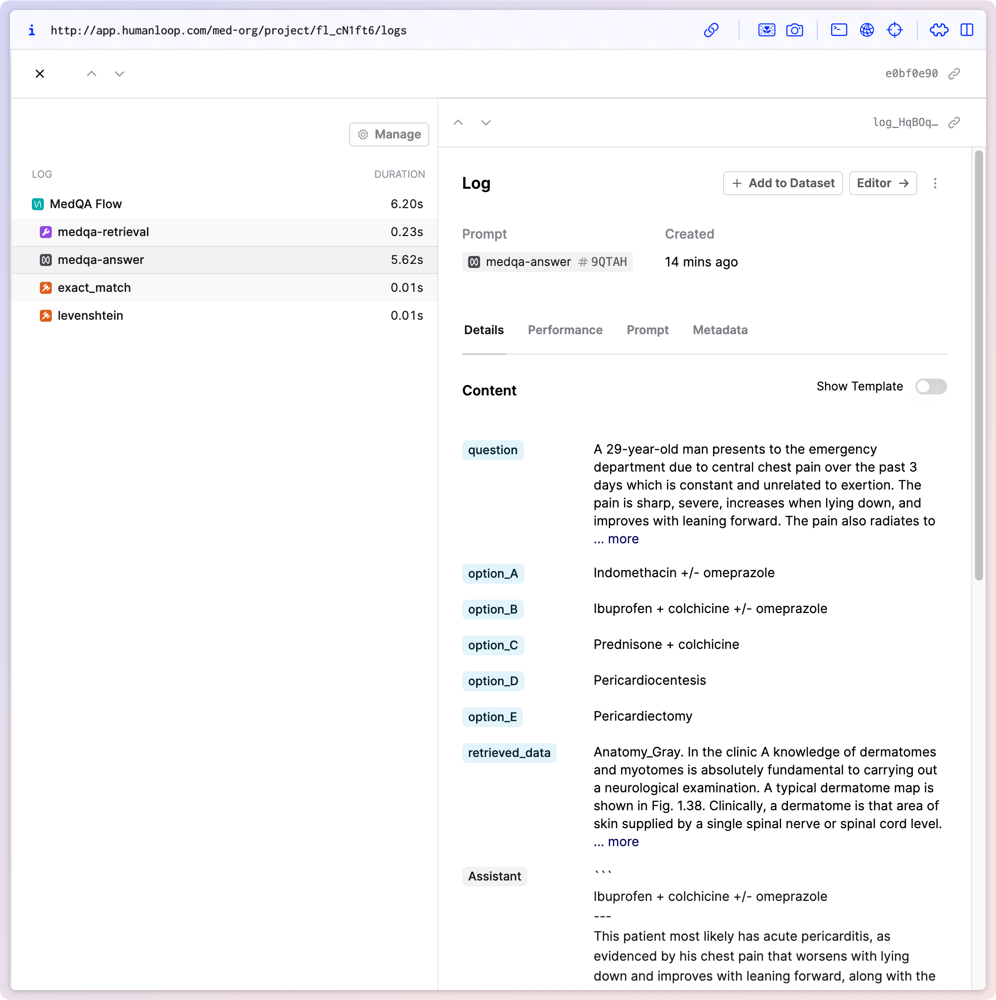

## Introducing Flows

We've added a new key building block to our app with the first release of Flows. Flows allow you to collect multiple Logs into a Trace and evaluate them together, improving observability across your apps.

This release focuses on improving the code-first workflows for evaluating more complex AI applications like RAG and Agent-based apps. Currently, only the inputs and output of a Trace can be evaluated, with a future release allowing Evaluators access to all Logs inside the Trace. Additionally, we will build on this by adding UI-first visualisations and management of your Flows, and offer SDK equivalents to the new API resource.

Sessions will be discontinued in the favour of Flows in the near future. New Sessions can no longer be created, but existing ones can still be viewed. Reach out to us for guidance on how to migrate your Session-based workflows to Flows.

