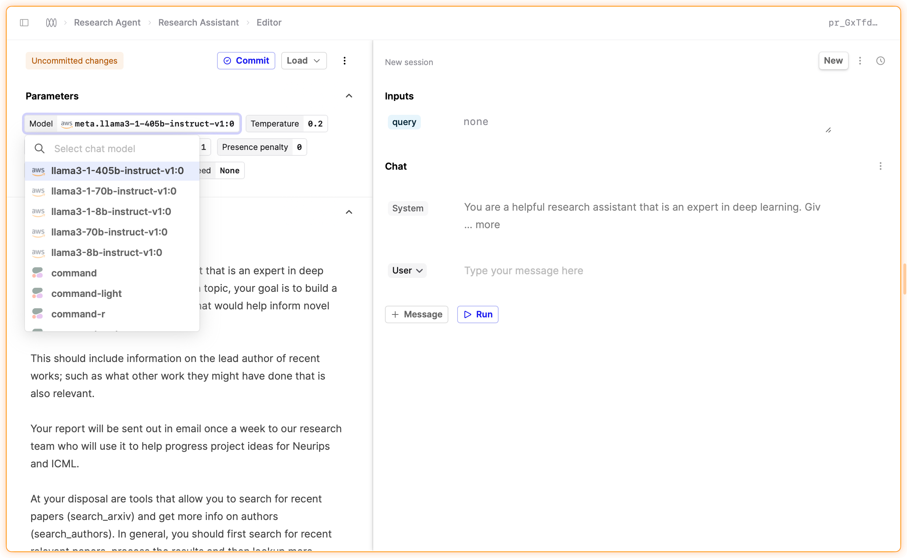

## Bedrock support for Llama models

We've added support for Llama models through our AWS Bedrock integration.

You can now select Llama models in the model selection dropdown in the Prompt Editor and start using them in your Prompts.
Humanloop supports tool calling for Llama 3.1 models, helping you to build more powerful AI applications.