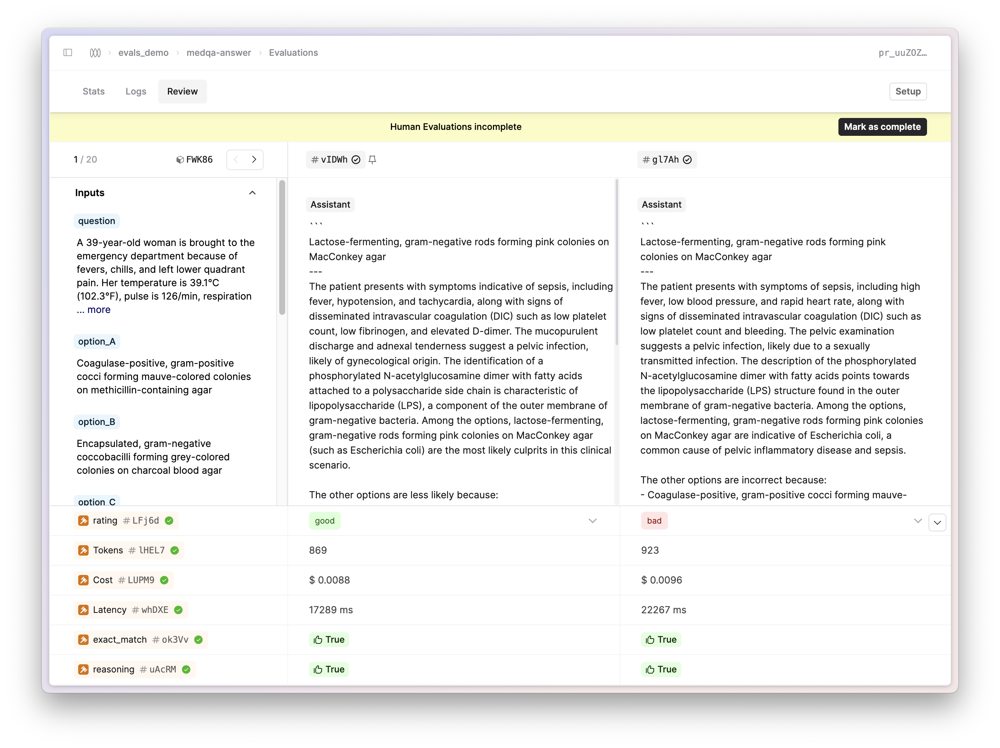

## Evals Comparison Mode

We've added a side-by-side comparison view to evals on Humanloop. This new view enables domain experts to view multiple outputs side-by-side and provide judgments with easy-to-use, configurable controls. 

To start using this new view, choose a File and click on the Evaluations submenu. Select the eval you want to view and navigate to the Review tab. This is particularly useful when trying to compare and contrast the outputs from different versions of your AI apps when providing relative judgements.
