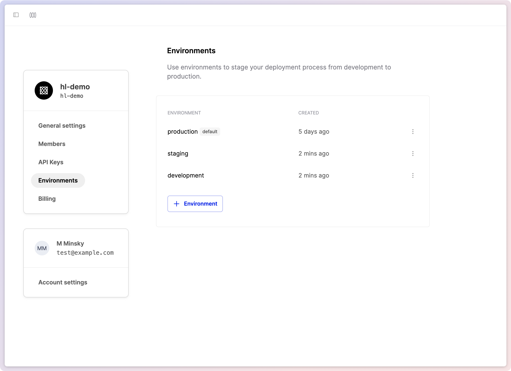
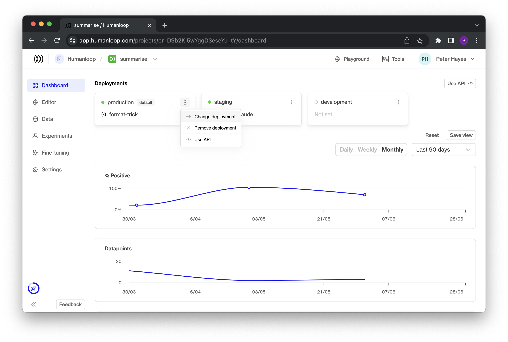
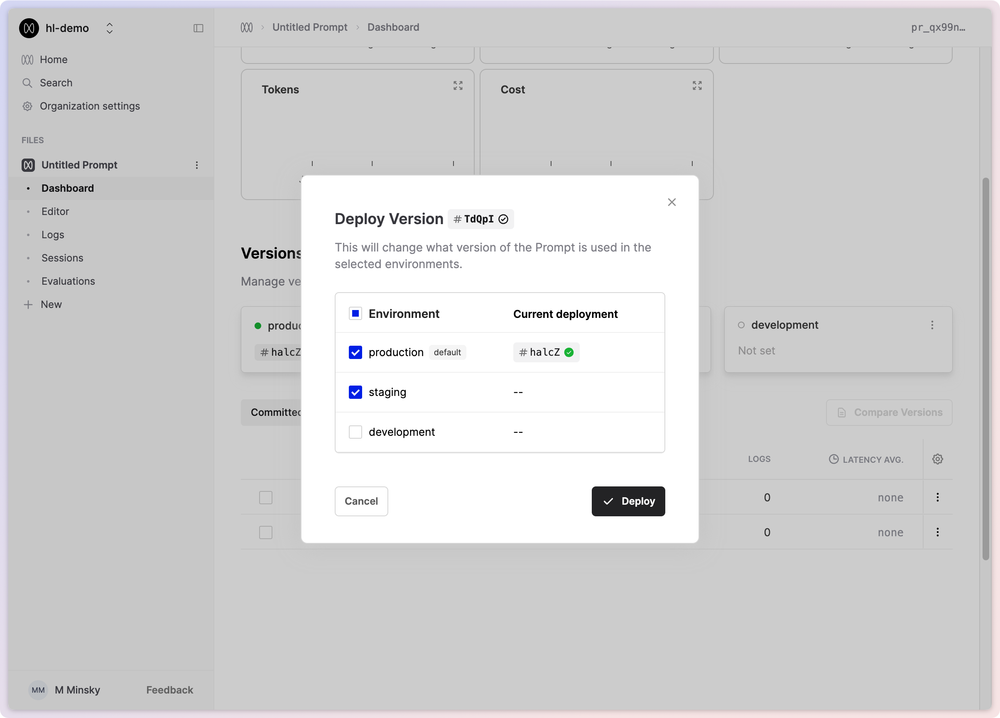

Environments enable you to deploy your model configurations to specific environments, allowing you to separately manage the deployment workflow between testing and production. With environments, you have the control required to manage the full LLM deployment lifecycle.

### Managing your environments

Every organisation automatically receives a default production environment. You can create additional environments with custom names by visiting your organisation's [environments page](https://app.humanloop.com/account/environments).

<Warning>
  Only Enterprise customers can create more than one environment
</Warning>

The environments you define for your organisation will be available for each project and can be viewed in the project dashboard once created.

#### The default environment

By default, the production environment is marked as the Default environment. This means that all API calls targeting the "Active Deployment," such as [Get Active Config](/doc/reference/projects_getactiveconfig) or [Chat Deployed](/api-reference/chats/createdeployed) will use this environment. You can rename the default environment on the [organisation's environments](https://app.humanloop.com/account/environments) page.

<Warning>
  Renaming the environments will take immediate effect, so ensure that this
  change is planned and does not disrupt your production workflows.
</Warning>

### Using environments

Once created on the environments page, environments can be used for each project and are visible in the respective project dashboards.

You can deploy directly to a specific environment by selecting it in the **Deployments** section.

Alternatively, you can deploy to multiple environments simultaneously by deploying a Model Config from either the Editor or the Model Configs table.

### Using environments via API

For v4.0 API endpoints that support Active Deployments, such as [Get Active Config](/api-reference/projects/getactiveconfig) or [Chat Deployed](/api-reference/chats/createdeployed), you can now optionally point to a model configuration deployed in a specific environment by including an optional additional `environment` field.

You can find this information in our v4.0 API Documentation or within the environment card in the Project Dashboard under the "Use API" option.

Clicking on the "Use API" option will provide code snippets that demonstrate the usage of the `environment` variable in practice.

