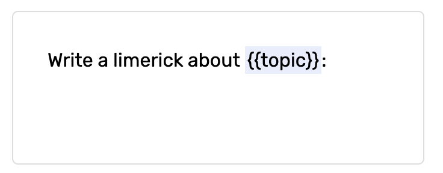
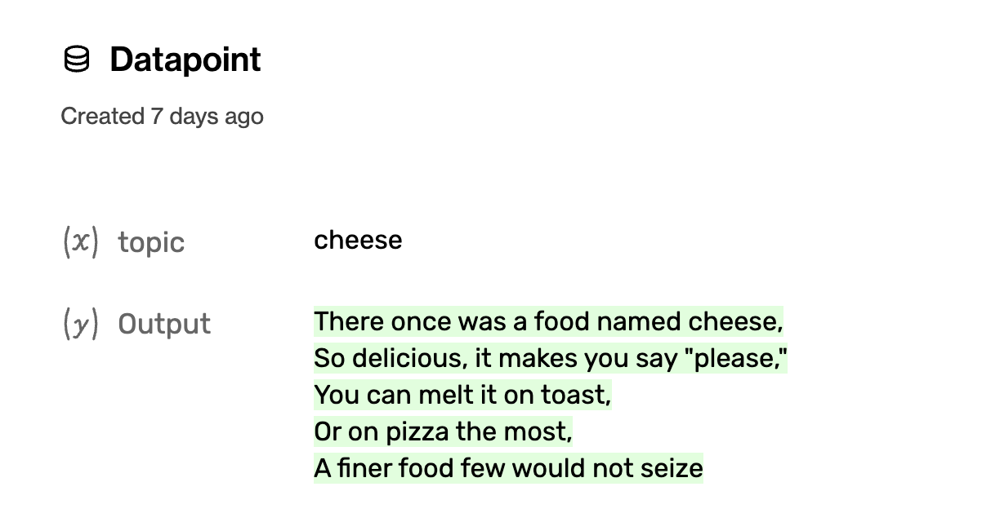

## Projects

A project groups together the data, prompts and models that are all achieving the same task to be done using the large language model.

For example, if you have a task of ‘generate google ad copy’, that should be a project. If you have a summarization that works on top of tweets, that should be a project. You should have many separate projects for each of your tasks on top of the LLM.

## Models

The Humanloop platform gives you the ability to use and improve large language models like GPT‑3. There are many different models from multiple providers. The models may be different sizes, may have been trained differently, and are likely to perform differently. Humanloop gives you the ability to find the best model for your situation and optimise performance and cost.

**Model Provider** is where the model is from. For example, ‘OpenAI’, or ‘AI21’ etc.

**Model** refers to the actual AI model that should be used. Such as text-davinci-002 (large, relatively expensive, highly capable model trained to follow instructions) babbage (smaller, cheaper, faster but worse at creative tasks), or gpt-j (an open source model – coming soon!).

**Fine-tuned model** - finetuning takes one of the existing models and specialises it for a specific task by further training it with some task-specific data.

Finetuning lets you get more out of the models by providing:

1. Higher quality results than prompt design
2. Ability to train on more examples than can fit in a prompt
3. Token savings due to shorter prompts
4. Lower latency requests

## Model config

This is the prompt template, the model (e.g. `text-davinci-002`) and the various parameters such as temperature that define how the model will generate text.

A new model config is generated for each unique set of parameters used within that project. This is so you can compare different model configs to see which perform better, for things like the prompt, or settings like temperature, or stop sequences.

## Prompt templates

This is the prompt that is fed to the model, which also allows the use of variables. This allows you track how the same prompt is being used with different input values.

The variables are surrounded by `{{ and }}` like this:

## Datapoint

This is a generation from the model. It contains the `inputs` and the `output` and tracks which model config was used.

In the above example, the prompt template has one `input` called ‘topic’ and the `output` will be the completion. Each time this model is called it will create a datapoint with the actual values.

## Feedback

Human feedback is crucial to help understand how your models are performing and to direct you in the ways to improve them. 

**Explicit feedback**  these are purposeful actions to review the generations. For example, ‘thumbs up/down’ button presses. 

**Implicit feedback** – actions taken by your users may signal whether the generation was good or bad, for example, whether the user ‘copied’ the generation, ‘saved it’ or ‘dismissed it’ (which is negative feedback).

You can also have corrections as a feedback too.

## Experiment

Experiments help remove the guesswork from working with large language models. Experiments allow you to set up A/B test between multiple different model configs. This enables you to try out alternative prompts or models and use the feedback from your users to determine which works better.

## Semantic search

Semantic search is an effective way to retrieve the most relevant information for a query from a large dataset of documents. The documents are typically split into small chunks of text that are stored as vector embeddings which are numerical representations for the meaning of text. Retrieval is carried out by first embedding the query and then using some measure of vector similarity to find the most similar embeddings from the dataset and return the associated chunks of text.