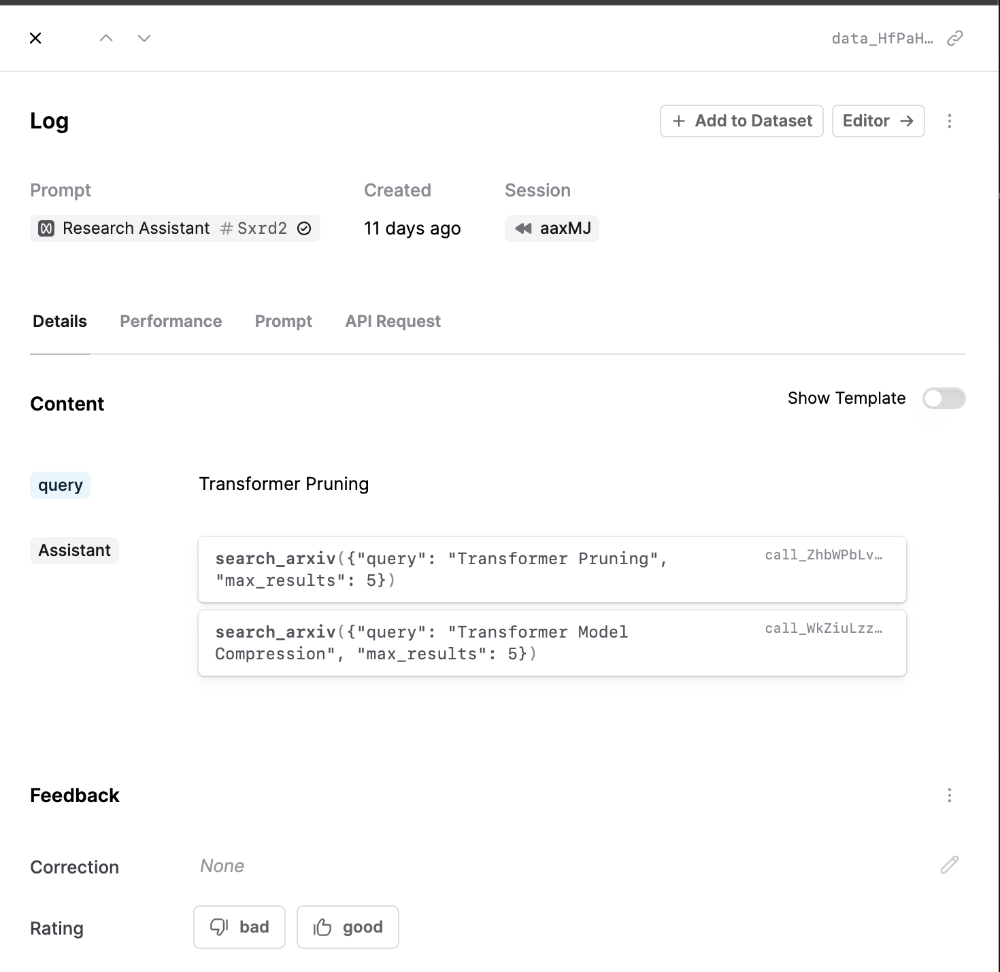

All [Prompts](./prompts), [Tools](./tools) and [Evaluators](./evaluators) produce Logs. A Log containsthe `inputs` and the `output`s and tracks which version of Prompt/Tool/Evaluator was used.

For the example of a Prompt above, the Log would have one `input` called ‘topic’ and the `output` will be the completion.

<Frame caption="A Log which contains an input called query and which resulted in two tool calls from the model.">

</Frame>
