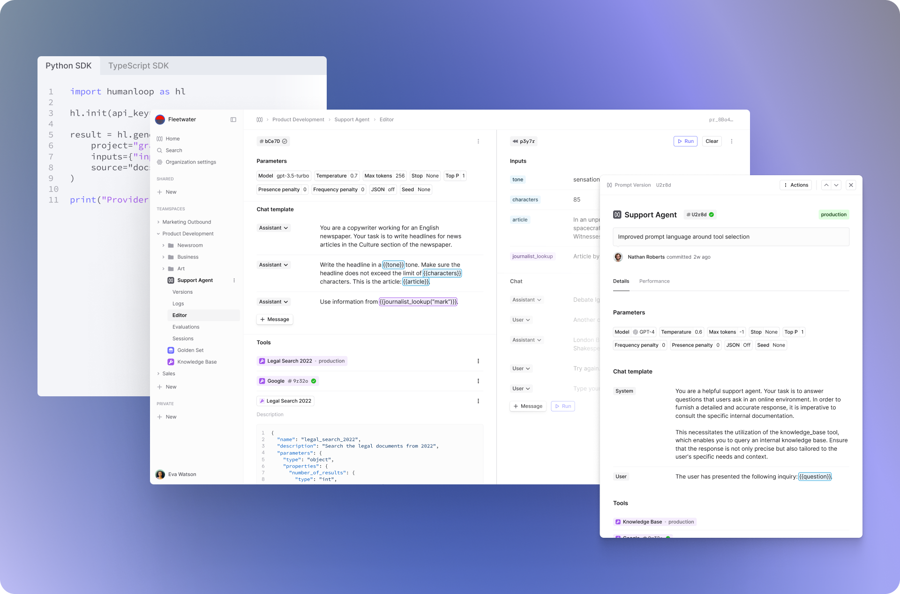

//dodesn't work
/// snippet peace-lily>

<EndpointRequestSnippet endpoint="GET /v4/projects" />
<EndpointResponseSnippet endpoint="GET /v4/projects" />

Humanloop enables product teams to develop LLM-based applications that are reliable and scalable.

Principally, it is an **evaluation suite** to enable you to rigorously measure and improve LLM performance during development and in production and a **collaborative workspace** where engineers, PMs and subject matter experts improve prompts, tools and agents together.

By adopting Humanloop, teams save 6-8 engineering hours each week through better workflows and they feel confident that their AI is reliable.

<Frame caption="Humanloop's IDE for LLMs helps teams prompt engineer and evaluate LLM applications.">
  
</Frame>

The power of Humanloop lies in its integrated approach to AI development. Evaluation, monitoring and prompt engineering in one platform enables you to understand system performance and take the actions needed to fix it. Additionally, the SDK slots seamlessly into your existing code-based orchestration and the user-friendly interface allows both developers and non-technical stakeholders to adjust the AI together.

You can learn more about the challenges of AI development and how Humanloop solves them in [Why Humanloop?](/docs/why-humanloop).
