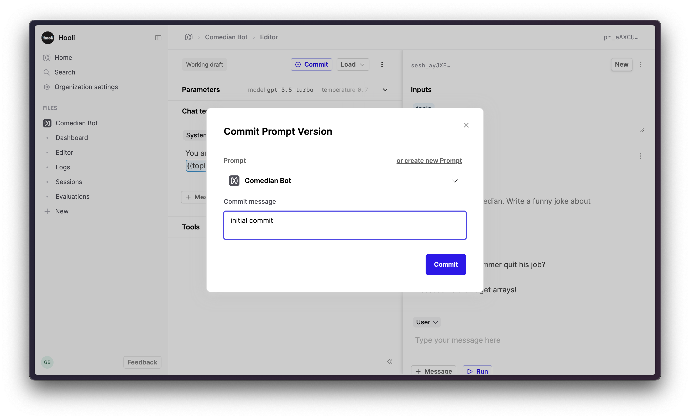

## Account Setup

### Create a Humanloop Account

If you haven’t already, create an account or log in to Humanloop

### Add an OpenAI API Key

If you’re the first person in your organization, you’ll need to add an API key to a model provider.

1. Go to OpenAI and [grab an API key](https://platform.openai.com/api-keys)
2. In Humanloop [Organization Settings](https://app.humanloop.com/account/api-keys) set up OpenAI as a model provider.

<Info>
Using the Humanloop playground will use your OpenAI credits in the same way that the OpenAI playground does. Keep your API keys for Humanloop and the model providers private.
</Info>

## Get Started

<Steps>
### Create a Prompt File

When you first open Humanloop you’ll see your File navigation on the left. Click ‘**+ New**’ and create a **Prompt**.


In the sidebar, rename this file to "Comedian Bot" now or later.

### Create the Prompt template in the Editor

The left hand side of the screen defines your Prompt – the parameters such as model, temperature and template. The right hand side is a single chat session with this Prompt.


Click the “**+ Message**” button within the chat template to add a system message to the chat template.


Add the following templated message to the chat template.

```
You are a funny comedian. Write a joke about {{topic}}.
```

This message forms the chat template. It has an input slot called `topic` (surrounded by two curly brackets) for an input value that is provided each time you call this Prompt. 

On the right hand side of the page, you’ll now see a box in the **Inputs** section for `topic`. Add 

1. Add a value for`topic` e.g. music, jogging, whatever
2. Click **Run** in the bottom right of the page

This will call OpenAI’s model return the assistant response. Feel free to try other values, the model is _very_ funny.

You now have a first version of your prompt that you can use.

### Commit your first version of this Prompt

1. Click the **Commit** button
2. Put “initial version” in the commit message field
3. Click **Commit**




### View the logs


Under the Prompt File click ‘Logs’ to view all the generations from this Prompt

Click on a row to see the details of what version of the prompt generated it. From here you can give feedback to that generation, see performance metrics, open up this example in the Editor, or add this log to a dataset.

</Steps>

## Next Steps

Well done! You've now created your first Prompt. If you look around it might seem a bit empty at the moment. 

To find out more on how to get the most from Humanloop, including how to use your model in your app and improve it, we recommend following our guide: [ChatGPT clone in Next.js](/docs/tutorials/chat-gpt-clone-in-next-js).
