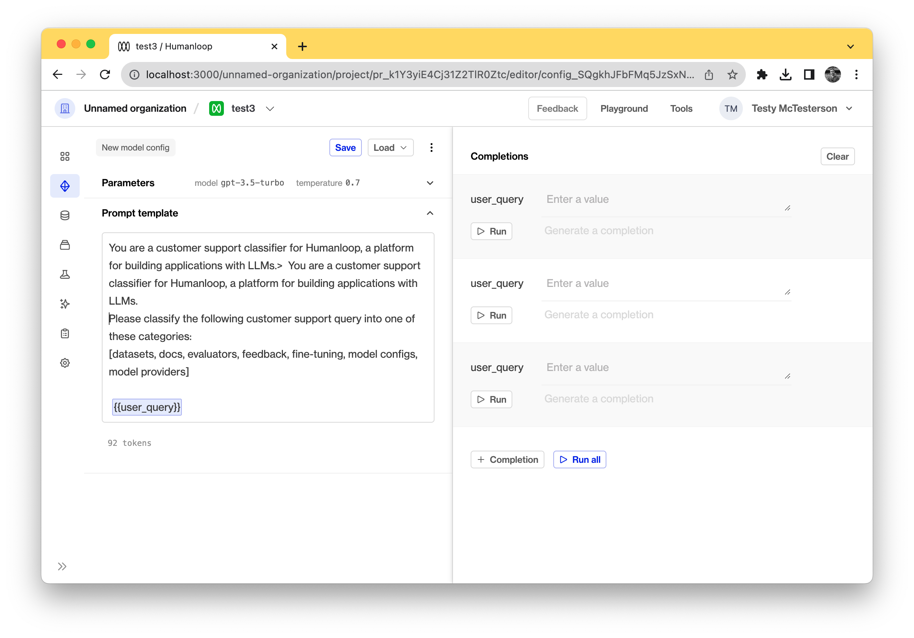
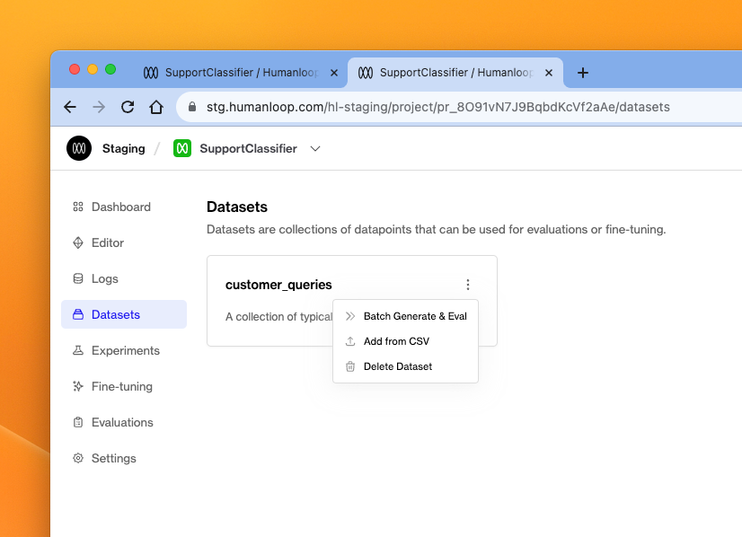
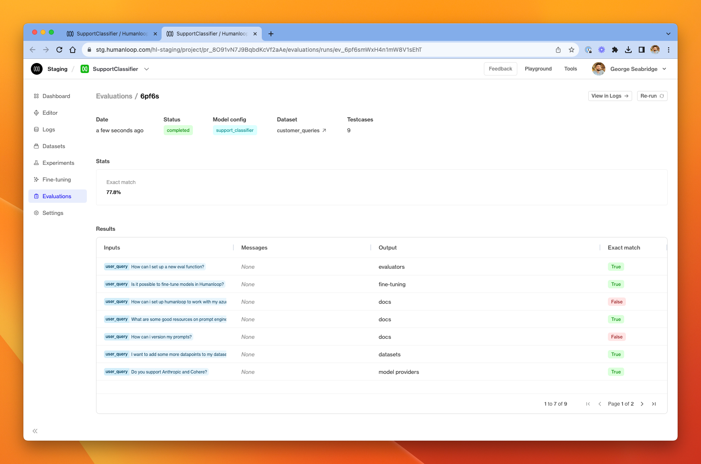

This guide demonstrates how to run a batch generation across all the datapoints in a dataset.

**Prerequistes**

- A [Prompt](./prompts) in Humanloop
- A [dataset](./datasets) in that project

## Create a model config

It's important that the model config we use to perform the batch generation is consistent with the dataset. We're going to use the simple customer support dataset that we uploaded in the previous [Create a dataset guide](./create-a-dataset). As a reminder, the dataset looks like this

We want to get the model to classify the customer support query into the appropriate category. For this dataset, we have specified the correct category for each datapoint, so we'll be able to know easily if the model produced the correct output.

<Steps>
### In Editor, create a simple completion model config as below.

We've used the following prompt:

_You are a customer support classifier for Humanloop, a platform for building applications with LLMs._

_Please classify the following customer support query into one of these categories:
[datasets, docs, evaluators, feedback, fine-tuning, model configs, model providers]_

_{{user_query}}_

The most important thing here is that we have included a **prompt variable** - `{{ user_query }}` which corresponds to the input key on all the datapoints in our dataset. This was the first column header in the CSV file we used to upload the dataset.

### Save the model config by clicking the **Save** button. Call the config `support_classifier`.

### Go to the **Datasets** tab

### Click the menu icon in the top-right corner of the dataset you want to perform a batch generation across.

### In that menu, choose **Batch Generate & Eval**

### In the dialog window, choose the `support_classifier` model config created in step 2.

### You can also optionally select an evaluator to use to compare the model's generation output to the target output in each datapoint. We set up the `Exact match` offline evaluator in our project (it's one of the builtins and requires no further configuration).

### Click **Batch generate**

### Follow the link in the pop-up to the batch generation run which is under the **Evaluations** tab.

</Steps>

The output the model produced is shown in the **output** column, and the exact match column shows that the model produced the expected (target) output in most cases. From here, we could inspect the failing cases and iterate on our model config before testing again to see if the accuracy across the whole dataset has improved.
