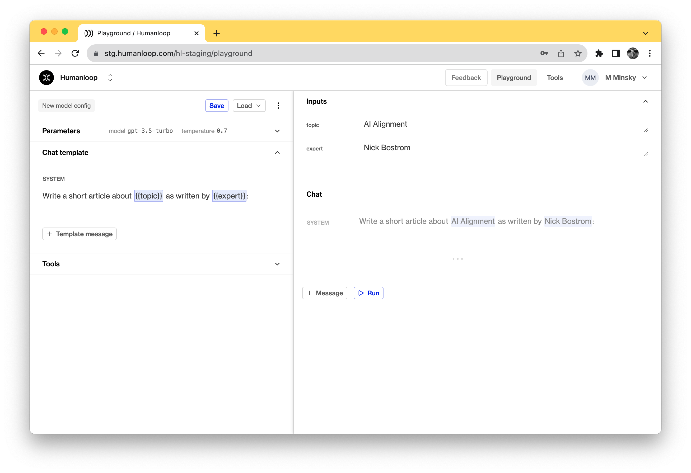
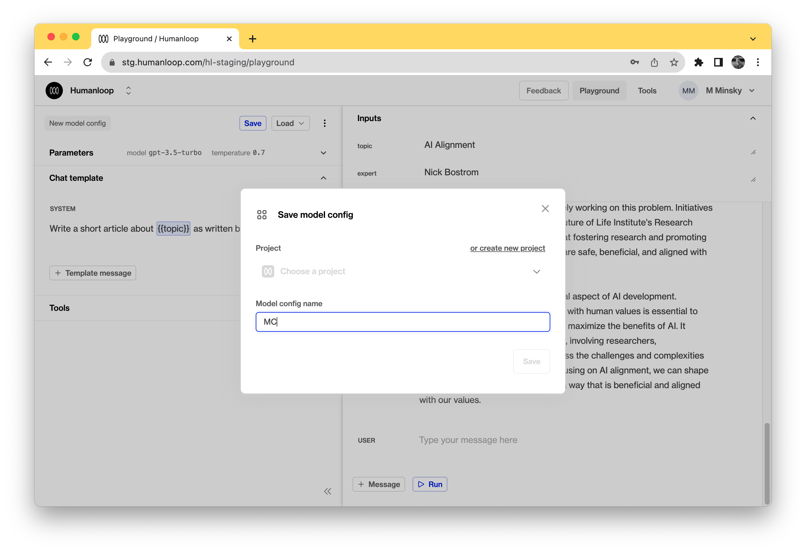
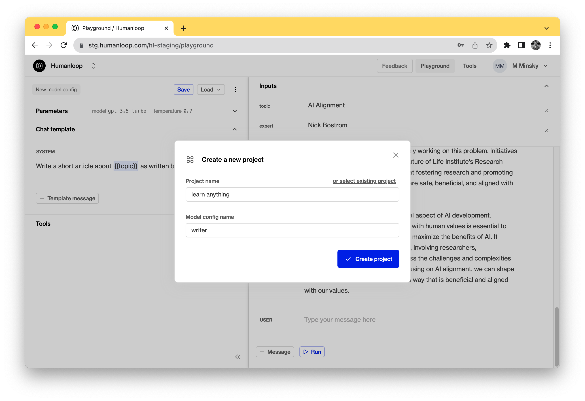
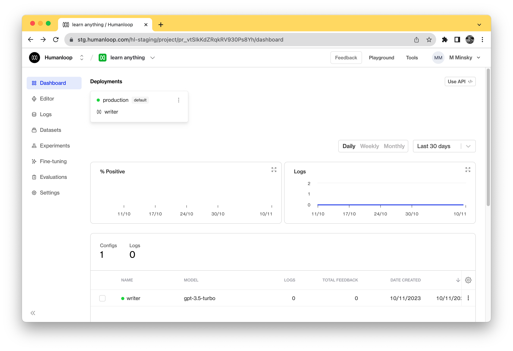

Going from exploring in the Playground to a [Humanloop project](/docs/key-concepts#projects) ready for integration into your application takes just a few clicks.

## Prerequisites

1. A Humanloop account. If you don't have one, you can create an account now by going to the [Sign up page](https://app.humanloop.com/signup).

## Create a prompt template

1. Go to the [Humanloop Playground](https://app.humanloop.com/playground). If this is your first time using the Playground, enter your OpenAI API key and click Save.
2. Enter a [prompt template](/docs/core-entities/key-concepts#prompt-templates) into the text box on the left of the page.
3. Update the chat template to and press the Run button on the right to iterate on the prompt and parameters until you're happy to save this template in a project.

## Save to a project

1. Click **Save as** button above the prompt template

2. Select **or create new project** button if you haven't got existing projects
3. Enter a name for your project and a name for the model config.

<Info>
The project name should be a unique name that will be used to reference the project. We recommend using a readable format using hyphens  e.g. google-playground-demo
</Info>

4. Click **Save**

5. To view this project, click **Open in project editor** in the toast 

Well done you've just created a project on Humanloop! 🎉

With the project set up, you can now integrate it into your app by following the [SDK/API integration guide](../generate-and-log-with-the-sdk).