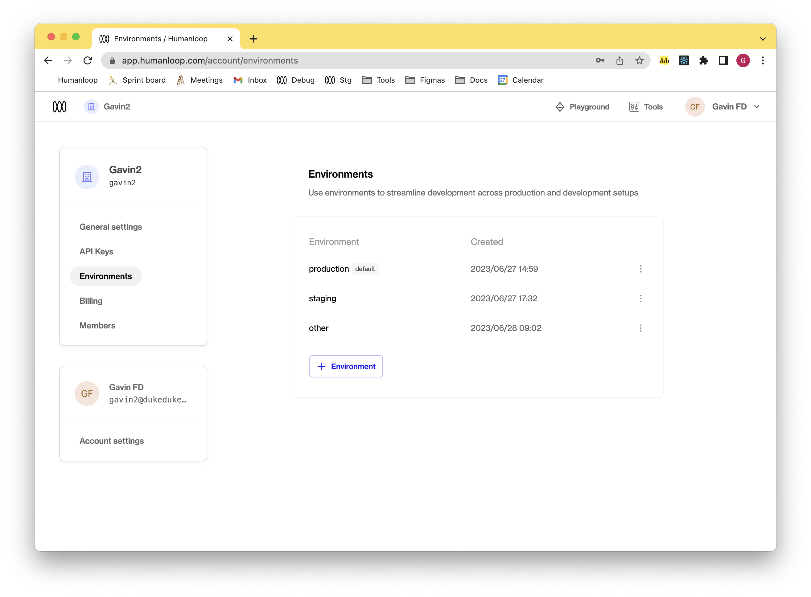
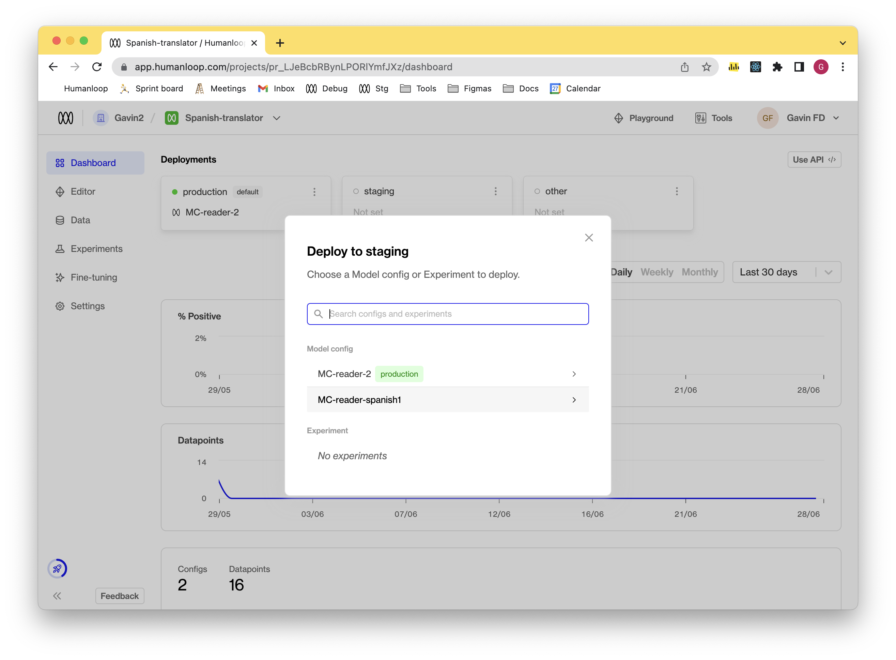
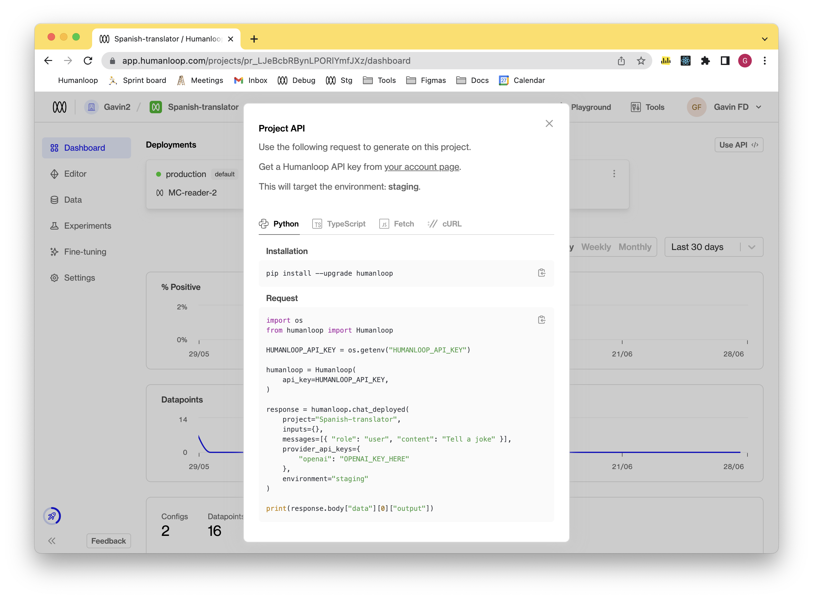
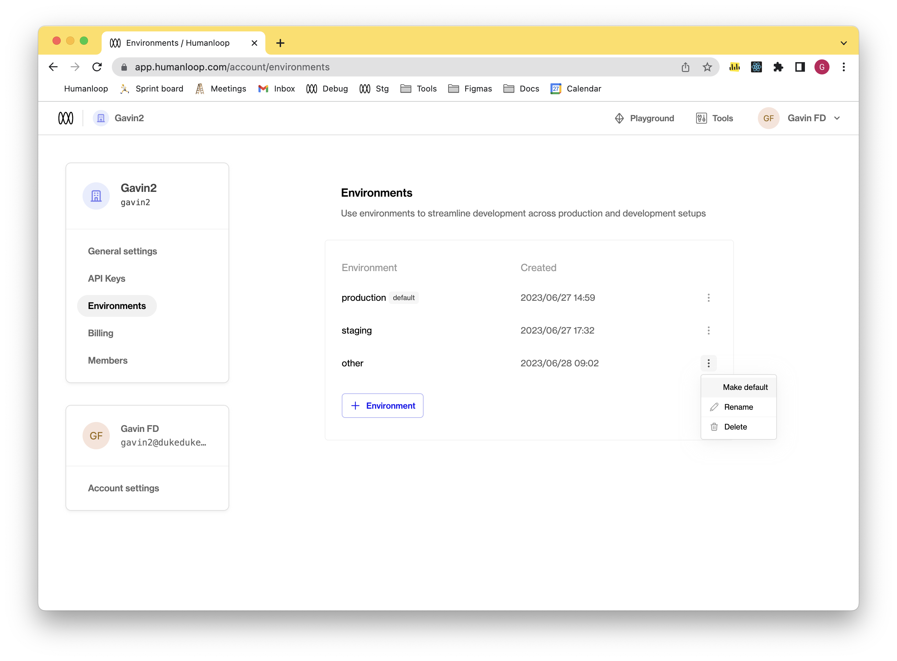

[Environments](./environments) enable you to deploy model configurations and experiments, making them accessible via API, while also maintaining a streamlined production workflow. These environments are created at the organizational level and can be utilized on a per-project basis.

## Create an environment

<Steps>
### Go to your Organization's [Environments](https://app.humanloop.com/account/environments) page.

### Click the **+ Environment** button to open the new environment dialog.

### Assign a custom name to the environment.

### Click **Create**.

</Steps>



---

## Deploying to an environment

### Prerequisites

- You already have a Prompt — if not, please first follow our [Prompt creation](./create-a-prompt) guide.
- Ensure that your project has existing model configs that you wish to use.

To deploy a model config to an environment:

<Steps>
### Navigate to the **Dashboard** of your project.

### Click the dropdown menu of the environment.


### Click the **Change deployment** button

### Select a version

From the model configs or experiments within that project, click on the one that you wish to deploy to the target environment



### Click the **Deploy** button.

</Steps>

---

## Calling the model in the environment

### Prerequisites

- You have already deployed either a chat or completion model config - if not, please follow the steps in either the [Generate chat responses](./chat-using-the-sdk) or [Generate completions](./completion-using-the-sdk) guides.
- You have multiple environments, with a model config deployed in a non-default environment. See the [Deploying to an environment](#deploying-to-an-environment) section above.

<Info>
  The following steps assume you're using an OpenAI model and that you're
  calling a `chat` workflow. The steps needed to target a specific environment
  for a `completion` workflow are similar.
</Info>

<Steps>
### Navigate to the **Models** tab of your Humanloop project.
### Click the dropdown menu of the environment you wish to use.
### Click the **Use API** menu option. 
A dialog will open with code snippets. 
Select the language you wish to use (e.g. Python, TypeScript). The value of `environment` parameter is the name of environment you wish to target via the chat-deployed call.
An example of this can be seen in the code below.

```python
import os
from humanloop import Humanloop

HUMANLOOP_API_KEY = os.getenv("HUMANLOOP_API_KEY")

humanloop = Humanloop(api_key=HUMANLOOP_API_KEY)

response = humanloop.chat_deployed(
    project="YOUR_PROJECT_NAME",
    inputs={},
    messages=[{ "role": "user", "content": "Tell a joke" }],
    provider_api_keys={
        "openai": "OPENAI_KEY_HERE"
    },
    environment="YOUR_ENVIRONMENT_NAME"
)

print(response.body["data"][0]["output"])
```



</Steps>
***

## Updating the default environment

<Warning>
  Only Enterprise customers can update their default environment
</Warning>

### Prerequisites

- You have multiple environments - if not first go through the [Create an
  environment](./deploy-to-an-environment) section.

Every organization will have a default environment. This can be updated by the following:

<Steps>
### Go to your Organization's [Environments](https://app.humanloop.com/account/environments) page.

### Click on the dropdown menu of an environment that is not already the default.

### Click the **Make default** option

A dialog will open asking you if you are certain this is a change you want to make. If so, click the **Make default** button.

### Verify the default tag has moved to the environment you selected.

</Steps>


