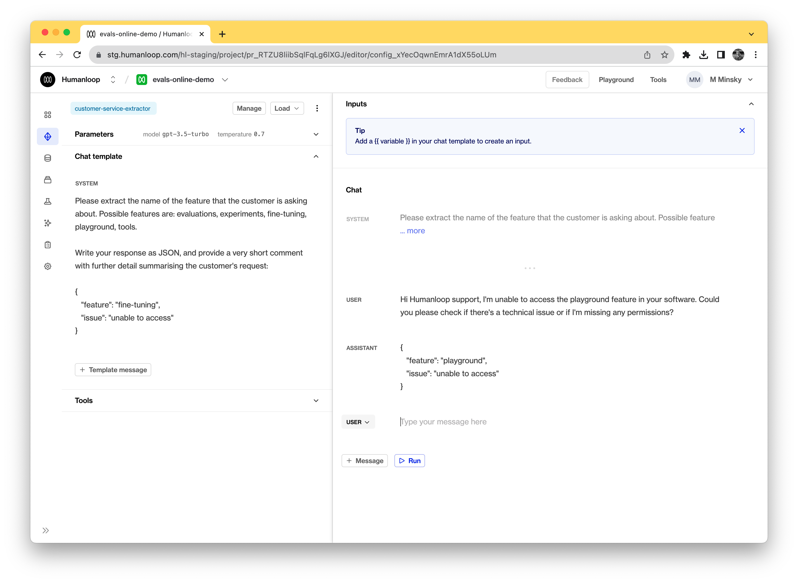
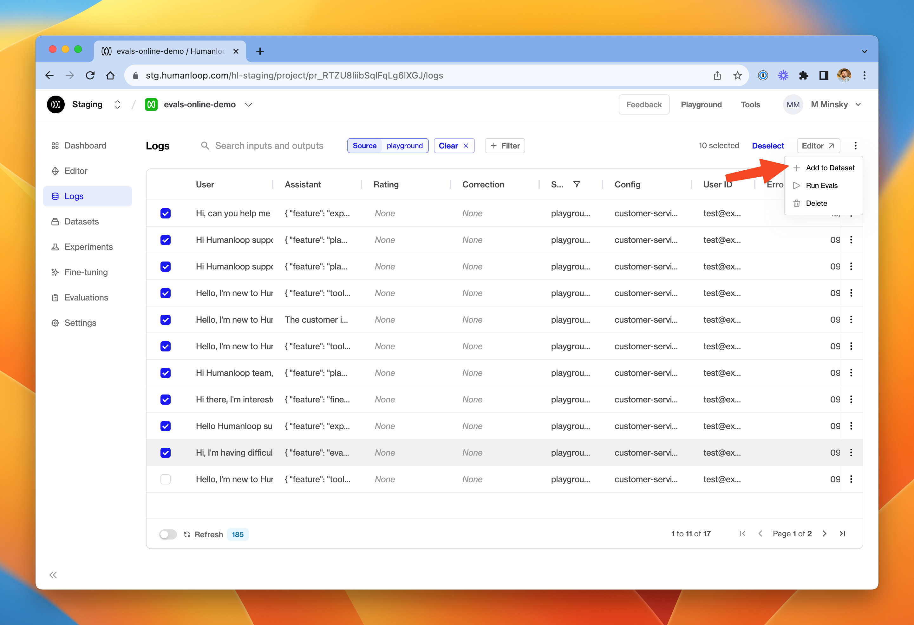
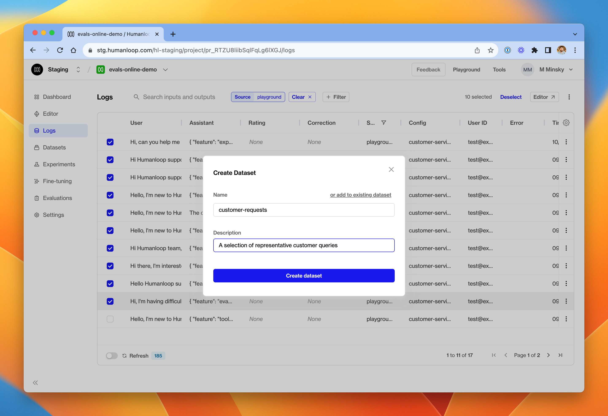
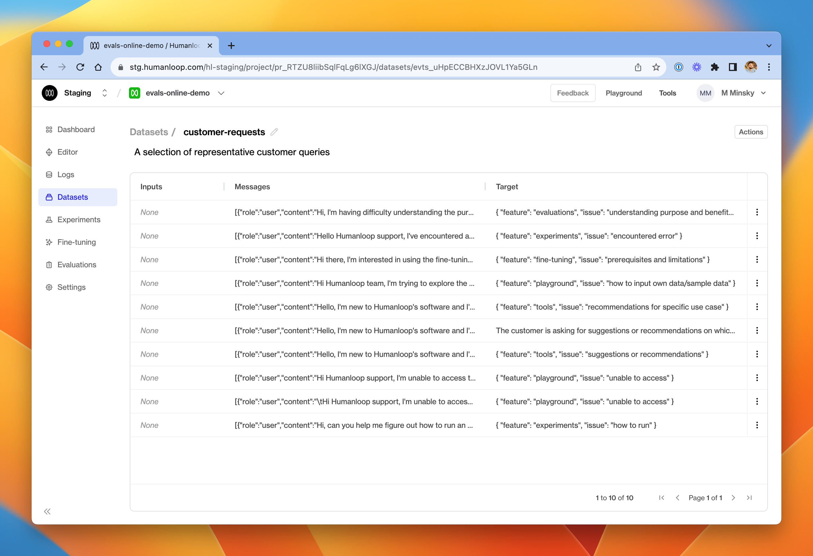
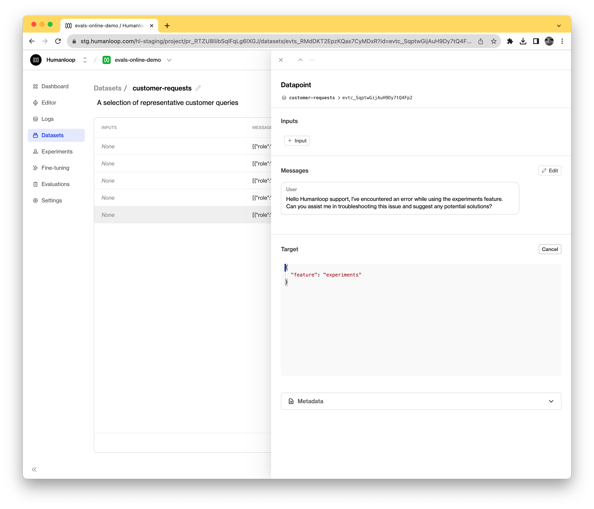
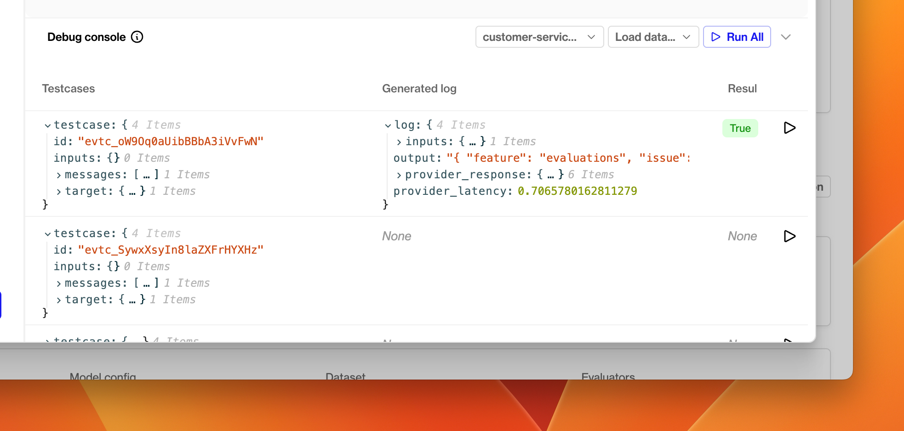
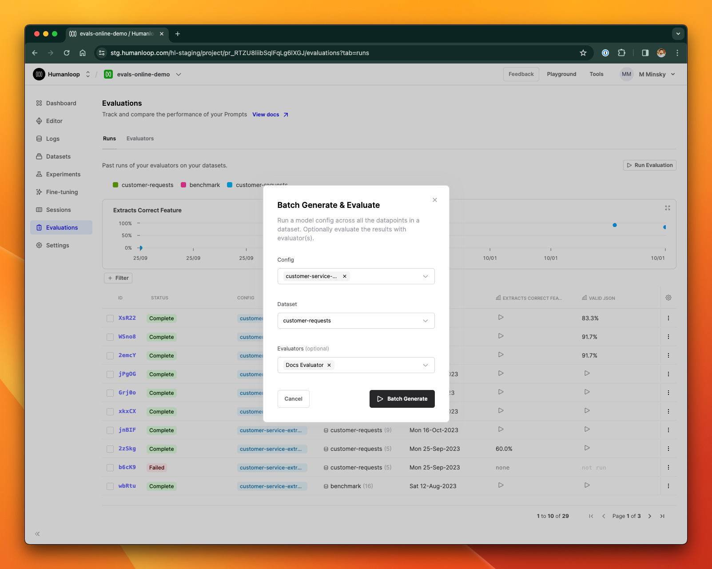
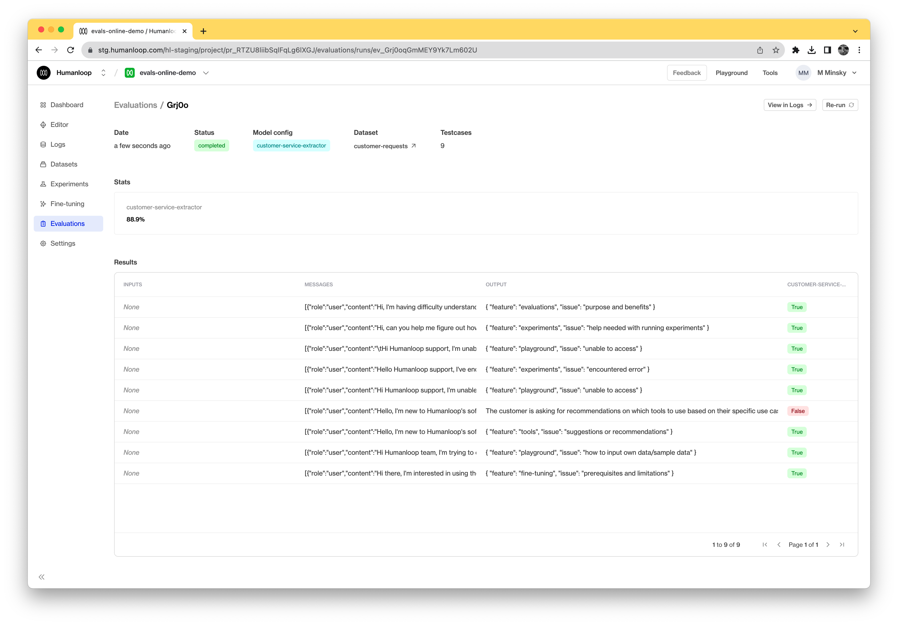

## Create an offline evaluator

### Prerequisites

- You need to have access to evaluations.
- You also need to have a project created - if not, please first follow our [project creation](../create-project/from-playground) guides.
- Finally, you need at least a few logs in your project. Use the **Editor** to generate some logs if you don't have any yet.

<Info> 
You need logs in your project because we will use these a source of test datapoints for the dataset we will create. If you want to create arbitrary test datapoints from scratch, see our guide to doing this from the API. We will soon be updating the app to enable arbitrary test datapoint creation from your browser.
</Info>

For this example, we're going to evaluate a model who's responsibility is to extract key information from a customer service request and return this information in JSON. In the image below, you can see the model config we've drafted on the left, and an example of it running against a customer query on the right.



### Set up a dataset

We will create a dataset based on existing logs that are already in the project.

<Steps>
### Navigate to the **Logs** tab
### Select the logs you would like to convert into test datapoints
### From the dropdown menu in the top right (see below), choose **Add to Dataset**




### In the dialog box, give the new dataset a name and provide an optional description. Click **Create dataset**.



<Info> 
You can add more datapoints to the same dataset later by clicking the 'add to existing dataset' button at the top.
</Info>

### Go to the **Datasets** tab.
### Click into the newly created dataset. One datapoint will be present for each log you selected in step 3




### Click on a datapoint to inspect its parameters. 

<Tip> 
A test datapoint contains inputs (the variables passed into your model config template), an optional sequence of messages (if used for a chat model) and a target representing the desired output.

As we converted existing logs into datapoints, the target defaults to the output of the source log.
</Tip>

In our example, we created datapoints from existing logs. The default behaviour is that the original log's output becomes an output field in the target JSON. 

In order to access the `feature` field more easily in our evaluator, we'll modify the datapoint targets to be a raw JSON with a feature key.


### Modify the datapoint if you need to make refinements. You can provide an arbitrary JSON object as the target.



</Steps>


### Create an offline evaluator

Having set up a dataset, we'll now create the evaluator. As with online evaluators, it's a Python function but for offline mode, it also takes a `testcase` parameter alongside the generated log.

<Steps>
### Navigate to the evaluations section, and then the Evaluators tab
### Select **+ New Evaluator** and choose **Offline Evaluation**
### Choose **Start from scratch**

For this example, we'll use the code below to compare the LLM generated output with what we expected for that testcase.

```python Python
import json
from json import JSONDecodeError

def it_extracts_correct_feature(log, testcase):
    expected_feature = testcase["target"]["feature"]

    try:
        # The model is expected to produce valid JSON output
        # but it could fail to do so.
        output = json.loads(log["output"])
        actual_feature = output.get("feature", None)
        return expected_feature == actual_feature

    except JSONDecodeError:
        # If the model didn't even produce valid JSON, then
        # we evaluate the output as bad.
        return False
```

### In the debug console at the bottom of the dialog, click **Load data** and then **Datapoints from dataset**. Select the dataset you created in the previous section. The console will be populated with its datapoints.




### Choose a model config from the dropdown menu.
### Click the run button at the far right of one of the test datapoints. 

A new debug run will be triggered, which causes an LLM generation using that datapoint's inputs and messages parameters. The generated log and the test datapoint will be passed into the evaluator and the resulting evaluation displays in the **Result** column.

### Click **Create** when you are happy with the evaluator.

</Steps>

## Trigger an offline evaluation

Now that you have an offline evaluator and a dataset, you can use them to evaluate the performance of any model config in your project.

<Steps>
### Go to the **Evaluations** section.
### In the **Runs** tab, click **Run Evaluation**
### In the dialog box, choose a model config to evaluate, and select your newly created dataset and evaluator.



### Click **Batch Generate**
### A new evaluation is launched. Click on the card to inspect the results. 

A batch generation has now been triggered. This means that the model config you selected will be used to generate a log for each datapoint in the dataset. It may take some time for the evaluation to complete, depending on how many test datapoints are in your dataset and what model config you are using. Once all the logs have been generated, the evaluator will execute for each in turn.

### Inspect the results of the evaluation.



</Steps>