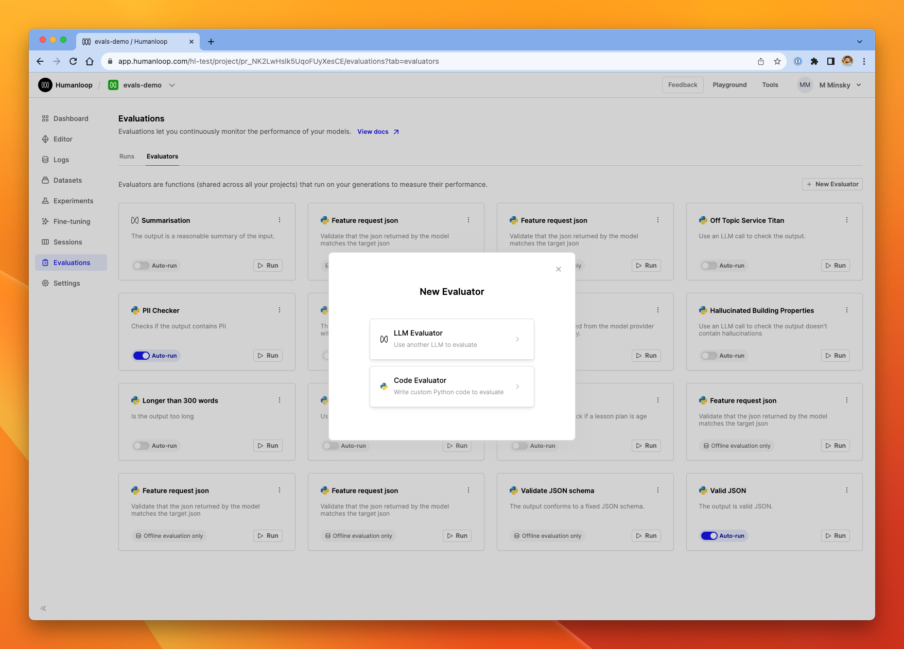
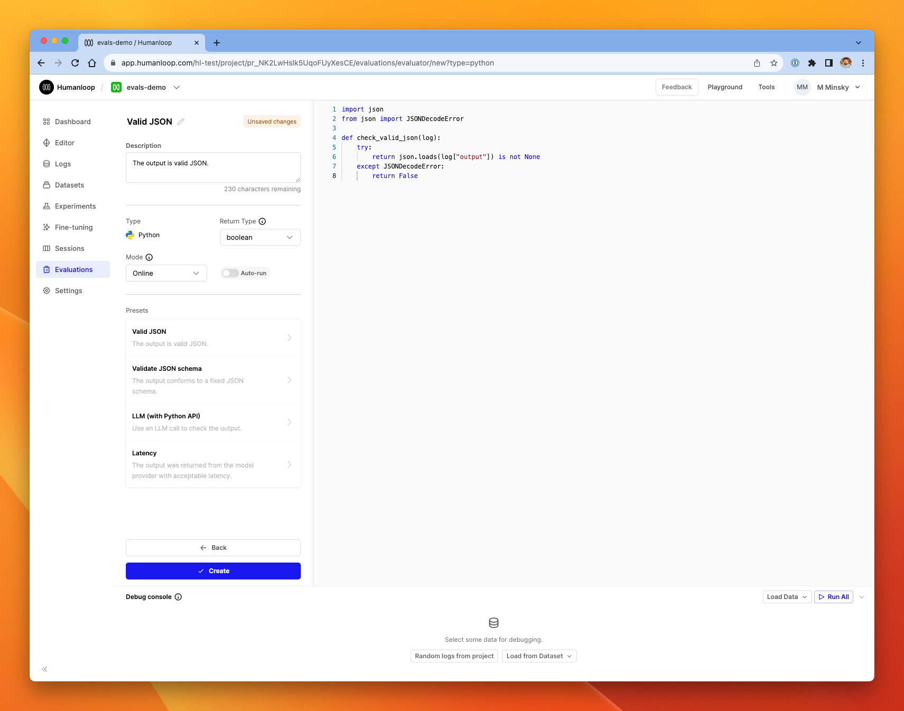
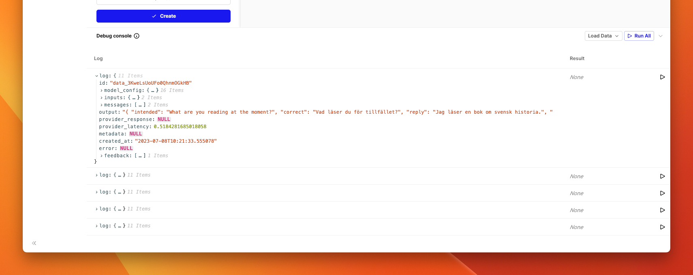
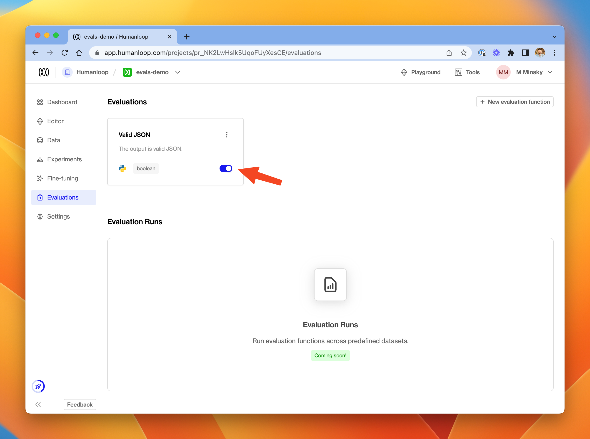
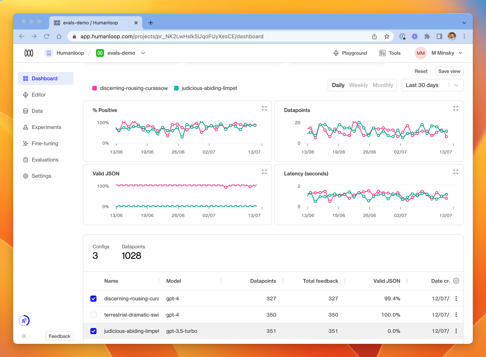

## Create an online evaluator

### Prerequisites

- You need to have access to evaluations.
- You also need to have a project created - if not, please first follow our [project creation](./create-a-prompt-in-the-ui) guides.
- Finally, you need at least a few logs in your project. Use the **Editor** to generate some logs if you don't have any yet.

To set up an online Python evaluator:

<Steps>
### Go to the **Evaluations** page in one of your projects and select the **Evaluators** tab
### Select **+ New Evaluator** and choose **Code Evaluator** in the dialog

### From the library of presets on the left-hand side, we'll choose **Valid JSON** for this guide. You'll see a pre-populated evaluator with Python code that checks the output of our model is valid JSON grammar.

### In the debug console at the bottom of the dialog, click **Random logs from project**. The console will be populated with five datapoints from your project.

### Click the **Run** button at the far right of one of the log rows. After a moment, you'll see the **Result** column populated with a `True` or `False`.

### Explore the `log` dictionary in the table to help understand what is available on the Python object passed into the evaluator.

### Click **Create** on the left side of the page.

</Steps>

## Activate an evaluator for a project

<Steps>
### On the new **Valid JSON ** evaluator in the Evaluations tab, toggle the switch to **on** - the evaluator is now activated for the current project.

### Go to the **Editor**, and generate some fresh logs with your model.

### Over in the **Logs** tab you'll see the new logs. The **Valid JSON** evaluator runs automatically on these new logs, and the results are displayed in the table.

</Steps>

## Track the performance of models

### Prerequisites

- A Humanloop project with a reasonable amount of data.
- An Evaluator activated in that project.

To track the performance of different model configs in your project:

<Steps>
  ### Go to the **Dashboard** tab. ### In the table of model configs at the
  bottom, choose a subset of the project's model configs. ### Use the graph
  controls at the top of the page to select the date range and time granularity
  of interest. ### Review the relative performance of the model configs for each
  activated Evaluator shown in the graphs.
</Steps>

## Note: Available Modules

The following Python modules are available to be imported in your code evaluators:

- `math`
- `random`
- `datetime`
- `json` (useful for validating JSON grammar as per the example above)
- `jsonschema` (useful for more fine-grained validation of JSON output - see the in-app example)
- `sqlglot` (useful for validating SQL query grammar)
- `requests` (useful to make further LLM calls as part of your evaluation - see the in-app example for a suggestion of how to get started).
