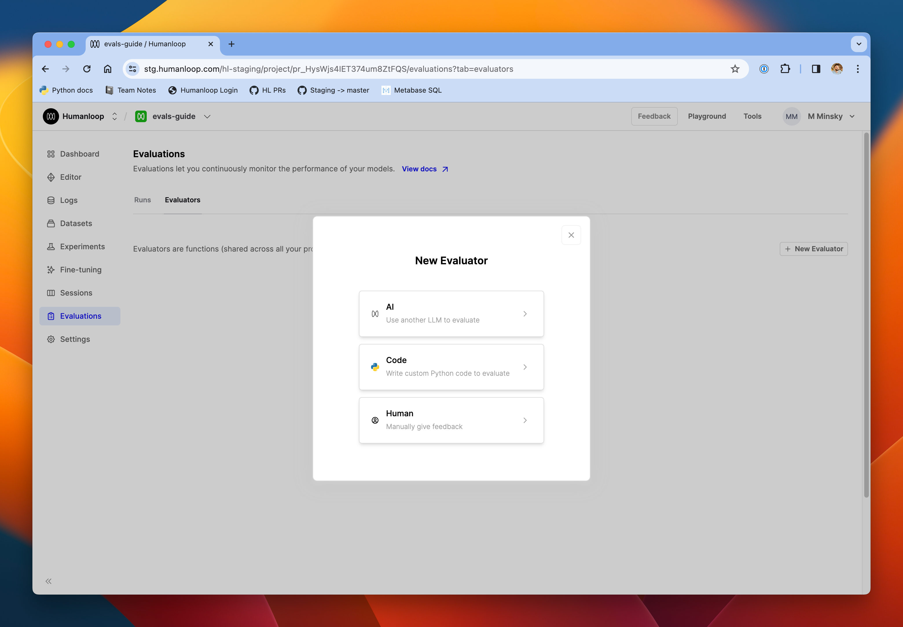
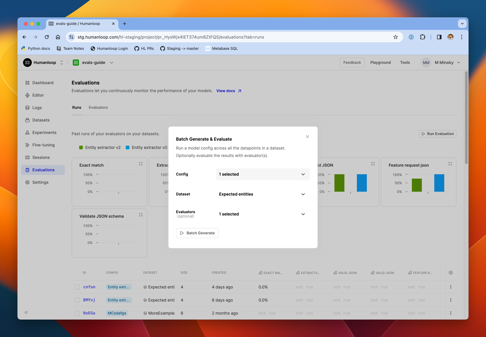
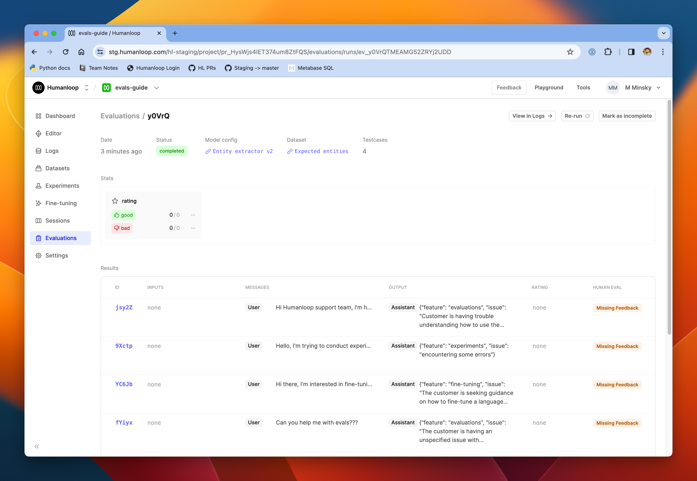
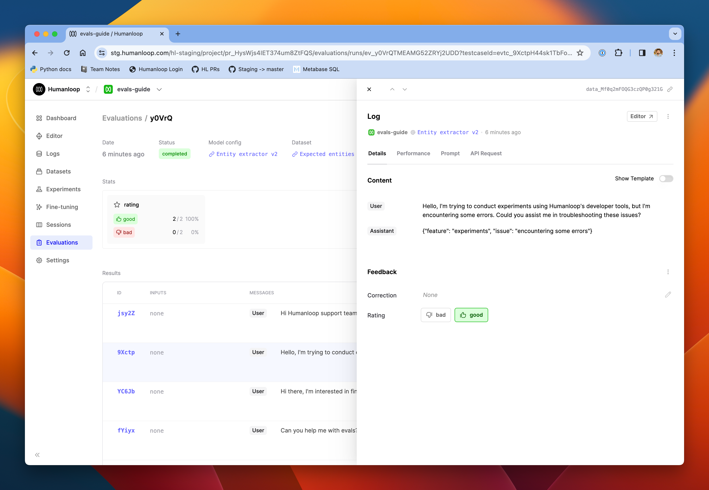

### Prerequisites

- You need to have access to evaluations.
- You also need to have a project created - if not, please first follow our [project creation](/docs/create-a-project-from-the-playground) guides.
- Finally, you need at least a few logs in your project. Use the **Editor** to generate some logs if you don't have any yet.

### Set up an evaluator to collect human feedback

<Steps>
### From the Evaluations page, click **New Evaluator** and select **Human**.

### Give the evaluator a name and description and click **Create** in the top-right.
### Return to the **Evaluations** page and select **Run Evaluation**.
### Choose the model config you are evaluating, a dataset you would like to evaluate against and then select the new Human evaluator.

### Click **Batch generate** and follow the link in the bottom-right corner to see the evaluation run.

### As the rows populate with the generated output from the model, you can review those outputs and apply feedback in the rating column. Click a row to see the full details of the Log in a drawer.
### Apply your feedback either directly in the table, or from the drawer.

### Once you've finished providing feedback for all the Logs in the run, click **Mark as complete** in the top right of the page.
### You can review the aggregated feedback results in the **Stats** section on this page.
</Steps>

### Configuring the feedback schema

If you need a more complex feedback schema, visit the **Settings** page in your project and follow the link to **Feedbacks**. Here, you can add more categories to the default feedback types. If you need more control over feedback types, you can [create new ones via the API](/api-reference/humanloop-api/projects/createfeedbacktype).