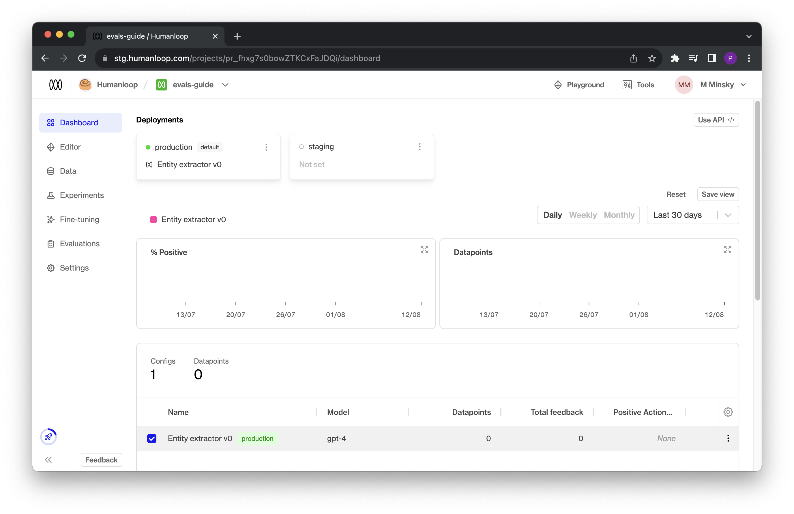
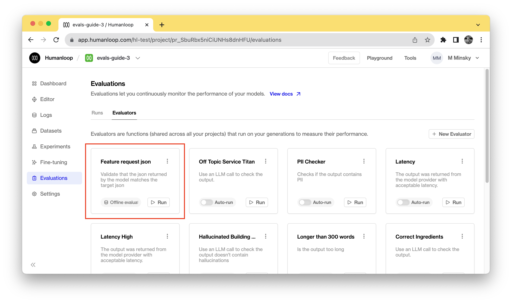
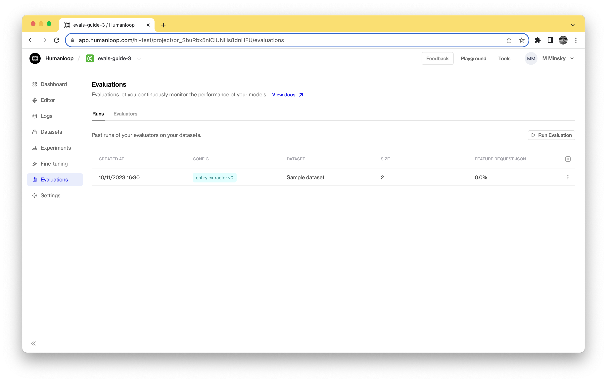

## Prerequisites:

- You need to have access to the beta preview of evaluations.

<Info title="API Options">
This guide uses our [Python SDK](/api-reference/introduction/sdks). All of the endpoints used are available in our [Typescript SDK](/api-reference/introduction/sdks) and directly [via the API](/api-reference/humanloop-api).
</Info>

### Install and initialize the SDK

First you need to install and initialize the SDK, which requires **Python 3.8 or greater.** If you have already set this up, skip to the next section. Otherwise, open up your terminal and follow these steps:

<Steps>
### Install the Humanloop Python SDK:
   <Tip> 
   We recommend pinning your installed Humanloop SDK to a specific version so that changes don't cause issues.
   </Tip>
   ```shell
   $ pip install humanloop
   ```
### Start a Python interpreter:
   ```shell
   $ python
   ```
### Test your installation by running:
   ```python
   >>> from humanloop import Humanloop
   ```
</Steps>

## Create evaluation

We'll go through how to use the SDK in a Python script to set up a project, create a testset and then finally trigger an evaluation.

### Set up a project

<Steps>
### Import Humanloop and set your [Humanloop](https://app.humanloop.com/account/api-keys) and [OpenAI API](https://platform.openai.com/account/api-keys) keys.

```python
from humanloop import Humanloop

HUMANLOOP_API_KEY = "<YOUR HUMANLOOP KEY>"
OPENAI_API_KEY = "<YOUR OPENAI KEY>"

# Initialize the Humanloop client
humanloop = Humanloop(
    api_key=HUMANLOOP_API_KEY,
    openai_api_key=OPENAI_API_KEY,
)

```

### Create a project and register your first model config - we'll use OpenAI's GPT-4 for extracting product feature names from customer queries in this example. The first model config created against the project is automatically deployed:

```python

# Create a project
project = humanloop.projects.create(name="evals-guide")
project_id = project.body["id"]

# Create the first model config for the project, which will automatically be deployed
model_config = humanloop.model_configs.register(
    project_id=project_id,
    model="gpt-4",
    name="Entity extractor v0",
    endpoint="chat",
    chat_template=[
        {
            "role": "system",
            "content": "Extract the name of the feature or issue the customer is describing. "
            "Possible features are only: evaluations, experiments, fine-tuning \n"
            "Write your response in json format as follows:"
            ' \n {"feature": "feature requested", "issue": "description of issue"}',
        }
    ],
)
config_id = model_config.body["config"]["id"]

```

If you log onto your Humanloop account you will now see your project with a single model config defined:



</Steps>

### Create a dataset

Follow the steps in our guide to [Upload a Dataset via API](/docs/create-a-dataset#upload-via-api).

<Steps>
### Now test your model manually by generating a log for one of the datapoints' messages:

```python
# Generate a log
log = humanloop.chat_deployed(
    project_id=project_id,
    messages=data[0]["messages"],
    inputs={"features": "evaluations, experiments, fine-tuning"},
).body["data"][0]

import json
print(json.dumps(log))
```

You can see from the `output` field in the response that the model has done a good job at extracting the mentioned features in the desired json format:

```json
{
    "id": "data_aVUA2QZPHaQTnhoOCG7yS",
    "model_config_id": "config_RbbfjXOkEnzYK6PS8cS96",
    "messages": [
        {
            "role": "system",
            "content": "Extract the name of the feature or issue the customer is describing. Possible features are only: evaluations, experiments, fine-tuning \nWrite your response in json format as follows: \n {\"feature\": \"feature requested\", \"issue\": \"description of issue\"}",
        },
        {
            "role": "user",
            "content": "Hi Humanloop support team, I'm having trouble understanding how to use the evaluations feature in your software. Can you provide a step-by-step guide or any resources to help me get started?",
        }
    ],
    "output": "{\"feature\": \"evaluations\", \"issue\": \"trouble understanding how to use the evaluations feature\"}",
		"finish_reason": "stop"
}
```
</Steps>

### Create an evaluator

Now that you have a project with a model config and a dataset defined, you can create an evaluator that will determine the success criteria for a log generated from the model using the target defined in the test datapoint.

<Steps>
### Create an evaluator to determine if the extracted JSON is correct and test it against the generated log and the corresponding test datapoint:

```python
# Define an evaluator
import json
from json import JSONDecodeError


def check_feature_json(datapoint, testcase):
    expected_feature = testcase["target"]["feature"]
    
    try:
        # The model is expected to produce valid JSON output but it could fail to do so.
        output = json.loads(datapoint["output"])
        actual_feature = output.get("feature", None)
        return expected_feature == actual_feature
    except JSONDecodeError:
        # If the model didn't even produce valid JSON, then it fails
        return False

# Try out the evalutor
print(f"Test case result: {check_feature_json(datapoint, data[0])}")

```

```shell
Test case result: True
```

### Submit this evaluator to Humanloop so it can be used for future evaluations triggered via the UI or the API:

```python
import inspect

# The evaluator must be sent as a string, so we convert it first
json_imports = "import json\nfrom json import JSONDecodeError\n"
evaluator_code = json_imports + inspect.getsource(check_feature_json)

# Send evaluator to Humanloop
evaluator = humanloop.evaluators.create(
    name="Feature request json",
    description="Validate that the json returned by the model matches the target json",
    code=evaluator_code,
    arguments_type="target_required",
    return_type="boolean",
)
evaluator_id = evaluator.body["id"]
```

In your Humanloop project you will now see an evaluator defined:



</Steps>

### Launch an evaluation

<Steps>
### You can now launch an evaluation against the model config using the dataset and evaluator. In practise you can include more than one evaluator:

```python
# Finally trigger an evaluation
evaluation = humanloop.evaluations.create(
    project_id=project_id,
    evaluator_ids=[evaluator_id],
    config_id=config_id,
    dataset_id=dataset_id,
)
```

Navigate to your Humanloop account to see the evaluation results. Initially it will be in a pending state, but will quickly move to completed given the small number of test cases. The datapoints generated by your model as part of the evaluation will also be recorded in your project's logs table.



</Steps>

## Create evaluation - full script

Here is the full script you can copy and paste and run in your Python environment:

```python
from humanloop import Humanloop
import inspect
import json
from json import JSONDecodeError


HUMANLOOP_API_KEY = "<YOUR HUMANLOOP API KEY>"
OPENAI_API_KEY = "<YOUR OPENAI API KEY>"

# Initialize the Humanloop client
humanloop = Humanloop(
    api_key=HUMANLOOP_API_KEY,
    openai_api_key=OPENAI_API_KEY,
)

# Create a project
project = humanloop.projects.create(name="evals-guide")
project_id = project.body["id"]

# Create the first model config for the project, which will automatically be deployed
model_config = humanloop.model_configs.register(
    project_id=project_id,
    model="gpt-4",
    name="Entity extractor v0",
    chat_template=[
        {
            "role": "system",
            "content": "Extract the name of the feature or issue the customer is describing. "
            "Possible features are only: evaluations, experiments, fine-tuning \n"
            "Write your response in json format as follows:"
            ' \n {"feature": "feature requested", "issue": "description of issue"}',
        }
    ],
    endpoint="chat",
    temperature=0.5,
)
config_id = model_config.body["config"]["id"]

# Example test case data
data = [
    {
        "messages": [
            {
                "role": "user",
                "content": "Hi Humanloop support team, I'm having trouble understanding how to use the evaluations feature in your software. Can you provide a step-by-step guide or any resources to help me get started?",
            }
        ],
        "target": {"feature": "evaluations", "issue": "needs step-by-step guide"},
    },
    {
        "messages": [
            {
                "role": "user",
                "content": "Hi there, I'm interested in fine-tuning a language model using your software. Can you explain the process and provide any best practices or guidelines?",
            }
        ],
        "target": {
            "feature": "fine-tuning",
            "issue": "process explanation and best practices",
        },
    },
]

# Create a dataset
dataset = humanloop.datasets.create(
    project_id=project_id,
    name="Target feature requests",
    description="Target feature request json extractions",
)
dataset_id = dataset.body["id"]

# Create test datapoints for the dataset
datapoints = humanloop.datasets.create_datapoint(
    dataset_id=dataset_id,
    body=data,
)

# Generate a log
log = humanloop.chat_deployed(
    project_id=project_id,
    messages=data[0]["messages"],
).body["data"][0]


# Define an evaluator

def check_feature_json(log, testcase):
    expected_feature = testcase["target"]["feature"]

    try:
        # The model is expected to produce valid JSON output but it could fail to do so.
        output = json.loads(log["output"])
        actual_feature = output.get("feature", None)
        return expected_feature == actual_feature

    except JSONDecodeError:
        # If the model didn't even produce valid JSON, then it fails
        return False


# Try out the evalutor
print(f"Test case result: {check_feature_json(log, data[0])}")

# The evaluator must be sent as a string, so we convert it first
json_imports = "import json\nfrom json import JSONDecodeError\n"
evaluator_code = json_imports + inspect.getsource(check_feature_json)

# Send evaluator to Humanloop
evaluator = humanloop.evaluators.create(
    name="Feature request json",
    description="Validate that the json returned by the model matches the target json",
    code=evaluator_code,
    arguments_type="target_required",
    return_type="boolean",
)
evaluator_id = evaluator.body["id"]

# Finally trigger an evaluation
evaluation = humanloop.evaluations.create(
    project_id=project_id,
    evaluator_ids=[evaluator_id],
    config_id=config_id,
    dataset_id=dataset_id,
)

# Now navigate to your project's evaluations tab on humanloop to inspect the results
```