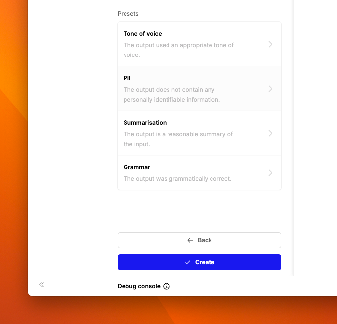
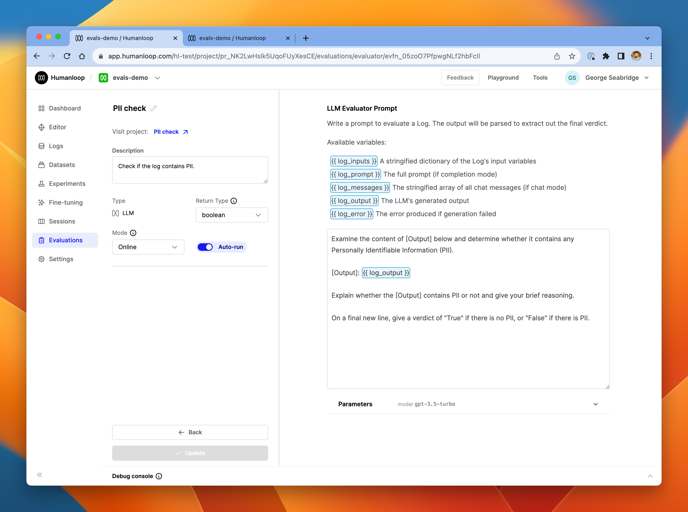
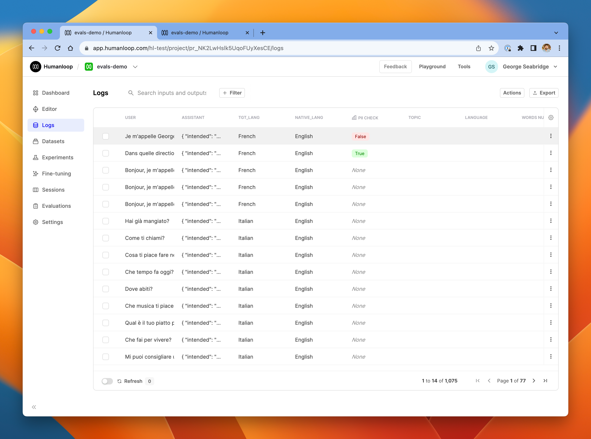
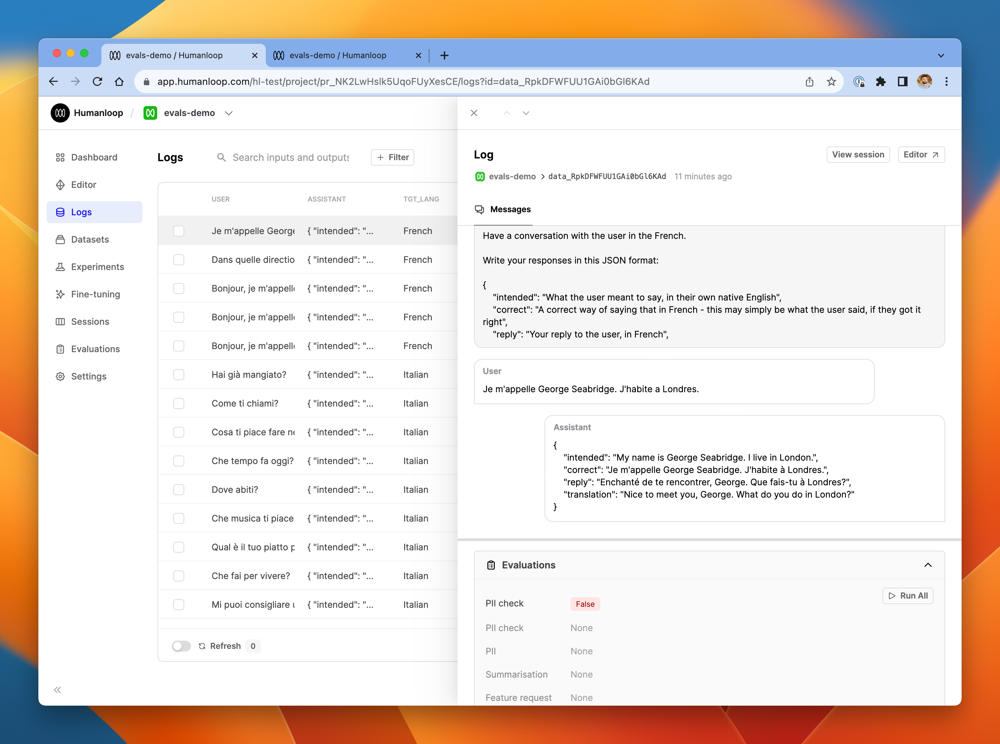
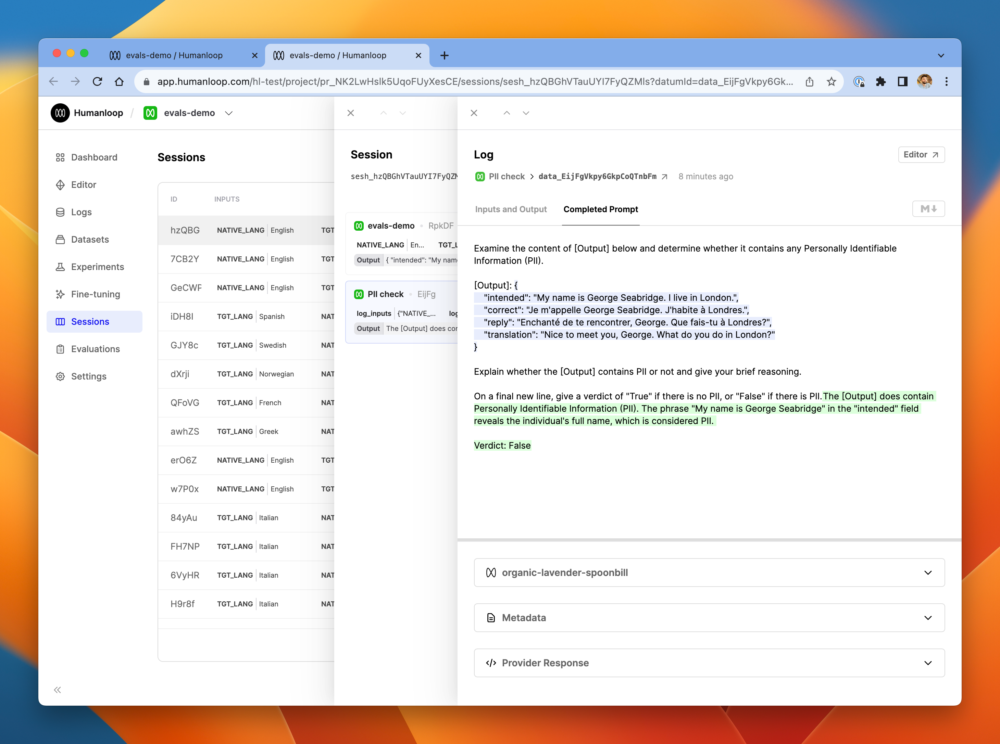

As well as using Python code to evaluate logs, you can also create special-purpose prompts for LLMs to evaluate logs too.

In this guide, we'll show how to set up LLM evaluations.

### Prerequisites

- You need to have access to evaluations.
- You also need to have a project created - if not, please first follow our [project creation](./create-a-prompt-in-the-ui) guides.
- Finally, you need at least a few logs in your project. Use the **Editor** to generate some logs if you don't have any yet.

### Set up an LLM evaluator

<Steps>
### From the Evaluations page, click **New Evaluator** and select AI.


### From the presets menu on the left-hand side of the page, select **PII**.



### Set the evaluator to **Online** mode, and toggle **Auto-run** to on. This will make the PII checker run on all new logs in the project.



### Click **Create** in the bottom left of the page.

### Go to Editor and try generating a couple of logs, some containing PII and some without.

### Go to the Logs table to review these logs.



### Click one of the logs to see more details in the drawer.

In our example below, you can see that the the log did contain PII, and the **PII check** evaluator has correctly identified this and flagged it with **False**.



### Click **View session** at the top of log drawer to inspect in more detail the LLM evaluator's generation itself.

### Select the **PII check** entry in the session trace

In the **Completed Prompt** tab of the log, you'll see the full input and output of the LLM evaluator generation.



</Steps>

### Available variables

In the prompt editor for an LLM evaluator, you have access to the underlying log you are evaluating as well as the testcase that gave rise to it in the case of offline evaluations. These are accessed with the standard `{{ variable }}` syntax, enhanced with a familiar dot notation to pick out specific values from inside the `log` and `testcase` objects. The `log` and `testcase` shown in the debug console correspond to the objects available in the context of the LLM evaluator prompt.

For example, suppose you are evaluating a log object like this.

```Text JSON
{
    "id": "data_B3RmIu9aA5FibdtXP7CkO",
    "model_config": {...},
    "inputs": {
    	"hello": "world",
    },
    "messages": []
    "output": "This is what the AI responded with.",
    ...etc
}
```

In the LLM evaluator prompt, if you write `{{ log.inputs.hello }}` it will be replaced with `world` in the final prompt sent to the LLM evaluator model.

Note that in order to get access to the fully populated prompt that was sent in the underlying log, you can use `{{ log_prompt }}`.
