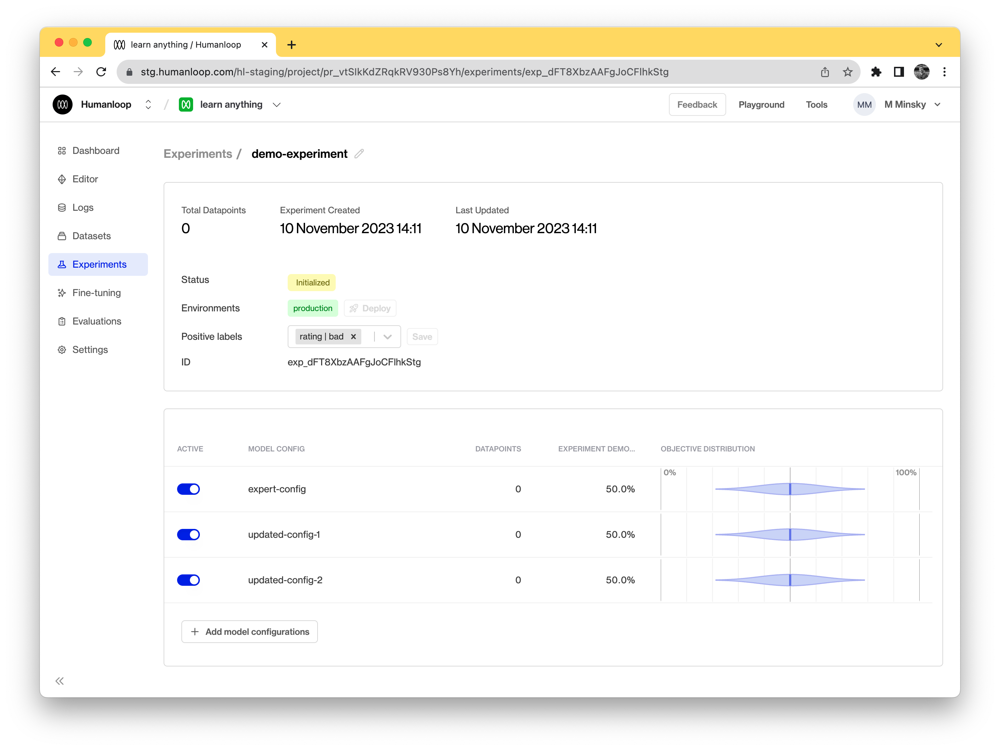

Experiments allow you to set up A/B test between multiple different [Prompts](/docs/prompts).

Experiments can be used to compare different prompt templates, different parameter combinations (such as temperature and presence penalties) and even different base models.

This enables you to try out alternative prompts or models and use the feedback from your users to determine which works better.

