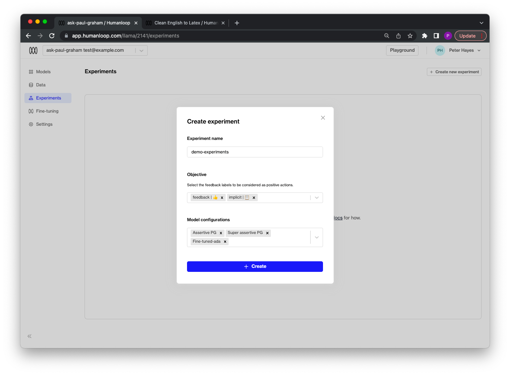
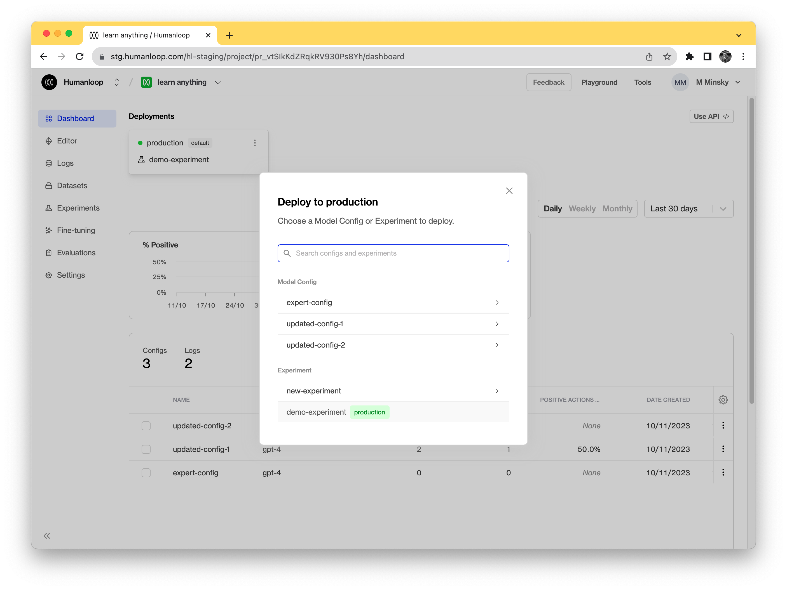
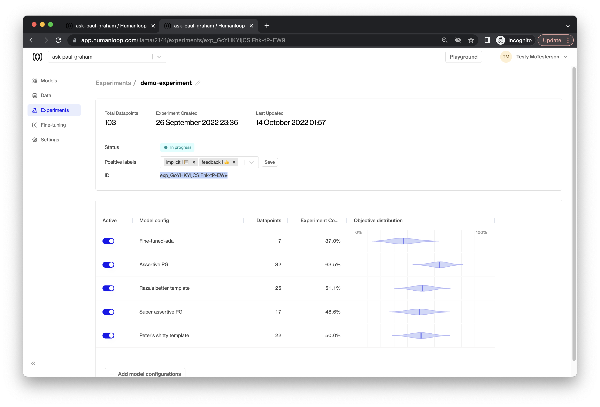

Experiments can be used to compare different prompt templates, different parameter combinations (such as temperature and presence penalties) and even different base models.

**This guide focuses on the case where you wish to manage your own model provider calls.**

## Prerequisites

- You already have a Prompt — if not, please follow our [Prompt creation](/docs/guides/create-prompt) guide first.
- You have integrated `humanloop.complete_deployed()` or the `humanloop.chat_deployed()` endpoints, along with the `humanloop.feedback()` with the [API](https://www.postman.com/humanloop/workspace/humanloop) or [Python SDK](./generate-and-log-with-the-sdk).

<Info>
This guide assumes you're are using an OpenAI model. If you want to use other providers or your own model please also look at the [guide for running an experiment with your own model provider](./use-your-own-model-provider).

**Support for other model providers on Humanloop is coming soon.**

</Info>

## Create an experiment

<Steps>
  ### Navigate to the **Experiments** tab of your project. ### Click the
  **Create new experiment** button: 1. Give your experiment a descriptive name.
  2. Select a list of feedback labels to be considered as positive actions -
  this will be used to calculate the performance of each of your model configs
  during the experiment. 3. Select which of your project’s model configs you
  wish to compare. Then click the **Create** button.
  
</Steps>

## Log to your experiment

In order to log data for your experiment without using `humanloop.complete_deployed()` or `humanloop.chat_deployed()`, you must first determine which model config to use for your LLM provider calls. This is where the `humanloop.experiments.get_model_config()` function comes in.

<Steps>

### Go to your Prompt dashboard

### Set the experiment as the active deployment.

To do so, find the **default** environment in the Deployments bar. Click the dropdown menu from the default environment and from those options select **Change deployment**. In the dialog that opens select the experiment you created.



### Copy your `project_id`

From the URL, `https://app.humanloop.com/projects/<project_id>/dashboard`. The project ID starts with `pr_`.

### Alter your existing logging code

To now first sample a model_config from your experiment to use when making your call to OpenAI:

```python
from humanloop import Humanloop
import openai

# Initialize the SDK with your Humanloop API key
humanloop = Humanloop(api_key="<YOUR Humanloop API KEY>")

# Sample a model_config from your experiment.
model_config_response = humanloop.projects.get_active_config(id=project_id)
model_config = model_config_response.config

# Make a generation using OpenAI using the parameters from the sampled model_config.
response = openai.Completion.create(
    prompt="Answer the following question like Paul Graham from YCombinator:\n"
    "How should I think about competition for my startup?",
    model=model_config["model"],
    temperature=model_config["temperature"],
)

# Parse the output from the OpenAI response.
output = response.choices[0].text

# Log the inputs and outputs to the experiment trial associated to the sampled model_config.
log_response = humanloop.log(
    project_id=project_id,
    inputs={"question": "How should I think about competition for my startup?"},
    output=output,
    trial_id=model_config["trial_id"],
)

# Use this ID to associate feedback received later to this log.
data_id = log_response.id
```

</Steps>

You can also run multiple experiments within a single project. In this case, first navigate to the **Experiments** tab of your project and select your **Experiment card**. Then, retrieve your `experiment_id` from the experiment summary:



Then, retrieve your model config from your experiment by calling `humanloop.experiments.sample(experiment_id=experiment_id)`.
