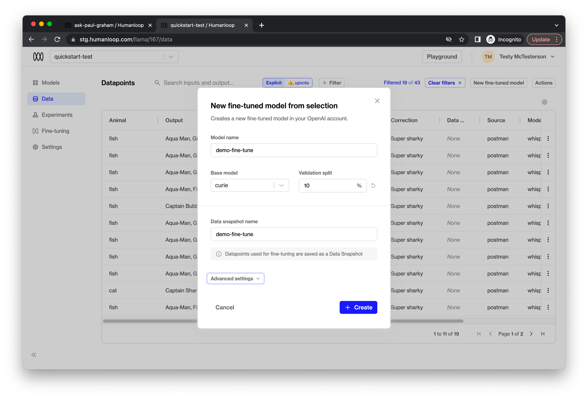

<Markdown src="../../snippets/paid-feature.mdx" />

## Prerequisites

- You already have a Prompt — if not, please first follow our [Prompt creation](./create-a-prompt) guide.
- You have integrated `humanloop.complete_deployed()` or the `humanloop.chat_deployed()` endpoints, along with the `humanloop.feedback()` with the [API](https://www.postman.com/humanloop/workspace/humanloop) or [Python SDK](./generate-and-log-with-the-sdk).

<Note>
  A common question is how much data do I need to fine-tune effectively? Here we
  can reference the [OpenAI
  guidelines](https://beta.openai.com/docs/guides/fine-tuning): > _The more
  training examples you have, the better. We recommend having at least a couple
  hundred examples. In general, we've found that each doubling of the dataset
  size leads to a linear increase in model quality._
</Note>

## Fine-tuning

The first part of fine-tuning is to select the data you wish to fine-tune on.

<Steps>
### Go to your Humanloop project and navigate to **Logs** tab.
### Create a **filter** 
Using the **+ Filter** button above the table of the logs you would like to fine-tune on.

For example, all the logs that have received a positive upvote in the feedback captured from your end users.

### Click the **Actions** button, then click the **New fine-tuned model** button to set up the finetuning process.

### Enter the appropriate parameters for the fine-tuned model.

1.  Enter a **Model** name. This will be used as the suffix parameter in OpenAI’s fine-tune interface. For example, a suffix of "custom-model-name" would produce a model name like `ada:ft-your-org:custom-model-name-2022-02-15-04-21-04`.
2.  Choose the **Base model** to fine-tune. This can be `ada`, `babbage`, `curie`, or `davinci`.
3.  Select a **Validation split** percentage. This is the proportion of data that will be used for validation. Metrics will be periodically calculated against the validation data during training.
4.  Enter a **Data snapshot name**. Humanloop associates a data snapshot to every fine-tuned model instance so it is easy to keep track of what data is used (you can see yourexisting data snapshots on the **Settings/Data snapshots** page)

### Click **Create**

The fine-tuning process runs asynchronously and may take up to a couple of hours to complete depending on your data snapshot size.

### See the progress

Navigate to the **Fine-tuning** tab to see the progress of the fine-tuning process.

Coming soon - notifications for when your fine-tuning jobs have completed.

### When the **Status** of the fine-tuned model is marked as **Successful**, the model is ready to use.

</Steps>

🎉 You can now include this fine-tuned model in a new model config for your project to evaluate its performance. You can use the Playground or SDK in order to achieve this.
