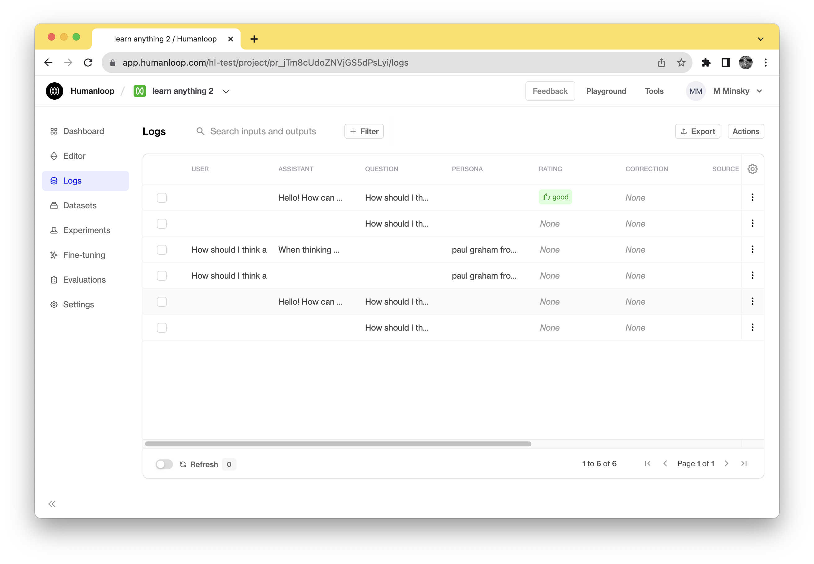
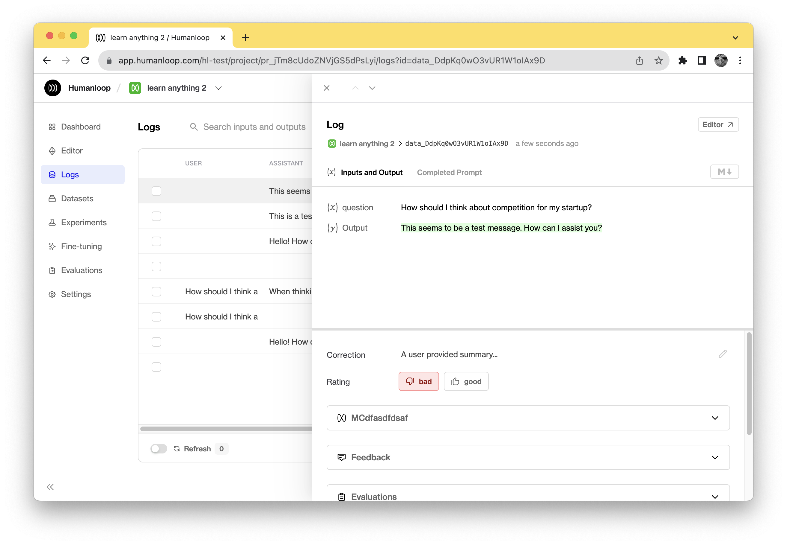

This guide shows how to use the Humanloop SDK to record user feedback on datapoints. This works equivalently for both the completion and chat APIs.

## Prerequisites

1. Already have a project created - if not, please pause and first follow our [project creation](../create-project/from-playground) guides.
2. Already have integrated `humanloop.chat()` or `humanloop.complete()` to log generations with the Python or TypeScript SDKs. If not, follow our [guide to integrating the SDK](./overview).

## Record feedback with the datapoint ID

1. Extract the data ID from the `humanloop.complete_deployed()` response.

   ```python
   complete_response = humanloop.complete_deployed(  
       project="<YOUR UNIQUE PROJECT NAME>",  
       inputs={"question": "How should I think about competition for my startup?"},
   )

   data_id = completion.body["data"][0]["id"]
   ```

2. Call `humanloop.feedback()` referencing the saved datapoint ID to record user feedback.  
   You can also include the source of the feedback when recording it.

   ```
   # You can capture a single piece feedback
   humanloop.feedback(data_id=data_id, type="rating", value="good")

   # And you can associate the feedback to a specific user.
   humanloop.feedback(data_id=data_id, type="rating", value="good", user="user_123456")
   ```

The feedback recorded for each datapoint can be viewed in the **Logs** tab of your project.



Different use cases and user interfaces may require different kinds of feedback that need to be mapped to the appropriate end user interaction. There are broadly 3 important kinds of feedback:

1. **Explicit feedback**: these are purposeful actions to review the generations. For example, ‘thumbs up/down’ button presses.
2. **Implicit feedback**: indirect actions taken by your users may signal whether the generation was good or bad, for example, whether the user ‘copied’ the generation, ‘saved it’ or ‘dismissed it’ (which is negative feedback).
3. **Free-form feedback**: Corrections and explanations provided by the end-user on the generation.

## Recording corrections as feedback

It can also be useful to allow your users to correct the outputs of your model. This is strong feedback signal and can also be considered as ground truth data for finetuning later.

```python
# You can capture text based feedback to record corrections
humanloop.feedback(data_id=data_id, type="correction", value="A user provided completion...")

# And also include this as part of an array of feedback for a logged datapoint
humanloop.feedback([
    {"data_id": data_id, "type": "rating", "value": "bad"},
    {"data_id": data_id, "type": "correction", "value": "A user provided summary..."},
])
```



This feedback will also show up within Humanloop, where your internal users can also provide feedback and corrections on logged data to help with evaluation.