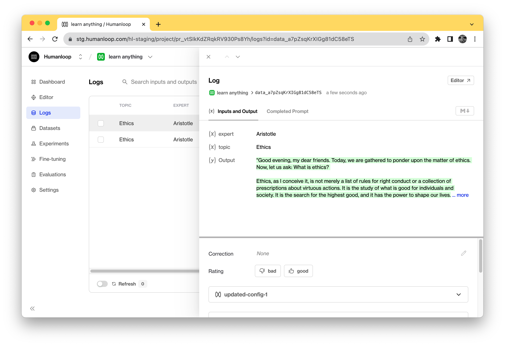

A **log** is a generation from the AI model. It contains the inputs and the output as well as metadata such as which model configuration was used and any associated feedback.

There are two types of log on Humanloop - a **completion** and a **chat**, generated by the `/completion` and the `/chat` API endpoint variants respectively. 

The guides in this section instruct how to create datapoints for your projects on Humanloop. Once this is setup, you can begin to use Humanloop to evaluate and improve your LLM apps.

