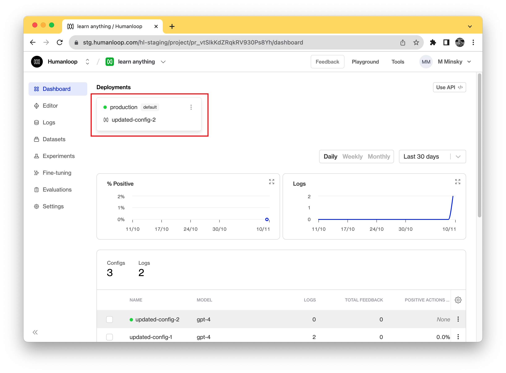

The Humanloop Python SDK allows you to easily replace your `openai.ChatCompletions.create()` calls with a `humanloop.chat()` call that, in addition to calling OpenAI to get a response, automatically logs the data to your Humanloop project.

## Prerequisites

1. You already have a project created - if not, please pause and first follow our [project creation](../create-project/from-playground) guides.

<Info>
This guide assumes you're using an OpenAI model. If you want to use other providers or your own model please also look at our [guide to using your own model](./use-model).
</Info>

## Install and initialize the SDK

<Info>
The SDK requires Python 3.8 or greater.
</Info>

First you need to install and initialize the SDK. If you have already done this, skip to the next section. Otherwise, open up your terminal and follow these steps:

1. Install the Humanloop Python SDK:
   <Tip>
   We recommend pinning your installed Humanloop SDK to a specific version as our API is still currently evolving.

   You will be kept informed of the changes as we make them, and we do support older versions to accommodate a transition period.
   </Tip>
   ```shell
   $ pip install humanloop
   ```
2. Start a Python interpreter:
   ```shell
   $ python
   ```
3. Test your installation by running:
   ```python
   >>> from humanloop import Humanloop
   ```

## Activate a model

1. Log in to Humanloop and navigate to the **Models** tab of your project.
2. Ensure that the default environment is in green at the top of the dashboard, the default environment is mapped to your active deployment. If there is no active deployment set, then use the dropdown button for the default environment and select the **Change deployment** option to select one of your existing model configs to use to generate. You also need to confirm the model you config you have deployed is a Chat model. This can be confirmed by clicking on the config in the table and viewing the Endpoint, making sure it says **Chat**.  
   

## Use the SDK to call your model

Now you can use the SDK to generate completions and log the results to your project. The following code demonstrates how:

```python
from humanloop import Humanloop

# You need to initialize the Humanloop SDK with your API Keys
humanloop = Humanloop(api_key="<YOUR Humanloop API KEY>")

# humanloop.chat_deployed(...) will call the active model config on your project.
# The inputs must match the input of the chat template in your project.
chat_response = humanloop.chat_deployed(
    project="<YOUR UNIQUE PROJECT NAME>",
  	 # inputs required by your chat_template - for example your templated system message.
    inputs={"persona": "paul graham from YC"},
  	messages=[
    	  {"role": "user", "content": "How should I think about competition for my startup?"}
    ]
) 

# A single call to chat may return multiple outputs.
data_id = chat_response.body["data"][0]["id"]
output = chat_response.body["data"][0]["output"]

# You can also access the raw response from OpenAI.
print(chat_response.body["provider_responses"])
```

Navigate to your project's **Logs** tab in the browser to see the recorded inputs, messages and responses of your chat.

🎉  Now that you have chat messages flowing through your project you can start to log your end user feedback to evaluate and improve your models.