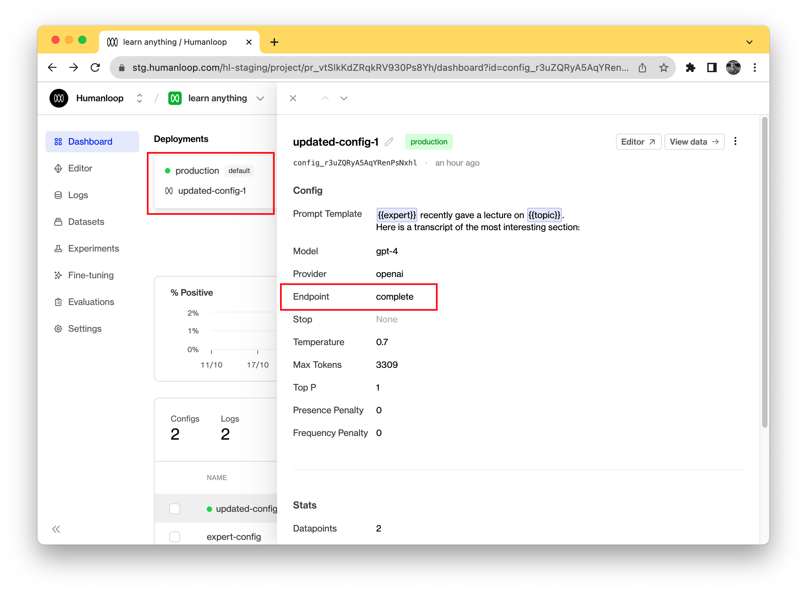

The Humanloop Python SDK allows you to easily replace your `openai.Completions.create()` calls with a `humanloop.complete()` call that, in addition to calling OpenAI to get a generation, automatically logs the data to your Humanloop project.

## Prerequisites

- You already have a Prompt — if not, please follow our [Prompt creation](/docs/guides/create-prompt) guide first.

<Info>
This guide assumes you're using an OpenAI model. If you want to use other providers or your own model please also look at our [guide to using your own model](./use-your-own-model-provider).
</Info>

<Markdown src="../../../snippets/setup-sdk.mdx" />

## Activate a model

1. Log in to Humanloop and navigate to the **Dashboard** tab of your project.
2. Ensure that the default environment is in green at the top of the dashboard, the default environment is mapped to your active deployment. If there is no active deployment set, then use the dropdown button for the default environment and select the **Change deployment** option to select one of your existing model configs to use to generate. You also need to confirm the model you config you have deployed is a Completion model. This can be confirmed by clicking on the config in the table and viewing the Endpoint, making sure it says **Complete**.
   

## Use the SDK to call your model

Now you can use the SDK to generate completions and log the results to your project.

```python
# humanloop.complete_deployed(...) will call the active model config on your project.
# The inputs must match the input of the prompt template in your project.
complete_response = humanloop.complete_deployed(
    project="<YOUR UNIQUE PROJECT NAME>", # change the project name to your project
    inputs={"question": "How should I think about competition for my startup?"},
)

# A single call to generate may return multiple outputs.
data_id = complete_response.data[0].id
output = complete_response.data[0].output

# You can also access the raw response from OpenAI.
print(complete_response.provider_responses)
```

Navigate to your project's **Logs** tab in the browser to see the recorded inputs and outputs of your generation.

🎉 Now that you have generations flowing through your project you can start to log your end user feedback to evaluate and improve your models.
