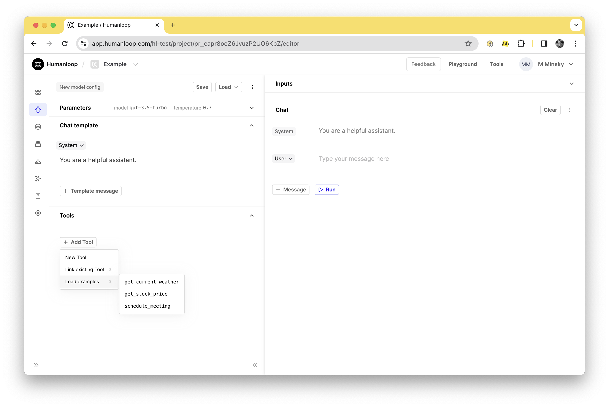
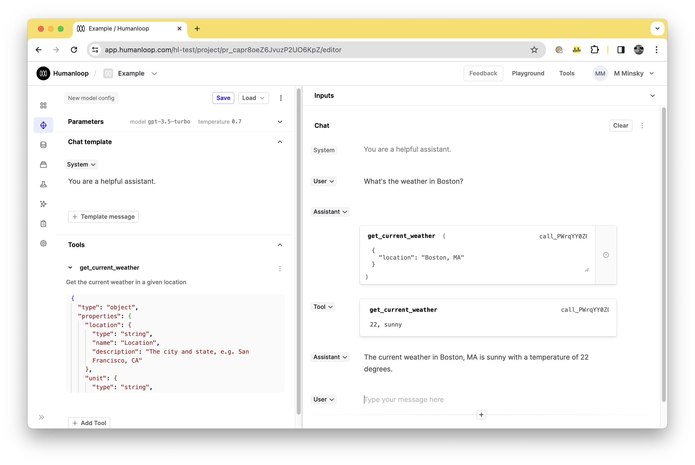

Humanloop's Editor supports the usage of [OpenAI function calling](https://platform.openai.com/docs/guides/function-calling/function-calling), which we refer to as JSON Schema tools. JSON Schema tools follow the universal [JSON Schema syntax](https://json-schema.org/) definition, similar to OpenAI function calling. You can define inline JSON Schema tools as part of your model configuration in the editor. These tools allow you to define a structure for OpenAI to follow when responding. In this guide, we'll walk through the process of using tools in the editor to interact with `gpt-4`.

---

## Create a Tool

### Prerequisites

- A Humanloop account - you can create one by going to our sign up page.
- You already have a project created - if not, please pause and first follow our [project creation](/docs/create-a-prompt-in-the-ui) guides.

<Info title="Models supporting OpenAI Functions"> 
The current OpenAI list of supported models is:

- `gpt-4o`
- `gpt-4`
- `gpt-4-1106-preview`
- `gpt-4-0613`
- `gpt-3.5-turbo`
- `gpt-3.5-turbo-1106`
- `gpt-3.5-turbo-0613`

</Info>

To create and use a tool follow the following steps:

<Steps>
### **Open the editor**
Start by opening the Humanloop Editor in your web browser. You can access this directly from your Humanloop account dashboard.

### **Select the model**

In the editor, you'll see an option to select the model. Choose `gpt-4` from the dropdown list.

### **Define the tool**

To define a tool, you'll need to use the universal [JSON Schema syntax](https://json-schema.org/) syntax. For the purpose of this guide, let's select one of our preloaded example tools `get_current_weather`. In practice this would correspond to a function you have defined locally, in your own code, and you are defining the parameters and structure that you want OpenAI to respond with to integrate with that function.



### **Input user text**

Let's input some user text relevant to our tool to trigger OpenAI to respond with the corresponding parameters. Since we're using a weather-related tool, type in: `What's the weather in Boston?`.

<Tip title="Function calling responds relative to the user input">

It should be noted that a user can ask a non-weather related question such as '_how are you today?_ ' and it likely wouldn't trigger the model to respond in a format relative to the tool.

</Tip>

### **Check assistant response**: If correctly set up, the assistant should respond with a prompt to invoke the tool, including the name of the tool and the data it requires. For our `get_current_weather` tool, it might respond with the relevant tool name as well as the fields you requested, such as:

```
get_current_weather

{
  "location": "Boston"
}
```

### **Input tool parameters**: The response can be used locally or for prototyping you can pass in any relevant values. In the case of our `get_current_weather` tool, we might respond with parameters such as temperature (e.g., 22) and weather condition (e.g., sunny). To do this, in the tool response add the parameters in the in the format `{ "temperature": 22, "condition": "sunny" }`. To note, the response format is also flexible, inputting `22, sunny` likely also works and might help you iterate more quickly in your experimentation.

### **Submit tool response**: After defining the parameters, click on the 'Run' button to send the Tool message to OpenAI.

### **Review assistant response**: The assistant should now respond using your parameters. For example, it might say: `The current weather in Boston is sunny with a temperature of 22 degrees.`



### **Save the model config** If you are happy with your tool, you can save the model config. The tool will be saved on that model config and can be used again in the future by loading the model config again in the editor or by calling the model config via our SDK.

</Steps>
