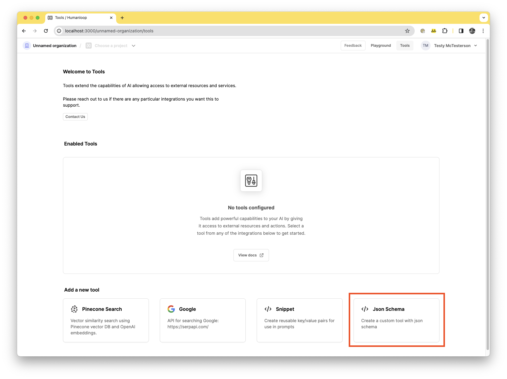
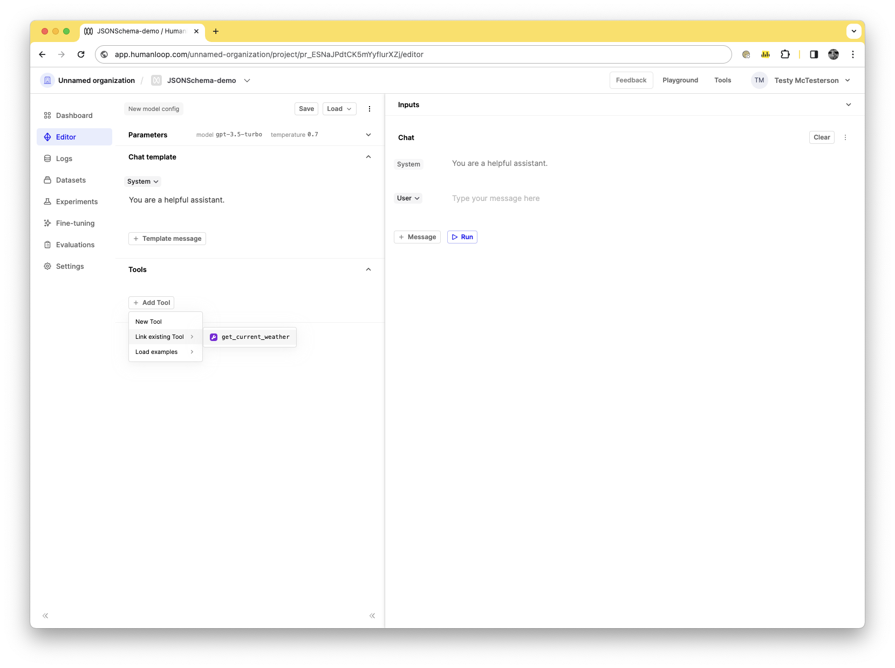
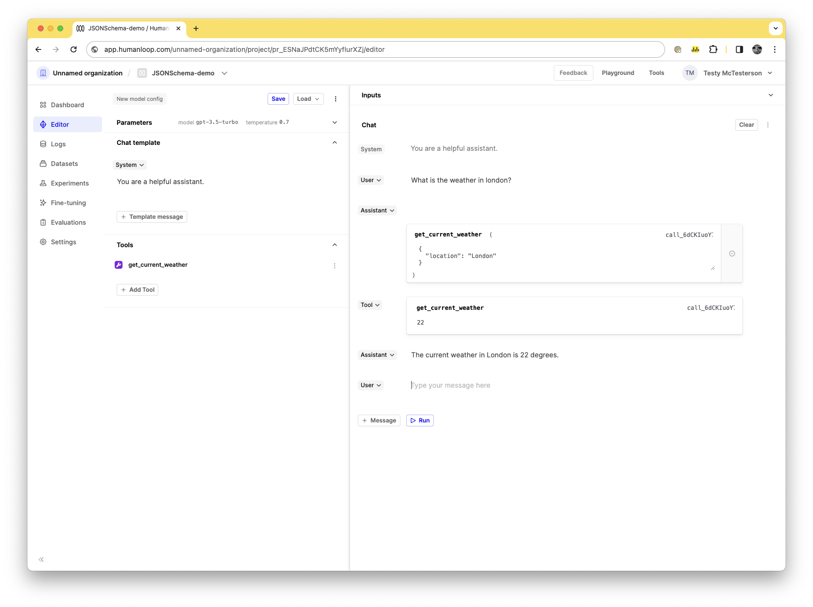
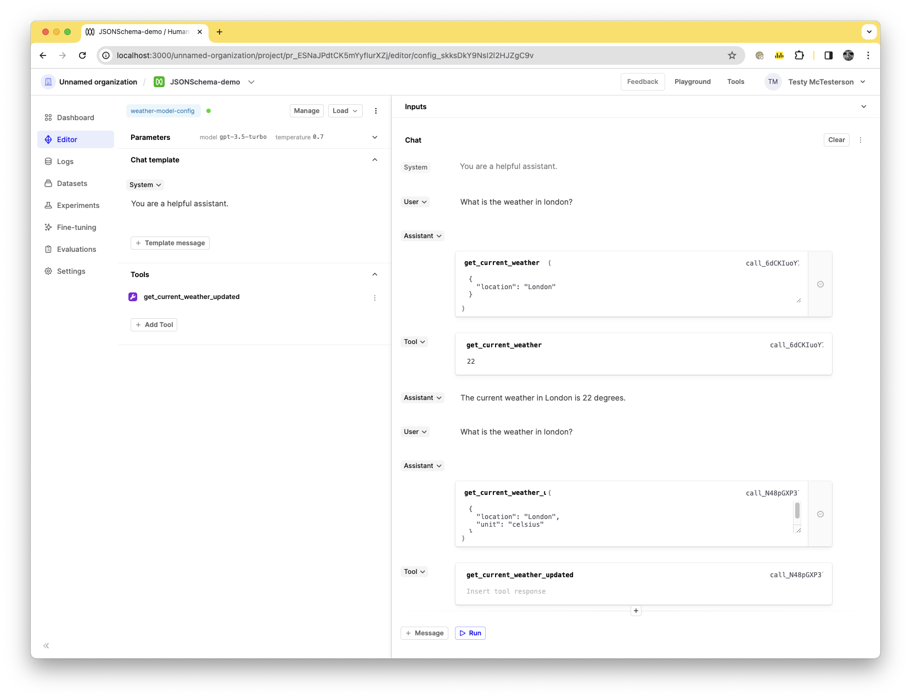

It's possible to manage tool definitions globally for your organization and re-use them across multiple projects by linking them to your model configs. You can achieve this tool re-use by first defining an instance of a `JSON Schema` tool in your global `Tools` tab. Here you can define a tool once, such as `get_current_weather(location: string, unit: 'celsius' | 'fahrenheit')`, and then link that to as many model configs as you need within the Editor as shown below.

Importantly, updates to the `get_current_weather` `JSON Schema` tool defined here will then propagate automatically to all the model configs you've linked it to, without having to publish new versions of the prompt.

## Creating and linking a JSON Schema Tool

### Prerequisites

- A Humanloop account - you can create one by going to our sign up page.
- Be on a paid plan - your organization has been upgraded from the Free tier.
- You already have a Prompt — if not, please first follow our [Prompt creation](./create-a-prompt) guide.

<Warning title="Paid Feature">
  The Snippet tool is not available for the Free tier. Please contact us if you
  wish to learn more about our [Enterprise plan](https://humanloop.com/pricing)
</Warning>

To create a JSON Schema tool that can be reusable across your organization, follow the following steps:

<Steps>
### Navigate to the [tools tab](https://app.humanloop.com/hl-test/tools) in your organisation and select the **Json Schema** tool card.



### With the dialog open, define your tool with `name`, `description`, and `parameters` values. Our guide for using [OpenAI Function Calling in the playground](./create-a-tool-in-the-editor) can be a useful reference in this case. We can use the `get_current_weather` schema in this case. Paste the following into the dialog:

```json
{
  "name": "get_current_weather",
  "description": "Get the current weather in a given location",
  "parameters": {
    "type": "object",
    "properties": {
      "location": {
        "type": "string",
        "name": "Location",
        "description": "The city and state, e.g. San Francisco, CA"
      },
      "unit": {
        "type": "string",
        "name": "Unit",
        "enum": ["celsius", "fahrenheit"]
      }
    },
    "required": ["location"]
  }
}
```

### Press the **Create** button.

### Navigate to the **Editor** of your previously created project. And make sure you are using a supported model, such as `gpt-3.5-turbo`.

<Info title="Models supporting OpenAI Function calling">

The current OpenAI list of supported models is:

- `gpt-4o`
- `gpt-4`
- `gpt-4-1106-preview`
- `gpt-4-0613`
- `gpt-3.5-turbo`
- `gpt-3.5-turbo-1106`
- `gpt-3.5-turbo-0613`

</Info>

### In the Tools section of the Editor press the **Add Tool** button.

### In the dropdown, go to the **Link existing tool** option. You should see your `get_current_weather` tool, click on it to link it to your editor.



### Now that your tool is linked you can start using it as you would normally use an inline tool. In the **Chat** section, in the **User** input, enter "What is the weather in london?"

### Press the **Run** button.

### You should see the **Assistant** respond with the tool response and a new **Tool** field inserted to allow you to insert an answer. In this case, put in `22` into the tool response and press **Run**.



### The model will respond with `The current weather in London is 22 degrees`.

### You've linked a tool to your model config, now let's save it. Press the **Save** button and name your model config `weather-model-config`.

### Now that's we've linked your `get_current_weather` tool to your model config, let's try updating the base tool and see how it propagates the changes down into your saved `weather-model-config` config. Navigate back to the organization Tools section by clicking the **Tools** button in the top right of the nav bar.

### Click the menu dropdown button of the `get_current_weather` tool and press **Edit**.

### Let's update both the name, as well as the required fields. For the name, update it to `get_current_weather_updated` and for the required fields, add `unit` as a required field. The should look like this now:

```json
{
  "name": "get_current_weather_updated",
  "description": "Get the current weather in a given location",
  "parameters": {
    "type": "object",
    "properties": {
      "location": {
        "type": "string",
        "name": "Location",
        "description": "The city and state, e.g. San Francisco, CA"
      },
      "unit": {
        "type": "string",
        "name": "Unit",
        "enum": ["celsius", "fahrenheit"]
      }
    },
    "required": ["location", "unit"]
  }
}
```

### Press the **Save** button, then the following **Continue** button to confirm.

### Your tool is now updated. Navigate back to your previous project, and open the editor. You should see the `weather-model-config` loaded as the active config. You should also be able to see the name of your previously linked tool in the Tools section now says `get_current_weather_updated`.

### In the Chat section enter in again, `What is the weather in london?`, and press **Run** again.

### You should see the updated tool response, and how it now contains the `unit` field.

</Steps>



<Warning title="Linked JSON Schema tool changes propogate to saved model configs">
  When updating your organization-level JSON Schema tools, remember that the
  change will affect all the places you're previously linked the tool. Be
  careful when making updates to not inadvertently change something you didn't
  intend.
</Warning>
