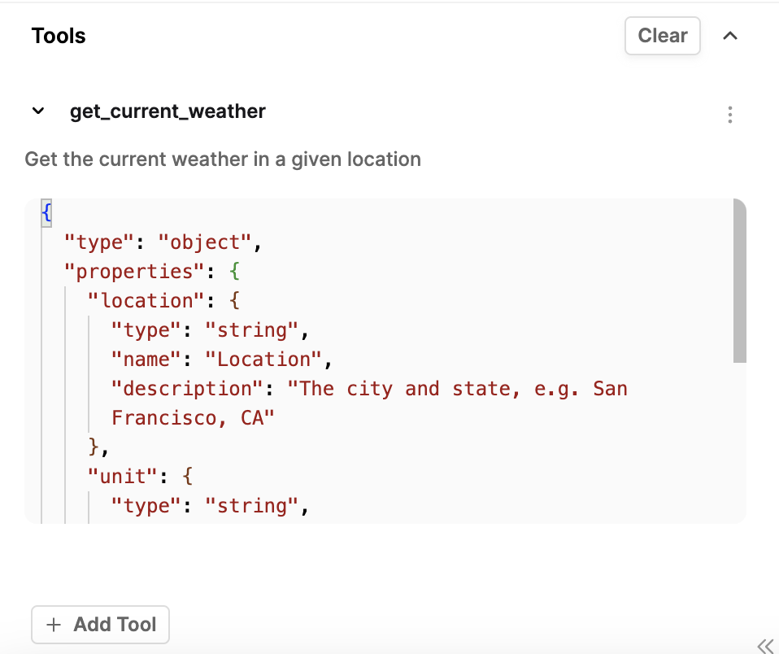

## What are tools?

Humanloop Tools can be broken down into two different categories: 

- Ways to integrate services or data sources into prompts. Integrating tools into your prompts allows you to fetch information to pass into your LLMs calls. We support both external API integrations as well as integrations within Humanloop.
- A process to specify to an LLM the expected request/response model, think [OpenAI Function calling](https://platform.openai.com/docs/guides/function-calling). These use the universal JSON Schema syntax and follow OpenAI's [function calling](https://platform.openai.com/docs/guides/function-calling) convention. 

If you have a tool call in the prompt e.g. `{{ google("population of india") }}`, this will get executed and replaced with the resulting text before the prompt is sent to the model. If your prompt contains an input variable `{{ google(query) }}` this will take the input that is passed into the LLM call. 

Tools for function calling can be defined inline in our Editor or centrally managed for an organization, and follow OpenAI's [function calling](https://platform.openai.com/docs/guides/function-calling) convention. 

***

## Supported Tools

### Third-party integrations

- _Pinecone Search_ - Vector similarity search using Pinecone vector DB and OpenAI embeddings.
- _Google Search_ - API for searching Google: [https://serpapi.com/](https://serpapi.com/).
- _GET API_  - Send a GET request to an external API.

### Humanloop tools

- _Snippet_ - Create reusable key/value pairs for use in prompts.
- _JSON Schema_ - JSON schema for tool calling that can be shared across model configs.