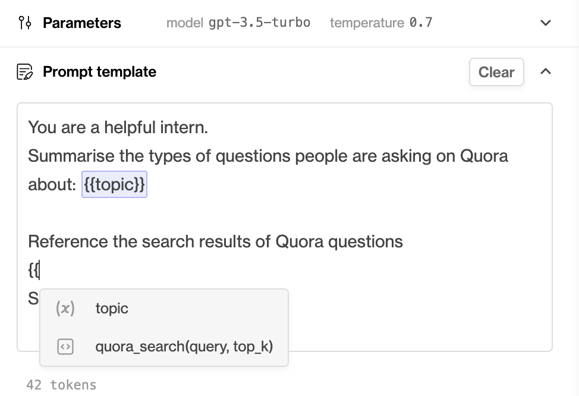

In this guide we will set up a Humanloop Pinecone tool and use it to enrich a prompt with the relevant context from a data source of documents. This tool combines [Pinecone's](https://www.pinecone.io/) [semantic search](https://docs.humanloop.com/docs/key-concepts#semantic-search) with [OpenAI's embedding models](https://platform.openai.com/docs/guides/embeddings).

***

# Prerequisites

- A Humanloop account - you can create one by going to our [sign up page](https://app.humanloop.com/signup).
- A Pinecone account - you can create one by going to their [sign up page](https://app.pinecone.io/?sessionType=signup).
- Python installed - you can download and install Python by following the steps on the [Python download page](https://www.python.org/downloads/).

<Note> 
If you have an existing Pinecone index that was created using one of [OpenAI's embedding models](https://platform.openai.com/docs/guides/embeddings), you can skip to section: **Setup Humanloop**
</Note>

***

# Set up Pinecone

## Install the Pinecone SDK

If you already have the Pinecone SDK installed, skip to the next section.

<Steps>
### Install the Pinecone Python SDK in your terminal:
   ```shell
   $ pip install pinecone-client
   ```
### Start a Python interpreter:
   ```shell
   $ python
   ```
### Go to the [Pinecone console](https://app.pinecone.io/) API Keys tab and create an API key - copy the key `value` and the `environment`.
### Test your Pinecone API key and environment by initialising the SDK
   ```python
   >>> import pinecone
   >>> pinecone.init(api_key="<YOUR API KEY>", environment="<YOUR ENV>")
   ```
</Steps>
***

## Create a Pinecone index

Now we'll initialise a Pinecone index, which is where we'll store our vector embeddings. We will be using OpenAI's [ada model](https://platform.openai.com/docs/guides/embeddings/what-are-embeddings) to create vectors to save to Pinecone, which has an output dimension of 1536 that we need to specify upfront when creating the index: 

```python
import pinecone

# Initialise the SDK
pinecone.init(api_key="<YOUR API KEY>", environment="<YOUR ENV>")

# Create index
# We can reference the dimension of the embeddings on OpenAI
# https://platform.openai.com/docs/guides/embeddings/what-are-embeddings
pinecone.create_index('humanloop-demo', dimension=1536)

# Connect to the index
index = pinecone.Index('humanloop-demo')
```

***

## Preprocess the data

Now that you have a Pinecone index, we need some data to put in it. In this section we'll pre-process some data ready for embedding and storing to the index in the next section.

We'll use the awesome [Hugging Face datasets](https://huggingface.co/docs/datasets/load_hub) to source a demo dataset (following the [Pinecone quick-start guide](https://docs.pinecone.io/docs/semantic-text-search)). In practice you will customise this step to your own use case.

<Steps>
### First install Hugging Face datasets using pip:

```Text Shell
$ pip install datasets
```

### Next download the Quora dataset:

```python
from datasets import load_dataset

dataset = load_dataset('quora', split='train')
```

### Now we can preview the dataset - it contains ~400K pairs of natural language questions from Quora:

```python
print(dataset[:5])
```

```
{'questions': [{'id': [1, 2],
   'text': ['What is the step by step guide to invest in share market in india?',
    'What is the step by step guide to invest in share market?']},
  {'id': [3, 4],
   'text': ['What is the story of Kohinoor (Koh-i-Noor) Diamond?',
    'What would happen if the Indian government stole the Kohinoor (Koh-i-Noor) diamond back?']},
  {'id': [5, 6],
   'text': ['How can I increase the speed of my internet connection while using a VPN?',
    'How can Internet speed be increased by hacking through DNS?']},
  {'id': [7, 8],
   'text': ['Why am I mentally very lonely? How can I solve it?',
    'Find the remainder when [math]23^{24}[/math] is divided by 24,23?']},
  {'id': [9, 10],
   'text': ['Which one dissolve in water quikly sugar, salt, methane and carbon di oxide?',
    'Which fish would survive in salt water?']}],
 'is_duplicate': [False, False, False, False, False]}
```

### Extract the text from the questions into a single list ready for embedding:

```python Python
questions = []

for record in dataset['questions']:
    questions.extend(record['text'])
  
# remove duplicates
questions = list(set(questions))
print('\n'.join(questions[:5]))
print(f"Number of questions: {len(questions)}")
```

```text
I am currently training at IBM in .NET. What are the probable locations IBM has to offer for this domain?
Can someone suggest some songs like this one?
How do sodium bicarbonate and HCL react?
Who inspires you most and why?
```
</Steps>
***

## Populate Pinecone

Now that you have a Pinecone index and a dataset of text chunks, we can populate the index with embeddings before moving on to Humanloop. We'll use one of OpenAI's embedding models to create the vectors for storage.

### Install and initialise Open AI SDK

If you already have your OpenAI key and the SDK installed, skip to the next section.

<Steps>
### Install the OpenAI SDK using pip:

```Text Shell
$ pip install openai
```

### Initialise the SDK (you'll need an OpenAI key from your [OpenAI account](https://platform.openai.com/account/api-keys))

```python
import openai

openai.api_key = "<YOUR OPENAI API KEY>"
```
</Steps>

### Populate the index

If you already have a Pinecone index set up, skip to the next section.
<Steps>
### Embed the questions and store them in Pinecone with the corresponding text as metadata:

```python Python
# For the sake of the demo we just use a small subset of the data
embed_questions = questions[:100]

for i, question in enumerate(embed_questions):   
    # Embed the question
    embedding = client.embeddings.create(input=question, model="text-embedding-ada-002").data[0].embedding
    
    # Upsert to Pinecone - expects tuples of (id, vector, metadata to associate to vector)
    index.upsert([(str(i), embedding, {"text": question})])

# check number of records in the index
index.describe_index_stats()
```

### You can now try out the semantic search with a test question:

```python
test_query = "What is the first law of Thermodynamics?"

# create the query vector
test_query = openai.Embedding.create(
      input=test_query, model="text-embedding-ada-002"
    ).data[0].embedding

# run the query
result = index.query(test_query, top_k=3, include_metadata=True)
print(result)
```

You should see semantically similar questions retrieved with the corresponding similarity scores:

```
{'matches': [{'id': '72',
              'metadata': {'text': 'Is kinetic energy gained when it is moving '
                                   'at a constant speed or when it is '
                                   'accelerating?'},
              'score': 0.792976439,
              'values': []},
             {'id': '28',
              'metadata': {'text': 'Is energy in vacuum real? How do we know '
                                   'that this energy that can be borrowed and '
                                   'returned immediately is real if virtual '
                                   "particles didn't exist then?"},
              'score': 0.787870169,
              'values': []},
             {'id': '425',
              'metadata': {'text': 'What is the most intriguing scientific '
                                   'paradox?'},
              'score': 0.78692925,
              'values': []}],
 'namespace': ''}
```
</Steps>
***

# Set up Humanloop

## Configure Pinecone

You're now ready to configure a Pinecone tool in Humanloop:

<Steps>
### Log on to Humanloop and navigate to the **Tools** tab available beside **Playground** at the top right.
### Under **Add a new tool**, select the **Pinecone Search** card.
### You need to configure both the Pinecone and OpenAI related values. These should be the same values you used when setting up your Pinecone index in the previous sections. All these values are editable later.
   1. **For Pinecone:** populate values for `Name` (use _quora_search_), `pinecone_key`, `pinecone_environment`, `pinecone_index` (note: we named our index `humanloop-demo`).  The name will be used to create the signature for the tool that you will use in your prompt templates in the next section.
   2. **For OpenAI: **populate the `openai_key` and `openai_model` (note: we used the `text-embedding-ada-002` model above)
### Save the tool by selecting **Create Tool.**
</Steps>

An active tool for _quora_search_ will now appear on the tools tab and you're ready to use it within a prompt template. 


## Enhance your prompt template

Now that we have a Pinecone tool configured we can use this to pull relevant context into your prompts. 

This is an effective way to enrich your LLM applications with knowledge from your own internal documents and also help fix hallucinations.

<Steps>
### Select **Playground** in the top right of the screen and toggle to **Completion** mode.
### Copy and paste the following text into the **Prompt template** box:

```text
You are a helpful intern.
Very succinctly summarise the types of questions people are asking on Quora about: {{topic}}

Reference the following search results of Quora questions {{quora_search(topic, 10)}}: 

Summary:

```

### On the right hand side under **Completions**, enter the following three examples of topics: Google, Physics and Exercise. 
### Press the **Run all** button bottom right (or use the keyboard shortcut `Command + Enter`).

On the right hand side the results from calling the Pinecone tool for the specific topic will be shown highlighted in purple and the final summary provided by the LLM that uses these results will be highlighted in green. 


</Steps>

<Tip title="Using tools in the prompt template"> 

Each active tool in your organisation will have a unique signature that you can use to specify the tool within a prompt template. 
 
You can find the signature in the pink box on each tool card on the **Tools** page. 

You can also use double curly brackets - `{{` - within the prompt template editor in playground to see a dropdown of available tools.
 
In the case of **Pinecone** tools, the signature takes two positional arguments: `query`(the query text passed to Pinecone) and `top_k`(the number of similar chunks to retrieve from Pinecone for the query).
 


</Tip>