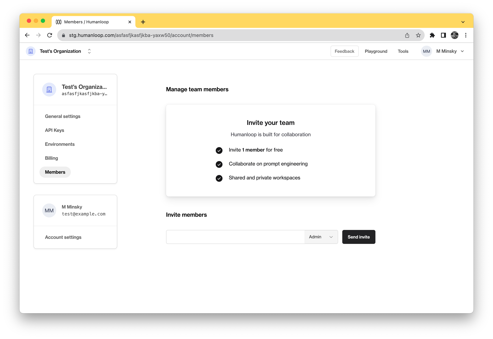

Inviting people to your organization allows them to interact with your Humanloop projects:

- Teammates will be able to create new model configs and experiments
- Developers will be able to get an API key to interact with projects through the SDK
- Annotators may provide feedback on logged datapoints using the Data tab (in addition to feedback captured from your end-users via the SDK feedback integration)

## Prerequisites

- You already have a Prompt — if not, please first follow our [Prompt creation](./create-a-prompt) guide.

## Invite Users

To invite users to your organization:

<Steps>
### Go to your organization's **[Members page](https://app.humanloop.com/account/members)**.
### Enter the **email address** of the person you wish to invite into the **Invite members** box.

### Click **Send invite**.

An email will be sent to the entered email address, inviting them to the organization. If the entered email address is not already a Humanloop user, they will be prompted to create an account before being added to the organization.

</Steps>

🎉 Once they create an account, they can view your projects at the same URL to begin collaborating.
