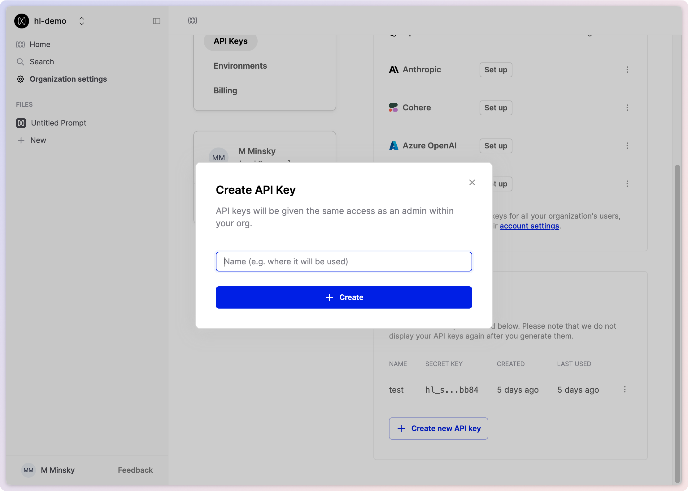
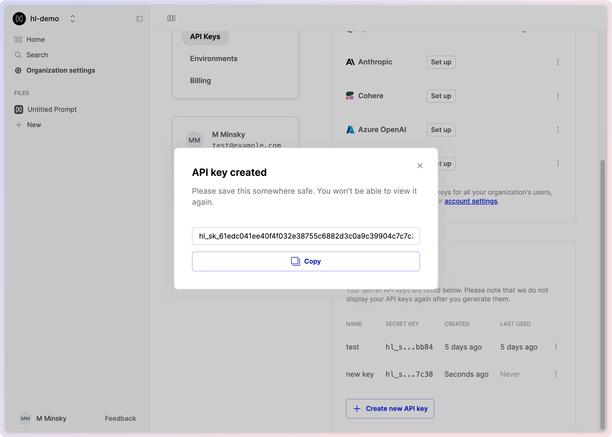
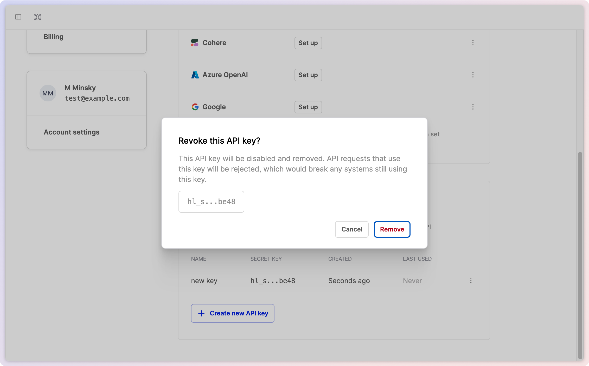

## Create a new API key

<Steps>

### Go to your Organization's **[API Keys page](https://app.humanloop.com/account/api-keys)**.

### Click the **Create new API key** button.

### Enter a name for your API key.

Choose a name that helps you identify the key's purpose. You can't change the name of an API key after it's created.

### Click **Create**.

### Copy the generated API key

Save it in a secure location. You will not be shown the full API key again.

</Steps>

## Revoke an API key

You can revoke an existing API key if it is no longer needed.

<Warning title="This may break production systems">
  When an API key is revoked, future API requests that use this key will be
  rejected. Any systems that are dependent on this key will no longer work.
</Warning>

<Steps>
  ### Go to API keys page

Go to your Organization's **[API Keys
page](https://app.humanloop.com/account/api-keys)**.

### Identify the API key

Find the key you wish to revoke by its name or by the displayed trailing characters.

### Click 'Revoke'

Click the three dots button on the right of its row to open its menu.
Click **Revoke**.
A confirmation dialog will be displayed. Click **Remove**.

</Steps>
