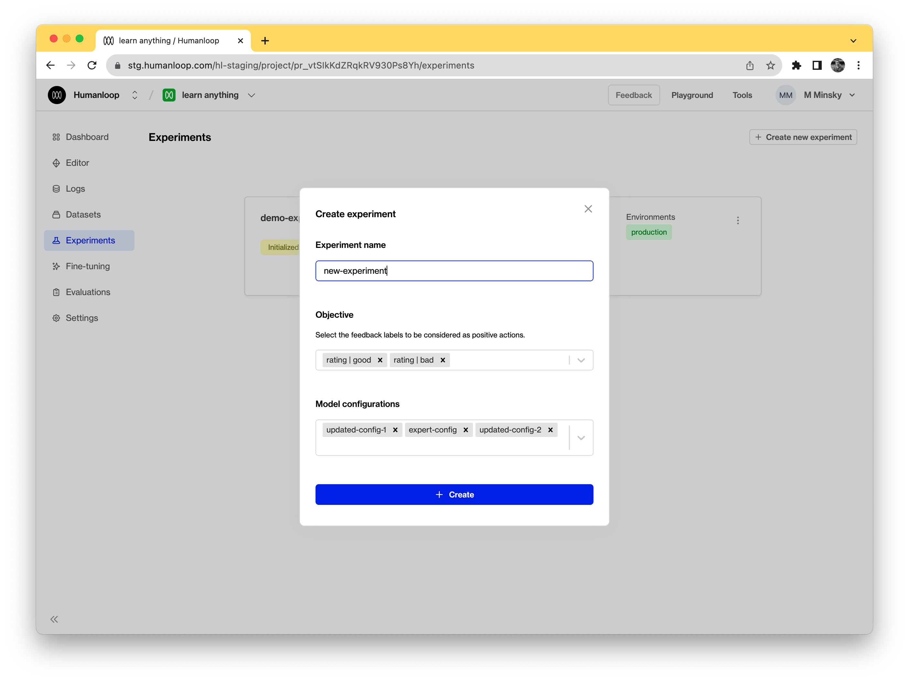
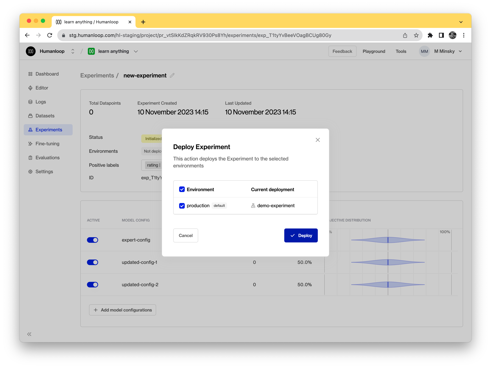

--- 
subtitle: This guide shows you how to set up an experiment on Humanloop to systematically find the best-performing model configuration for your project based on your end-users’ feedback.
---
Experiments can be used to compare different prompt templates, different parameter combinations (such as temperature and presence penalties) and even different base models.

## Prerequisites

- You already have a project created - if not, please pause and first follow our [project creation](../create-project/from-playground) guides.
- You have integrated `humanloop.complete_deployed()` or the `humanloop.chat_deployed()` endpoints, along with the `humanloop.feedback()` with the [API](https://www.postman.com/humanloop/workspace/humanloop) or [Python SDK](../generate/overview).

<Info>
This guide assumes you're are using an OpenAI model. If you want to use other providers or your own model please also look at the [guide for running an experiment with your own model provider](../generate/use-model).
</Info>

## Create an experiment

<Steps>
### Navigate to the **Experiments** tab of your project.
### Click the **Create new experiment** button:
   1. Give your experiment a descriptive name.
   2. Select a list of feedback labels to be considered as positive actions - this will be used to calculate the performance of each of your model configs during the experiment.
   3. Select which of your project’s model configs you wish to compare.
   4. Then click the **Create** button. 
        
</Steps>

## Set the experiment live

Now that you have an experiment, you need to set it as the project’s active experiment:

<Steps>
### Navigate to the **Experiments** tab.
### Click the **Experiment** card you want to deploy. 
### Click the **Deploy** button next to the Environments label. 
### Select the environment to deploy the experiment. We only have one environment by default so select the 'production' environment. 

</Steps>

<Check> 
Now that your experiment is active, any SDK or API calls to generate will sample model configs from the list you provided when creating the experiment and any subsequent feedback captured using feedback will contribute to the experiment performance.
</Check>

## Monitor experiment progress

Now that an experiment is live, the data flowing through your generate and feedback calls will update the experiment progress in real time:

<Steps>
### Navigate back to the **Experiments** tab.
### Select the **Experiment** card.
</Steps>

Here you will see the performance of each model config with a measure of confidence based on how much feedback data has been collected so far:

🎉  Your experiment can now give you insight into which of the model configs your users prefer.

<Tip>
How quickly you can draw conclusions depends on how much traffic you have flowing through your project.

Generally, you should be able to draw some initial conclusions after on the order of hundreds of examples.
</Tip>