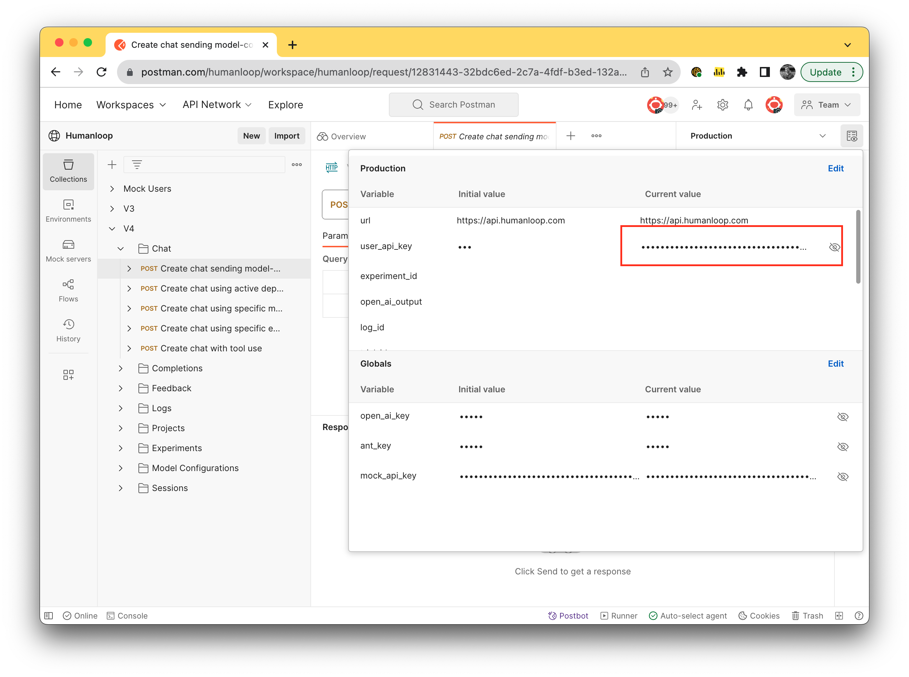
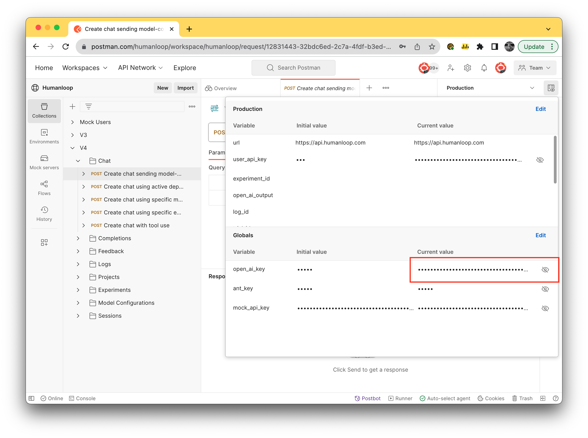
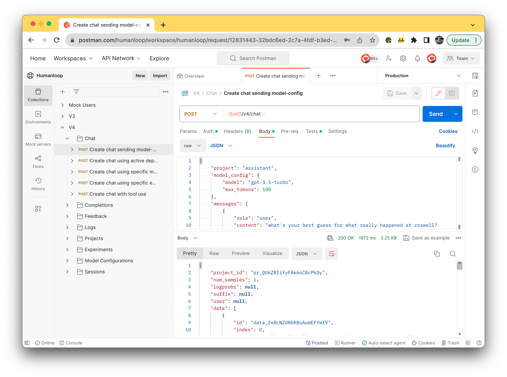
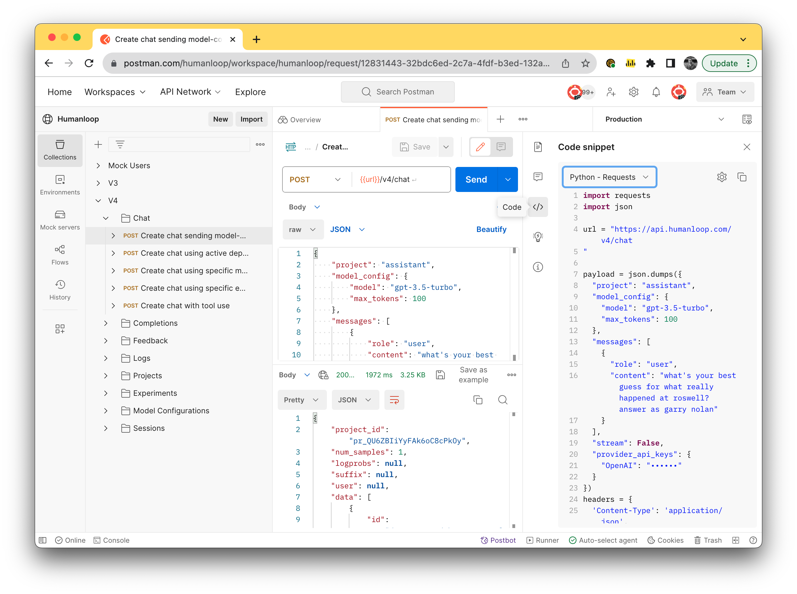

In our various guides we assumed the use of our [Python SDK](https://pypi.org/project/humanloop/). There are some use cases where this is not appropriate. For example, if you are integrating Humanloop from a non-Python backend, such as Node.js, or using a no-or-low-code builder such as [Bubble](https://bubble.io/) or [Zapier](https://zapier.com/). In these cases, you can leverage our RESTful [APIs](/docs/v4/api-reference/projects/get) directly.

To help with direct API integrations, we maintain a [Postman Workspace](https://www.postman.com/humanloop/workspace/humanloop) with various worked examples for the main endpoints you will need.

## Prerequisites

- A Humanloop account. If you don't have one, you can create an account now by going to the [Sign up page](https://app.humanloop.com/signup).

## Set your API keys in Postman

- Navigate to your [Humanloop profile page](https://app.humanloop.com/account/settings) and copy your Humanloop API key.
- Navigate to our [Postman Workspace](https://www.postman.com/humanloop/workspace/humanloop/overview) and set the environment to `Production` in the dropdown in the top right where it says `No Environment`
- Select the `Environment quick look` button beside the environment dropdown and paste your Humanloop API key into the `CURRENT VALUE` of the `user_api_key` variable:

- Navigate to your [OpenAI profile](https://beta.openai.com/account/api-keys) and copy the API key.
- Navigate back to our Postman Workspace and paste your OpenAI key into the `CURRENT VALUE` of the global `open_ai_key` variable:

You are now all set to use Postman to interact with the APIs with real examples!

## Try out the Postman Collections

<Info>
  A **collection** is a set of executable API specifications that are grouped
  together in Postman.
</Info>

There are 4 executable collections provided to check out.

The **Chat** collection is the best place to start to get a project setup and sending chat messages. To try it out:

- Expand the V4 **Chat** collection on the left hand side.
- Select **Create chat sending model-config** from the list
- Execute the `POST` calls in order from top to bottom by selecting them under the collection on the left hand side and pressing the `Send` button on the right hand side. You should see the resulting response body appearing in the box below the request body.
  - Try editing the request body and resending - you can reference the corresponding [API guides](https://humanloop.readme.io/reference) for a full spec of the request schema.

- If you now navigate to your [Humanloop projects page](https://app.humanloop.com), you will see a new project called `assistant` with logged data.
- You can now generate populated code snippets across a range of languages by selecting the code icon on the right hand side beside the request and response bodies:

