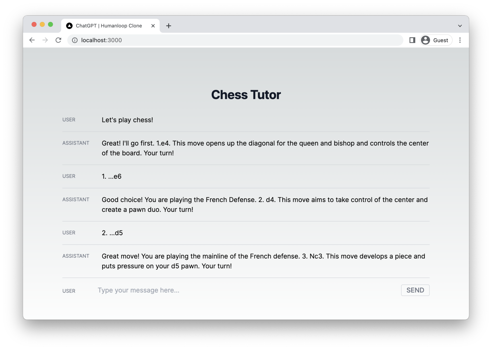
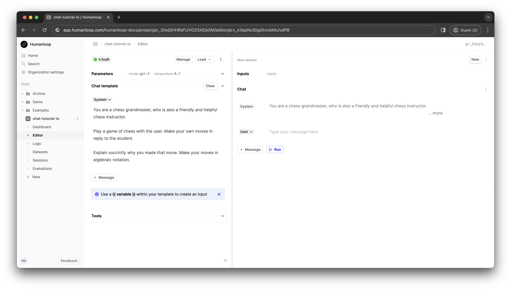
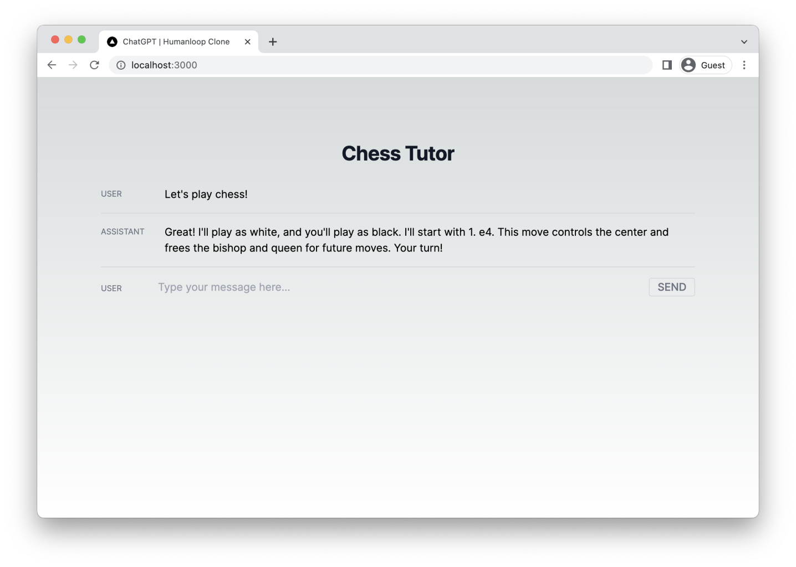
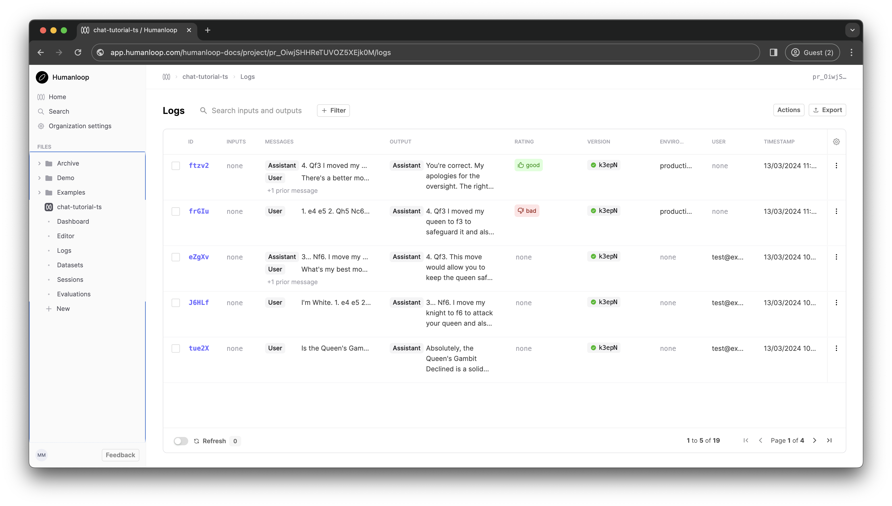
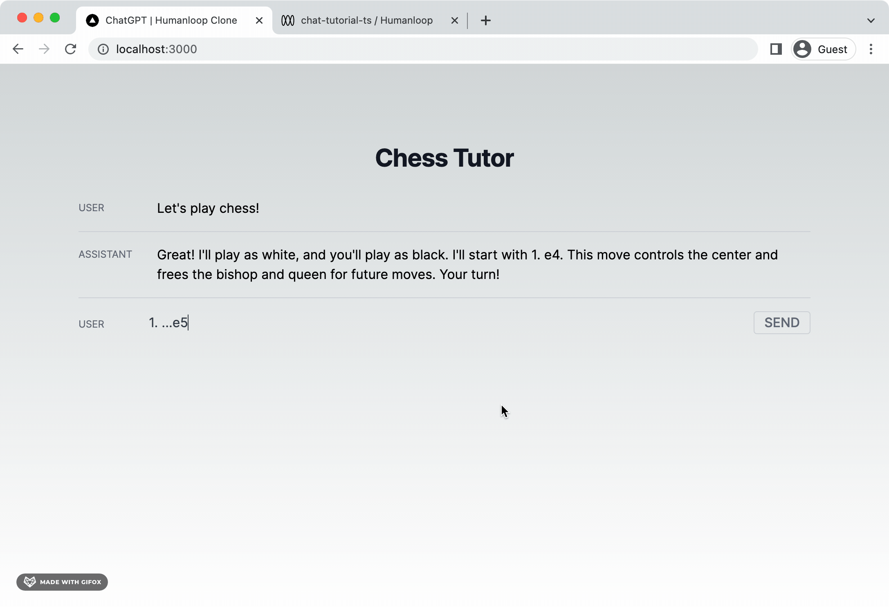
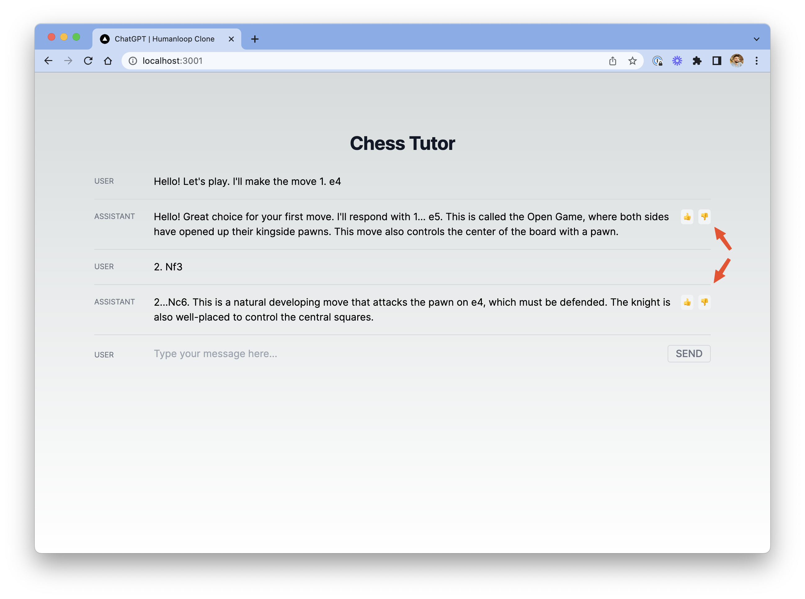
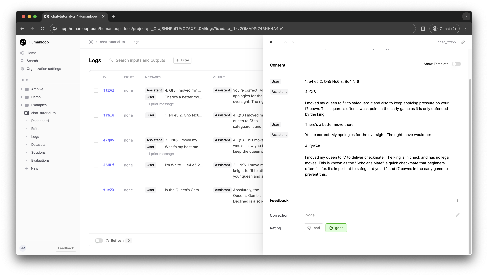

At the end of this tutorial, you'll have built a simple ChatGPT-style interface using Humanloop as the backend to manage interactions with your model provider, track user engagement and experiment with model configuration.

If you just want to leap in, the complete repo for this project is available on GitHub [here.](https://github.com/humanloop/hl-chatgpt-clone-typescript)



# Step 1: Create a new Prompt in Humanloop

First, create a Prompt with the name `chat-tutorial-ts`. Go to the **Editor** tab on the left. Here, we can play with parameters and prompt templates to create a model which will be accessible via the Humanloop SDK.

<Tip title=" Model Provider API keys">
  If this is your first time using the Prompt Editor, you'll be prompted to
  enter an OpenAI API key. You can create one by going
  [here.](https://beta.openai.com/account/api-keys)
</Tip>

The Prompt Editor is an interactive environment where you can experiment with prompt templates to create a model which will be accessible via the Humanloop SDK.



Let's try to create a chess tutor. Paste the following _system message_ into the **Chat template** box on the left-hand side.

```
You are a chess grandmaster, who is also a friendly and helpful chess instructor.

Play a game of chess with the user. Make your own moves in reply to the student.

Explain succintly why you made that move. Make your moves in algebraic notation.
```

In the **Parameters** section above, select gpt-4 as the model. Click **Commit** and enter a commit message such as "GPT-4 Grandmaster".

Navigate back to the **Dashboard** tab in the sidebar. Your new Prompt Version is visible in the table at the bottom of the Prompt dashboard.

# Step 2: Set up a Next.js application

Now, let's turn to building out a simple Next.js application. We'll use the Humanloop TypeScript SDK to provide programmatic access to the model we just created.

Run `npx create-next-app@latest` to create a fresh Next.js project. Accept all the default config options in the setup wizard (which includes using TypeScript, Tailwind, and the Next.js app router). Now `npm run dev` to fire up the development server.

Next `npm i humanloop` to install the Humanloop SDK in your project.

Edit `app/page.tsx` to the following. This code stubs out the basic React components and state management we need for a chat interface.

```typescript page.tsx
"use client";

import { ChatMessageWithToolCall } from "humanloop";
import * as React from "react";

const { useState } = React;

export default function Home() {
  const [messages, setMessages] = useState<ChatMessage[]>([]);
  const [inputValue, setInputValue] = useState("");

  const onSend = async () => {
    const userMessage: ChatMessageWithToolCall = {
      role: "user",
      content: inputValue,
    };

    setInputValue("");

    const newMessages = [...messages, userMessage];

    setMessages(newMessages);

    // REPLACE ME LATER
    const res = "I'm not a language model. I'm just a string. 😞";
    // END REPLACE ME

    const assistantMessage: ChatMessageWithToolCall = {
      role: "assistant",
      content: res,
    };

    setMessages([...newMessages, assistantMessage]);
  };

  const handleKeyDown = (e: React.KeyboardEvent<HTMLInputElement>) => {
    if (e.key === "Enter") {
      onSend();
    }
  };

  return (
    <main className="flex flex-col items-center min-h-screen p-8 md:p-24">
      <h1 className="text-2xl font-bold leading-7 text-gray-900 dark:text-gray-200 sm:truncate sm:text-3xl sm:tracking-tight">
        Chess Tutor
      </h1>
      <div className="flex-col w-full mt-8">
        {messages.map((msg, idx) => (
          <MessageRow key={idx} msg={msg}></MessageRow>
        ))}

        <div className="flex w-full">
          <div className="min-w-[70px] uppercase text-xs text-gray-500 dark:text-gray-300 pt-2">
            User
          </div>
          <input
            className="w-full px-4 py-1 mr-3 leading-tight text-gray-700 break-words bg-transparent border-none appearance-none dark:text-gray-200 flex-grow-1 focus:outline-none"
            type="text"
            placeholder="Type your message here..."
            aria-label="Prompt"
            value={inputValue}
            onChange={(e) => setInputValue(e.target.value)}
            onKeyDown={(e) => handleKeyDown(e)}
          ></input>
          <button
            className="px-3 font-medium text-gray-500 uppercase border border-gray-300 rounded dark:border-gray-100 dark:text-gray-200 hover:border-blue-500 hover:text-blue-500"
            onClick={() => onSend()}
          >
            Send
          </button>
        </div>
      </div>
    </main>
  );
}

interface MessageRowProps {
  msg: ChatMessageWithToolCall;
}

const MessageRow: React.FC<MessageRowProps> = ({ msg }) => {
  return (
    <div className="flex pb-4 mb-4 border-b border-gray-300">
      <div className="min-w-[80px] uppercase text-xs text-gray-500 leading-tight pt-1">
        {msg.role}
      </div>
      <div className="pl-4 whitespace-pre-line">{msg.content as string}</div>
    </div>
  );
};
```

<Warning>
  We shouldn't call the Humanloop SDK from the client's browser as this would
  require giving out the Humanloop API key, which _you should not do!_ Instead,
  we'll create a simple backend API route in Next.js which can perform the
  Humanloop requests on the Node server and proxy these back to the client.
</Warning>

Create a file containing the code below at `app/api/chat/route.ts`. This will automatically create an API route at `/api/chat`. In the call to the Humanloop SDK, you'll need to pass the project name you created in step 1.

```typescript app/api/chat/route.ts
import { Humanloop, ChatMessageWithToolCall } from "humanloop";

if (!process.env.HUMANLOOP_API_KEY) {
  throw Error(
    "no Humanloop API key provided; add one to your .env.local file with: `HUMANLOOP_API_KEY=..."
  );
}

const humanloop = new Humanloop({
  basePath: "https://api.humanloop.com/v4",
  apiKey: process.env.HUMANLOOP_API_KEY,
});

export async function POST(req: Request): Promise<Response> {
  const messages: ChatMessageWithToolCall[] =
    (await req.json()) as ChatMessageWithToolCall[];
  console.log(messages);

  const response = await humanloop.chatDeployed({
    project: "chat-tutorial-ts",
    messages,
  });

  return new Response(JSON.stringify(response.data.data[0].output));
}
```

In this code, we're calling `humanloop.chatDeployed`. This function is used to target the model which is actively deployed on your project - in this case it should be the model we set up in step 1. Other related functions in the [SDK reference](/docs/api-reference/sdks) (such as `humanloop.chat`) allow you to target a specific model config (rather than the actively deployed one) or even specify model config directly in the function call.

When we receive a response from Humanloop, we strip out just the text of the chat response and send this back to the client via a `Response` object (see [Next.js - Route Handler docs](https://nextjs.org/docs/app/building-your-application/routing/router-handlers)). The Humanloop SDK response contains much more data besides the raw text, which you can inspect by logging to the console.

For the above to work, you'll need to ensure that you have a `.env.local` file at the root of your project directory with your Humanloop API key. You can generate a Humanloop API key by clicking your name in the bottom left and selecting [API keys.](https://app.humanloop.com/account/api-keys) This environment variable will only be available on the Next.js server, not on the client (see [Next.js - Environment Variables](https://nextjs.org/docs/pages/building-your-application/configuring/environment-variables)).

```text .env.local
HUMANLOOP_API_KEY=...
```

Now, modify `page.tsx` to use a `fetch` request against the new API route.

```typescript page.tsx
const onSend = async () => {
  // REPLACE ME NOW

  setMessages(newMessages);

  const response = await fetch("/api/chat", {
    method: "POST",
    headers: {
      "Content-Type": "application/json",
    },
    body: JSON.stringify(newMessages),
  });

  const res = await response.json();

  // END REPLACE ME
};
```

You should now find that your application works as expected. When we send messages from the client, a GPT response appears beneath (after a delay).



Back in your Humanloop Prompt dashboard you should see Logs being recorded as clients interact with your model.



# Step 3: Streaming tokens

(Note: requires Node version 18+).

You may notice that model responses can take a while to appear on screen. Currently, our Next.js API route blocks while the entire response is generated, before finally sending the whole thing back to the client browser in one go. For longer generations, this can take some time, particularly with larger models like GPT-4. Other model config settings can impact this too.

To provide a better user experience, we can deal with this latency by streaming tokens back to the client as they are generated and have them display eagerly on the page. The Humanloop SDK wraps the model providers' streaming functionality so that we can achieve this. Let's incorporate streaming tokens into our app next.

Edit the API route at to look like the following. Notice that we have switched to using the `humanloop.chatDeployedStream` function, which offers [Server Sent Event](https://developer.mozilla.org/en-US/docs/Web/API/Server-sent_events) streaming as new tokens arrive from the model provider.

```typescript app/api/chat/route.ts
import { Humanloop, ChatMessageWithToolCall } from "humanloop";

if (!process.env.HUMANLOOP_API_KEY) {
  throw Error(
    "no Humanloop API key provided; add one to your .env.local file with: `HUMANLOOP_API_KEY=..."
  );
}

const humanloop = new Humanloop({
  basePath: "https://api.humanloop.com/v4",
  apiKey: process.env.HUMANLOOP_API_KEY,
});

export async function POST(req: Request): Promise<Response> {
  const messages: ChatMessageWithToolCall[] =
    (await req.json()) as ChatMessageWithToolCall[];

  const response = await humanloop.chatDeployedStream({
    project: "chat-tutorial-ts",
    messages,
  });

  return new Response(response.data);
}
```

Now, modify the `onSend` function in `page.tsx` to the following. This streams the response body in chunks, updating the UI each time a new chunk arrives.

```typescript app/page.tsx
const onSend = async () => {
  const userMessage: ChatMessageWithToolCall = {
    role: "user",
    content: inputValue,
  };

  setInputValue("");

  const newMessages: ChatMessageWithToolCall[] = [
    ...messages,
    userMessage,
    { role: "assistant", content: "" },
  ];

  setMessages(newMessages);

  const response = await fetch("/api/chat", {
    method: "POST",
    headers: {
      "Content-Type": "application/json",
    },
    body: JSON.stringify(newMessages),
  });

  if (!response.body) throw Error();

  const decoder = new TextDecoder();
  const reader = response.body.getReader();
  let done = false;
  while (!done) {
    const chunk = await reader.read();
    const value = chunk.value;
    done = chunk.done;
    const val = decoder.decode(value);
    const jsonChunks = val
      .split("}{")
      .map(
        (s) => (s.startsWith("{") ? "" : "{") + s + (s.endsWith("}") ? "" : "}")
      );
    const tokens = jsonChunks.map((s) => JSON.parse(s).output).join("");

    setMessages((messages) => {
      const updatedLastMessage = messages.slice(-1)[0];

      return [
        ...messages.slice(0, -1),
        {
          ...updatedLastMessage,
          content: (updatedLastMessage.content as string) + tokens,
        },
      ];
    });
  }
};
```

You should now find that tokens stream onto the screen as soon as they are available.



# Step 4: Add Feedback buttons

We'll now add feedback buttons to the Assistant chat messages, and submit feedback on those Logs via the Humanloop API whenever the user clicks the buttons.

Modify `page.tsx` to include an id for each message in React state. Note that we'll only have ids for assistant messages, and `null` for user messages.

```typescript page.tsx
// A new type which also includes the Humanloop data_id for a message generated by the model.
interface ChatListItem {
  id: string | null; // null for user messages, string for assistant messages
  message: ChatMessageWithToolCall;
}

export default function Home() {
  const [chatListItems, setChatListItems] =
      useState<ChatListItem[]>([]); // <- update to use the new type
  ...

```

Modify the `onSend` function to look like this:

```typescript page.tsx
const onSend = async () => {
  const userMessage: ChatMessageWithToolCall = {
    role: "user",
    content: inputValue,
  };

  setInputValue("");

  const newItems: ChatListItem[] = [
    // <- modified to update the new list type
    ...chatListItems,
    { message: userMessage, id: null },
    { message: { role: "assistant", content: "" }, id: null },
  ];

  setChatListItems(newItems);

  const response = await fetch("/api/chat", {
    method: "POST",
    headers: {
      "Content-Type": "application/json",
    },
    body: JSON.stringify(newItems.slice(0, -1).map((item) => item.message)), // slice off the final message, which is the currently empty placeholder for the assistant response
  });

  if (!response.body) throw Error();

  const decoder = new TextDecoder();
  const reader = response.body.getReader();
  let done = false;
  while (!done) {
    const chunk = await reader.read();
    const value = chunk.value;
    done = chunk.done;
    const val = decoder.decode(value);
    const jsonChunks = val
      .split("}{")
      .map(
        (s) => (s.startsWith("{") ? "" : "{") + s + (s.endsWith("}") ? "" : "}")
      );
    const tokens = jsonChunks.map((s) => JSON.parse(s).output).join("");
    const id = JSON.parse(jsonChunks[0]).id; // <- extract the data id from the streaming response

    setChatListItems((chatListItems) => {
      const lastItem = chatListItems.slice(-1)[0];
      const updatedId = id || lastItem.id; // <- use the id from the streaming response if it's not already set
      return [
        ...chatListItems.slice(0, -1),
        {
          ...lastItem,
          message: {
            ...lastItem.message,
            content: (lastItem.message.content as string) + tokens,
          },
          id: updatedId, // <- include the id when we update state
        },
      ];
    });
  }
};
```

Now, modify the `MessageRow` component to become a `ChatItemRow` component which knows about the id.

```typescript page.tsx
interface ChatItemRowProps {
  item: ChatListItem;
}

const ChatItemRow: React.FC<ChatItemRowProps> = ({ item }) => {
  const onFeedback = async (feedback: string) => {
    const response = await fetch("/api/feedback", {
      method: "POST",
      headers: {
        "Content-Type": "application/json",
      },
      body: JSON.stringify({ id: item.id, value: feedback }),
    });
  };

  return (
    <div className="flex pb-4 mb-4 border-b border-gray-300">
      <div className="min-w-[80px] uppercase text-xs text-gray-500 dark:text-gray-300 leading-tight pt-1">
        {item.message.role}
      </div>
      <div className="pl-4 whitespace-pre-line">
        {item.message.content as string}
      </div>
      <div className="grow" />
      <div className="text-xs">
        {item.id !== null && (
          <div className="flex gap-2">
            <button
              className="p-1 bg-gray-100 border-gray-600 rounded hover:bg-gray-200 border-1"
              onClick={() => onFeedback("good")}
            >
              👍
            </button>
            <button
              className="p-1 bg-gray-100 border-gray-600 rounded hover:bg-gray-200 border-1"
              onClick={() => onFeedback("bad")}
            >
              👎
            </button>
          </div>
        )}
      </div>
    </div>
  );
};
```

And finally for `page.tsx`, modify the rendering of the message history to use the new component:

```typescript page.tsx
// OLD
// {messages.map((msg, idx) => (
//   <MessageRow key={idx} msg={msg}></MessageRow>
// ))}

// NEW
{
  chatListItems.map((item, idx) => (
    <ChatItemRow key={idx} item={item}></ChatItemRow>
  ));
}
```

Next, we need to create a Next.js API route for submitting feedback, similar to the one we had for making a `/chat` request. Create a new file at the path `app/api/feedback/route.ts` with the following code:

```typescript api/feedback/route.ts
import { Humanloop } from "humanloop";

if (!process.env.HUMANLOOP_API_KEY) {
  throw Error(
    "no Humanloop API key provided; add one to your .env.local file with: `HUMANLOOP_API_KEY=..."
  );
}

const humanloop = new Humanloop({
  apiKey: process.env.HUMANLOOP_API_KEY,
});

interface FeedbackRequest {
  id: string;
  value: string;
}

export async function POST(req: Request): Promise<Response> {
  const feedbackRequest: FeedbackRequest = await req.json();

  await humanloop.feedback({
    type: "rating",
    data_id: feedbackRequest.id,
    value: feedbackRequest.value,
  });

  return new Response();
}
```

This code simply proxies the feedback request through the Next.js server. You should now see feedback buttons on the relevant rows in chat.



When you click one of these feedback buttons and visit the Prompt in Humanloop, you should see the feedback logged against the log.



# Conclusion

Congratulations! You've now built a working chat interface and used Humanloop to handle interaction with the model provider and log chats. You used a system message (which is invisible to your end user) to make GPT-4 behave like a chess tutor. You also added a way for your app's users to provide feedback which you can track in Humanloop to help improve your models.

Now that you've seen how to create a simple Humanloop project and build a chat interface on top of it, try visiting the Humanloop project dashboard to view the logs and iterate on your model configs. You can also create experiments to learn which model configs perform best with your users. To learn more about these topics, take a look at our guides below.

All the code for this project is available on [Github](https://github.com/humanloop/hl-chatgpt-clone-typescript).
