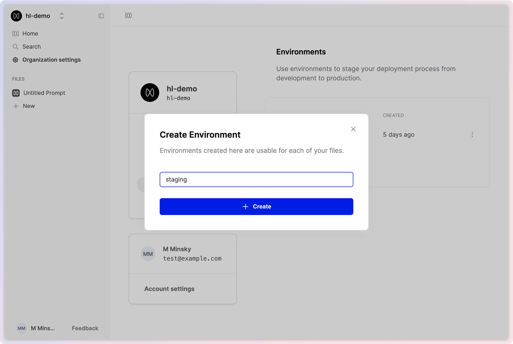
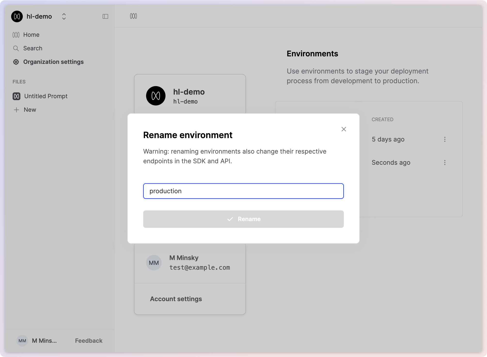

## Create a new environment

<Warning>
  Only Enterprise customers can create more than one environment.
</Warning>

<Steps>

### Go to your Organization's **[Environments page](https://app.humanloop.com/account/environments)**.

### Click the **+ Environment** button.

### Enter a name for your environment.

Choose a name that is relevant to the development workflow you intend to support, such as `staging` or `development`.

### Click **Create**.

</Steps>

## Rename an environment

You can rename an environment to re-arrange your development workflows. Since each new file is automatically deployed to the default environment, which is production unless altered, it may make more sense to create a separate production environment and rename your current environments.

<Warning title="This may break production systems">
  Renaming the environments will take immediate effect, so ensure that this
  change is planned and does not disrupt your production workflows.
</Warning>

<Steps>
  ### Go to environments page

Go to your Organization's **[environments
page](https://app.humanloop.com/account/environments)**.

### Identify the environments

Find the environments you wish to rename.

### Click 'Rename'

Click the three dots button on the right of its row to open its menu.
Click **Rename**.
A confirmation dialog will be displayed. Update the name and click **Rename**.

</Steps>
