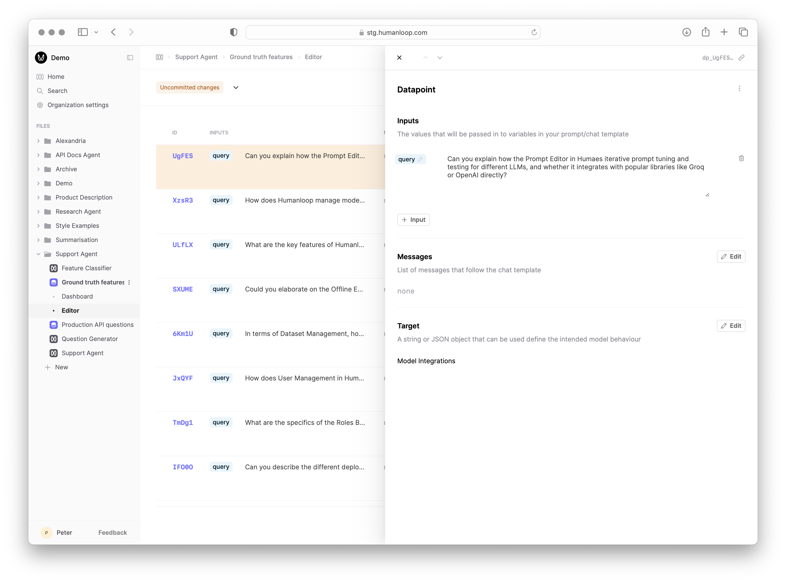

Datasets are primarily used for evaluation purposes on Humanloop. You can think of a Dataset as a collection of testcases for your AI applications. Each testcase is represented by a **Datapoint**, which contains the following fields:

- **Inputs**: a collection of prompt variable values which are interpolated into the prompt template at generation time (i.e. they replace the `{{ variables }}` you define in your prompt template).
- **Messages**: for chat models, as well as the prompt template, you can optionally have a history of chat messages that are fed into amodel when generating a response.
- **Target**: certain types of test cases can benefit from comparing the out your application to an expected or desired behaviour. In the simplest case, this can simply be a string representing the exact output you hope the model produces for the inputs and messages represented by the Datapoint.
  In more complex cases, you can define an arbitrary JSON object for `target` with whatever fields are necessary to help you specify the intended behaviour.
   

## Versioning

A Dataset will have multiple versions as you iterate on refining your test cases for your task. This tends to be an evolving process as you learn more about how your [Prompts](./prompts) behave and how users are interacting with your AI application in the wild.

Dataset versions are immutable and are uniquely defined by the contents of the Datapoints. If you change, or add additional, or remove existing Datapoints, this will constitute a new version.
When running Evaluations you always reference a specific version of the Dataset. This allows you to have confidence in your Evaluations because they are always tied transparently to a specific set of test cases.

## Creating Datasets

Datasets can be created in the following ways:

- via CSV upload in the UI.
- converting from existing [Logs](./logs) you've stored on Humanloop. These can be [Prompt](./prompts) or [Tool](./tools) Logs depending on your Evaluation goals.
- via API requests.

See our detailed [guide](../evaluation/guides/create-dataset) for more details.

## Evaluations use case

[Evaluations](../evaluation/overview) are run on Humanloop by iterating over the Datapoints in a Dataset and generating output for the different versions of your AI application that you wish to compare.
For example, you may wish to test out how Claude Opus compares to GPT-4 and Google Gemini on cost and accuracy for a specific set of testcases that describe the expected behaviour of your application.

[Evaluators](./evaluators) are then run against the logs generated by the AI applications for each Datapoint to provide a judgement on how well the model performed and can reference the target field in the Datapoint to determine the expected behaviour.
