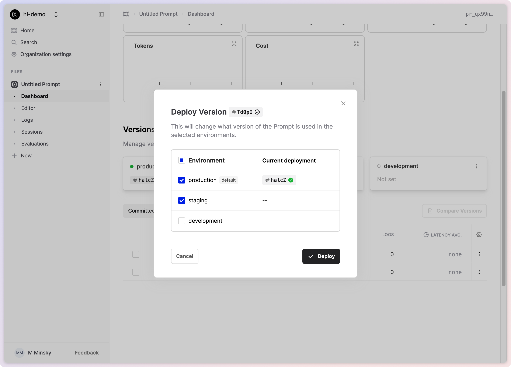

Environments enable you to deploy different versions of your files to specific environments, allowing you to separately manage the deployment workflow between testing and production. With environments, you have the control required to manage the full LLM deployment lifecycle.

### Managing your environments

Every organisation automatically receives a default production environment. You can create additional environments with custom names by visiting your organisation's [environments page](https://app.humanloop.com/account/environments).

<Warning>
  Only Enterprise customers can create more than one environment
</Warning>

The environments you define for your organisation will be available for each file and can be viewed in the file's dashboard once created.

#### The default environment

By default, the production environment is marked as the Default environment. This means that all API calls that don't explicitly target a specific environment will use this environment. You can rename the default environment on the [organisation's environments](https://app.humanloop.com/account/environments) page.

<Warning>
  Renaming the environments will take immediate effect, so ensure that this
  change is planned and does not disrupt your production workflows.
</Warning>

### Using environments

Once created on the environments page, environments can be used for each file and are visible in the respective dashboards.

You can deploy directly to a specific environment by selecting it in the **Deployments** section.

Alternatively, you can deploy to multiple environments simultaneously by deploying a version from either the Editor or the Versions table.

### Using environments via API

You can now call the version deployed in a specific environment by including an optional additional `environment` field. An exmaple of this field can be seen in the v5 [Prompt Call](/api-reference/prompts/log#request.query.environment) documentation.
