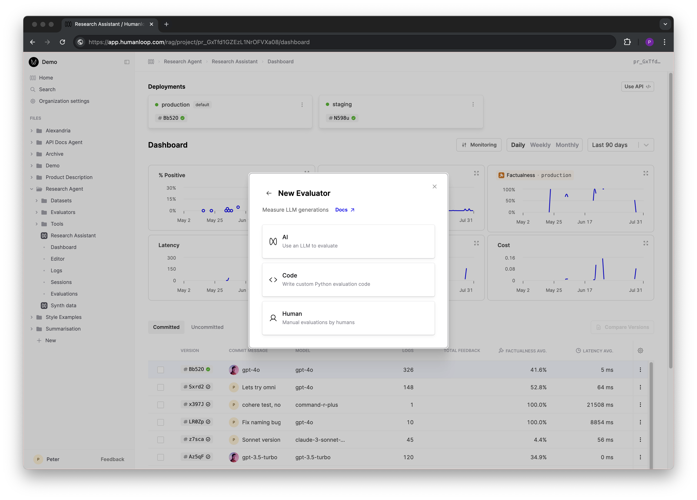

The core entity in the Humanloop evaluation framework is an **[Evaluator](/docs/v5/concepts/evaluators)** - a function you define which takes an LLM-generated log as an argument and returns a **judgment**.
The judgment is typically either a boolean or a number, indicating how well the model performed according to criteria you determine based on your use case.

Evaluators can be leveraged for [Monitoring](../observability/overview) your live AI application, as well as for [Evaluations](../evaluation/overview) to benchmark different version of your AI application against each other pre-deployment.

## Sources of Judgement

Currently, you can define three different Evaluator sources on Humanloop:

- **Code** - using simple deterministic rules based judgments against attributes like cost, token usage, latency, regex rules on the output, etc. These are generally fast and cheap to run at scale.
- **AI** - using other foundation models to provide judgments on the output. This allows for more qualitative and nuanced judgments for a fraction of the cost of human judgments.
- **Human** - getting gold standard judgments from either end users of your application, or internal domain experts. This can be the most expensive and slowest option, but also the most reliable.

## Online Monitoring versus Offline Evaluation

Evaluators can be deployed on Humanloop to support both testing new versions of your Prompts and Tools during development and for monitoring live apps that are already in production.

### Online Monitoring

Evaluators are run against the [Logs](./logs) generated by your AI applications. Typically, they are used to monitor deployed model performance over time and check for drift or degradation in performance.
The Evaluator in this case only takes a single argument - the `log` generated by the model. The Evaluator is expected to return a judgment based on the Log,
which can be used to trigger alerts or other actions in your monitoring system.

See our [Monitoring guides](../observability/overview) for more details.

### Offline Evaluations

Offline Evaluators are combined with predefined [**Datasets**](./datasets) in order to evaluate your application as you iterate in your prompt engineering workflow, or to test for regressions in a CI environment.

A test Dataset is a collection of **Datapoints**, which are roughly analogous to unit tests or test cases in traditional programming. Each datapoint specifies inputs to your model and (optionally) some target data.

When you run an offline evaluation, a Log needs to be generated using the inputs of each Datapoint and the version of the application being evaluated. Evaluators then need to be run against each Log to provide judgements,
which are then aggregated to provide an overall score for the application. Evaluators in this case take the generated `Log` and the `testcase` datapoint that gave rise to it as arguments.

See our guides on [creating Datasets](./guides/create-dataset) and [running Evaluations](../evaluation/overview) for more details.

## Humanloop runtime versus your runtime

Evaluations require the following to be generated:

1. Logs for the datapoints.
2. Evaluator results for those generated logs.

Evaluators which are defined within the Humanloop UI can be executed in the Humanloop runtime, whereas Evaluators defined in your code can be executed in your runtime and the results posted back to Humanloop.
This provides flexibility for supporting more complex evaluation workflows.

## Return types

Evaluators apply judgment to Logs. This judgment can be of the following types:

- **Boolean** - A true/false judgment.
- **Number** - A numerical judgment, which can act as a rating or score.
- **Select** - One of a predefined set of options. One option must be selected.
- **Multi-select** - Any number of a predefined set of options. None, one, or many options can be selected.
- **Text** - A free-form text judgment.

Code and AI Evaluators can return either **Boolean** or **Number** judgments.
Human Evaluators can return **Number**, **Select**, **Multi-select**, or **Text** judgments.
